# SODA (Student Overloaded by Deadlines and Activities) by Team Soda

<table>
<tr><td><b>Team</b></td><td>Samantha Chan Pei Yin, Lee Jia Yin, Yeap Boon Shen, Muhammad Ikhlas bin Mohd Faizal</td></tr>
<tr><td><b>Problem Statement</b></td><td>Stress &amp; Workload Manager</td></tr>
<tr><td><b>Video Presentation</b></td><td><i>Unlisted YouTube link, to be added</i></td></tr>
<tr><td><b>Presentation Slides</b></td><td><i>Public link, to be added</i></td></tr>
</table>

---

**Explore:** [🎯 Overview](#1--project-overview) · [🧭 Ideation](#2--ideation--process) · [📱 Prototype](#3--design--prototype) · [✨ Difference & impact](#4--what-makes-it-different) · [🔧 Feasibility](#5--technical-architecture--feasibility)

## 1. 🎯 Project Overview

### The Problem

An assignment, a paid shift and a club request can each look manageable. When they all land in the same week, students need to see the combined demand and decide what can change before recovery becomes the leftover.

**SODA addresses a workload visibility and decision-making gap.** Students may know their individual commitments while struggling to judge their combined demand. The challenge therefore calls for more than tracking: students need help recognising pressure, finding feasible adjustments and making space for recovery.

Research informs this direction. A study analysing **209 open-text responses** found academic workload was the most frequently mentioned influence on students' daily wellbeing, with links to stress and balance between study and life ([Gilmore et al., 2025](https://doi.org/10.1080/07294360.2024.2442636)). Research on working students also highlights differences in conflict between work and study, supporting a design that distinguishes fixed responsibilities from flexible tasks ([Creed et al., 2023](https://doi.org/10.3389/fpsyg.2023.1116031)). These findings support the problem framing; they do not validate SODA's calculations.

> **Our design question:** How might we help students see their combined workload and adjust it while they still have options?

<p align="center">
  
</p>

*Figure 1.1: The problem tree connects six contributing causes to the shared visibility problem and its possible consequences. It is a design hypothesis about accumulation, not a diagnostic model.*

### Who we are designing for

Our primary users are **undergraduates balancing coursework with substantial responsibilities outside class**, such as paid work, society leadership or caring. The four situations below can overlap; they are not personality labels.

| Student situation | Decision SODA should make easier |
|---|---|
| **Working student** | Fit coursework around a fixed shift without quietly sacrificing recovery. |
| **Over-committed student** | Understand the effect of a new request before agreeing. |
| **Final-year student** | Allow realistic time for open-ended project work alongside deadlines. |
| **Quiet grinder** | Notice when finishing the work repeatedly means postponing rest. |

Teammates, lecturers and employers may benefit from earlier conversations about conflicts. Campus support services remain the source of help beyond planning. **Personal schedules and check-ins are not automatically shared with any of these stakeholders.**

### Existing approaches and the remaining opportunity

The comparison focuses on the decision SODA is designed to support, not on claiming that established products are ineffective. Current product capabilities are based on public documentation and should be rechecked before submission.

| Approach | Existing strength | Remaining gap for SODA's target student | How SODA addresses the gap |
|---|---|---|---|
| **Task and calendar management**, represented by [Todoist](https://www.todoist.com/help/todoist/integrations/use-the-calendar-integration-rCqwLCt3G) | Records tasks, priorities, dates and durations and displays them alongside calendar events. | Organisation shows what and when, but its public calendar documentation does not describe an editable five-dimensional student-demand model, a before-acceptance capacity preview or a planned-versus-completed recovery ledger. | My Backpack combines recorded commitments across mental, time, physical, social and errands demand. Impact Preview then shows the consequence of a candidate commitment before it is saved. |
| **Adaptive scheduling**, represented by [Reclaim](https://reclaim.ai/features/tasks) | Automatically schedules flexible tasks, protects focus time and breaks, and supports task priority and calendar optimisation. | Calendar optimisation can find available time, but its public feature description does not document SODA's student-specific five-axis estimate or a recovery record that distinguishes protected intentions from completed recovery. | Smart Rebalance uses priority while preserving deadlines, fixed responsibilities and protected recovery. Every destination is recalculated against the student's workload model, and nothing moves without approval. |
| **Self-care and habit support**, represented by [Finch](https://play.google.com/store/apps/details?id=com.finch.finch) | Provides goals, check-ins, journaling, breathing activities, timers and encouraging rewards. | Self-care support can remain separate from the academic decision that caused recovery to be postponed. Continued engagement is also a recognised challenge across digital health interventions. | Recovery Island connects the recovery action to the same workload plan, while Recovery Debt distinguishes planned recovery from what the student chose to record as completed. SODA avoids streak penalties that could make missed recovery feel like failure. |
| **Manual planning using separate calendars, lists and wellbeing tools** | Flexible, familiar and inexpensive. | The student must mentally combine fragmented information and decide which commitment can move without a shared constraint check. | SODA joins workload visibility, an unsaved commitment preview, priority-based rescheduling and recovery in one approval-controlled journey. |

Recent reviews support the value of planning, prioritisation and task organisation, but they do not show that a conventional task list alone resolves combined workload or recovery decisions ([Liu et al., 2026](https://doi.org/10.3389/fpsyg.2026.1700298); [Patzak et al., 2025](https://doi.org/10.3389/feduc.2025.1623228)). Sustained engagement is itself a known difficulty across digital health tools, and the evidence does not isolate which technique causes it ([Milne-Ives et al., 2023](https://doi.org/10.3389/fpsyg.2023.1227443)).

SODA's proposed contribution is therefore the connected loop: see combined demand, preview a commitment, protect higher-priority work, approve a feasible adjustment and record recovery, not a claim that it invented scheduling or self-care. Its five-axis weights, priority order and recovery default remain proposed rules that require usability and longitudinal evaluation.

### Our Solution

SODA is a proposed student workload planner that combines recorded commitments across **mental, time, physical, social and errands** demand. It compares these with an editable personal baseline and previews the effect of a new task before the student accepts it. When the plan is too demanding, it proposes changes that respect fixed commitments, deadlines and protected recovery. Recovery logging and optional completion feedback then inform the student's next planning decision.

> **See total load → preview a commitment → choose a feasible change → protect recovery → improve the next estimate.**

<table>
<tr>
<td width="33%"></td>
<td width="33%"></td>
<td width="33%"></td>
</tr>
<tr>
<td align="center"><b>See the load</b><br><sub><b>82%</b>, and which axis is carrying it</sub></td>
<td align="center"><b>See the cost before you say yes</b><br><sub><b>82% &rarr; 112%</b>, rest down to 25m.<br>Nothing is saved yet.</sub></td>
<td align="center"><b>Choose what changes</b><br><sub><b>112% &rarr; 89%</b>, the paid shift untouched.<br>Nothing moves without approval.</sub></td>
</tr>
</table>

**Current status and scope.** SODA is at prototype stage: a Figma prototype and the specifications behind it, with exported screens in Section 3. The application and hosted services are proposed for the three-week building phase.

Two boundaries hold for everything that follows, so we state them once here instead of repeating them at every feature. **SODA produces planning estimates, never diagnoses or burnout-risk measurements.** And **no usability or wellbeing outcome has been evaluated yet**: the research cited throughout supports our design reasoning, not our weights, our thresholds or any claimed effect. Where a specific limit applies to one feature, we say so at that feature.

### Three core experiences

SODA centres on three experiences: **understand what I am carrying, decide what I can take on, and make room to recover.** Supporting functions make these experiences usable without becoming separate product promises.

| Student question | Main feature | Supporting functions |
|---|---|---|
| **“Why does my week feel so heavy?”** | **My Backpack:** see combined demand and identify the main source of pressure. | Task entry and calendar review supply commitments; Life Forecast adds the weekly outlook. |
| **“Can I realistically say yes?”** | **Impact Preview:** see the cost of a new commitment and choose what can change. | Protection Mode sets the response; Smart Rebalance offers feasible adjustments and safe undo. |
| **“What can I do to recover now?”** | **Recovery Island:** choose a suitable recovery action and give it a place in the plan. | Protected time, recovery logging and a timer support action; Recovery Debt keeps planned-versus-logged recovery visible. |

**Support across the journey:** Daily Check-in provides optional reflection and preference context. Reality Check helps students reconsider future estimates; Insights and How SODA Calculates explain patterns and assumptions. These improve the three experiences rather than adding more main features.

### How this answers the challenge brief

The Stress & Workload Manager brief asks for specific things. This table maps each one to where SODA answers it, so the fit can be checked rather than assumed.

| What the brief asks for | Where SODA answers it |
|---|---|
| "A clear picture of their load across different areas (mental, time, physical, social, errands)" | My Backpack breaks demand down across those same five areas. They are SODA's five axes, not a renamed subset. |
| "You're at 90% capacity this week" as a quick sanity-check | A daily estimate with a named band beside every number. 90% is exactly where the **Overload** band begins ([display rules](#how-the-estimate-works)). |
| "It shouldn't just track and report": helping before burnout hits | Impact Preview runs **before** a task is saved, and every over-limit state routes into a concrete set of changes rather than a warning on its own. |
| "A load balancer that groups tasks together and pushes back lower-priority ones" | Smart Rebalance proposes named moves, protects fixed shifts, deadlines and recovery, and applies nothing without approval. |
| "A stress tracker to log how you're feeling over time" | Daily Check-in and Insights record and explain patterns. Check-ins inform reflection and preferences; they never silently reduce the student's capacity. |
| "Some kind of recovery nudge, suggesting sleep, downtime or a hangout" | Recovery Island turns the nudge into a chosen action with protected time and a completion record; Recovery Debt keeps shortfalls visible across weeks. |
| "Usable, accessible, and something students would actually keep open on their phone" | Low-effort capture, a full dark mode and text alternatives to charts. Section 3 states plainly which accessibility work is designed and which is still unverified. |

The brief also sets platform expectations we build to. The planned application is deployable rather than local-only. AI is confined to reading and writing language, while a deterministic rules engine does every calculation, so we can account for how our own results are produced.

---

## 2. 🧭 Ideation & Process

### 2.1 Ideas We Considered

We compared four approaches against **challenge fit, user need, originality, feasibility and demonstration clarity**. Backpack offered the clearest route from seeing demand to making a decision; parts of the other concepts improved that route.

| Idea | Decision | Reason and trade-off |
|---|---|---|
| **Backpack (personal capacity model)** | **Chosen as the core** | Connects combined demand to the cost of a new commitment. We accepted the need to explain uncertainty and let students correct inputs. |
| **Streak (habit and self-care tracker)** | **Companion retained; rewards dropped** | A companion can communicate state. Streaks, XP and resets could make taking a needed break feel like failure, so they were removed. |
| **Echo (AI journaling coach)** | **Brief check-ins retained; journaling dropped** | Reflection was useful, but daily writing adds effort and does not itself identify which commitment can change. |
| **Sync (shared group calendar)** | **Deferred** | Group coordination needs multiple adopters, permissions and synchronisation. We prioritised a useful individual workflow before adding sharing. |

**Why this selection matters:** SODA retained the companion and reflection without becoming a reward tracker or journal. Its central interaction stayed **My Backpack → Impact Preview → Smart Rebalance**.

### 2.2 Ideation Boards

The problem tree above explains **why** overload can accumulate. The three boards below show **who needs help, what we considered, and how principles shaped the selected features**. They separate the original dense mindmap in response to mentor feedback.

#### Figure 1.2a: Users and needs

<p align="center">
  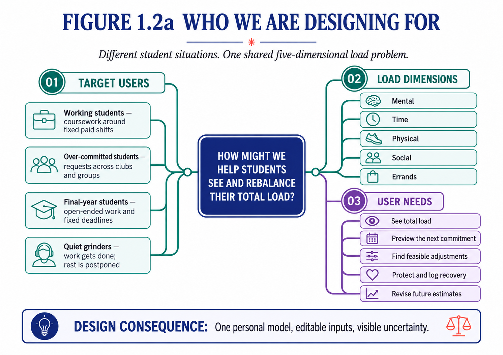
</p>

*Different student situations converge on shared planning needs. This led to one personal model with editable inputs, rather than separate modes for each type of student.*

#### Figure 1.2b: Concepts and selection

<p align="center">
  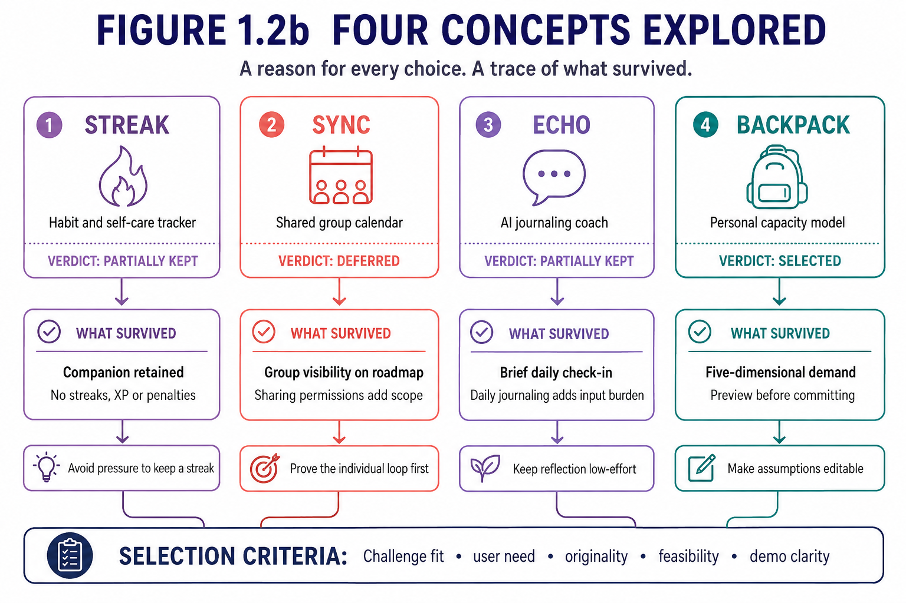
</p>

*The arrows trace what survived each concept and the trade-off behind it. Choosing Backpack preserved useful ideas while keeping the first build focused on the individual student.*

#### Figure 1.2c: Principles that shaped the features

<p align="center">
  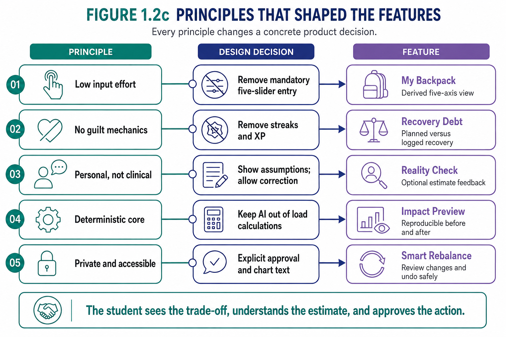
</p>

*Each connected row shows a principle changing a concrete design decision. The board includes both main and supporting functions; it is not a list of five main features. Privacy, accessibility and student control apply throughout.*

#### Figure 1.3: From the chosen idea to a usable flow

<p align="center">
  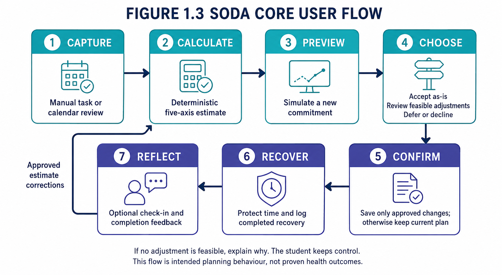
</p>

*The student can accept, adjust, defer or decline. Confirmation saves only the chosen changes; optional feedback improves the next estimate without silently rewriting the plan.*

### How the idea evolved

| Stage | Earlier direction | Change and reason | Trade-off accepted |
|---|---|---|---|
| **Explore** | Four separate product concepts | Chose Backpack; retained a companion and short check-ins. | Prioritised decision support over a broad feature collection. |
| **Simplify capture** | Five dimension ratings for every task | Derive defaults from duration, effort and category to reduce repeated input. | Defaults are coarser and must remain inspectable and correctable. |
| **Narrow scope** | The Crew / shared workload | Deferred collaboration until the personal workflow is useful. | Less group coordination in the first release. |
| **Correct estimates** | Strong forecast and “AI prediction” wording | Added visible assumptions and optional Reality Check feedback. | Present an estimate rather than promising prediction accuracy. |
| **Make recovery actionable** | Generic “take a break” reminders | Added choices, protected time, a reset timer and recovery history. | Requires preferences and logging; a suggestion cannot prove recovery occurred. |
| **Improve the explanation** | One dense ideation board | Split users, concepts and principles into connected diagrams. | More focused figures, each with a short explanation instead of repeated prose. |

**Two changes made concrete**

| Iteration | Earlier proposal → revised design | Why the change matters | Evidence and limit |
|---|---|---|---|
| **Task capture** | Rate five dimensions for every task → enter duration, effort and category, then inspect derived defaults. | Removes repeated abstract ratings while preserving correction. The trade-off is coarser defaults, not proven measurement accuracy. | [Figure 1.2c](#figure-12c-principles-that-shaped-the-features) and the [specified inputs](#how-the-estimate-works). The earlier design is recorded concept history rather than a saved screenshot, and we make no speed claim we have not measured. |
| **Recovery** | General reminder to rest → choose an action, protect time and record completion in Recovery Island. | Gives the student a next step and a visible record. It requires preferences and logging rather than assuming a reminder caused recovery. | [Core flow](#figure-13-from-the-chosen-idea-to-a-usable-flow) and [completion criteria](#minimum-completion-standard). The flow specifies intended behaviour; actual follow-through remains untested. |

### 2.3 Mentor Consultation

| Date | Mentor | Feedback received | What was changed |
|---|---|---|---|
| 7 Sep 2026 | Khor Jia Quan | Split the dense ideation mindmap and explain each part. | One board became three connected boards, each with its own caption: users and needs, concepts and selection, principles to features. See Figures 1.2a–c above. |
| 7 Sep 2026 | Khor Jia Quan | Show the selected backend technologies on the architecture figure. | Figure 5.2 now labels each selected technology, and the stack table beside it states why each was chosen and the constraint it brings. |
| 7 Sep 2026 | Khor Jia Quan | Explain chart alternatives, and research how screen-reader and colour-blind support helps these users. | Every figure carries a text description, and the [accessibility notes](#accessibility-what-is-designed-what-is-still-unverified) set out which support is designed and which is still unverified. |
| 7 Sep 2026 | Khor Jia Quan | Remove the Chat / Manual chooser that came before Impact Preview; let students reach the chat entry directly with manual input available on the same screen. | Adding is now a single screen. The chat field is present immediately and "Type it in yourself" expands the manual form in place; the separate chooser screen is gone. |
| 7 Sep 2026 | Khor Jia Quan | Give the backpack companion a functional role through dialogue rather than decoration. | The companion now speaks to load and recovery states at the points where a student is deciding, always alongside text that carries the same meaning on its own. |
| 7 Sep 2026 | Khor Jia Quan | Change the Add icon in the bottom navigation to the SODA backpack icon. | Adopted. The backpack is the main entry point in the navigation bar. |

**Where we went further than the advice.** The mentor asked us to remove the chooser; we also kept manual entry reachable in place rather than replacing it with chat. That protects the workflow for students who prefer typing fields, and it keeps the core loop working when optional language assistance is unavailable.

Assistive-technology testing is the one response we do not claim as finished. Contrast ratios, screen-reader labels and tap targets are verified during the build, not asserted here.

#### Follow-up consultation: Mr. Daniel Koh Yu Hang

A second consultation focused on making the user flow, rescheduling logic, recovery target, data handling and market distinction easier to explain.

| Date | Mentor | Feedback received | What was changed |
|---|---|---|---|
| 9 Sep 2026 | Daniel Koh Yu Hang | Explain the user flow one step and one screen at a time. | Section 3 became [sequential screen tables](#user-flow-end-to-end): each row names one screen, what it communicates and what the student does next, following onboarding, commitment entry, impact, adjustment and recovery. |
| 9 Sep 2026 | Daniel Koh Yu Hang | Keep effort level, but use Low, Medium and High priority for task rescheduling. | Effort still feeds the [five-dimensional demand estimate](#how-the-estimate-works). Priority is now a separate field that only Smart Rebalance reads, so importance never quietly inflates a load figure. Both appear in Manual Add and Tell SODA, in the proposed schema and in the model specification. |
| 9 Sep 2026 | Daniel Koh Yu Hang | Explain how SODA determines which tasks are rescheduled. | The [order is now stated](#how-the-estimate-works): fixed and completed commitments are excluded, feasible Low-priority work is considered before Medium and High, and deadlines, overlaps, destination load and protected recovery are all checked before a suggestion is shown. |
| 9 Sep 2026 | Daniel Koh Yu Hang | Set and explain how much recovery time is needed each week. | Added an editable [starting target](#how-the-estimate-works) of **5 hours 15 minutes a week**, derived from 45 minutes a day under the Moderate onboarding baseline. It appears beside Recovery Debt on the Recover screen, and the [display rules](#how-the-estimate-works) record both the derivation and its limits. It is a planning default, not advice about how much rest a person needs. |
| 9 Sep 2026 | Daniel Koh Yu Hang | Explain how sign-in and cross-device database data are handled, including sanitisation and sensitive information. | Added the [stored and excluded data](#data-handling), the input-validation boundary, authentication, Row Level Security, logging restrictions, encryption expectations and student controls. The [data-handling section](#data-handling) states plainly that sanitised does not mean anonymous, rather than claiming no personal data reaches the database. |
| 9 Sep 2026 | Daniel Koh Yu Hang | List weaknesses in existing approaches and explain how SODA addresses them. | The [existing-approaches comparison](#existing-approaches-and-the-remaining-opportunity) now covers task and calendar tools, adaptive scheduling, self-care applications and fragmented manual planning, naming the remaining decision gap in each without claiming that any competitor is ineffective. |

---


## 3. 📱 Design & Prototype

**UI Prototype:** [Open the main SODA prototype](https://www.figma.com/proto/izVJIUjNyiSDu0ivUEOtw5/Untitled?page-id=358%3A2225&node-id=189-1183&starting-point-node-id=189%3A1183&scaling=scale-down) · [View the Figma design file](https://www.figma.com/design/izVJIUjNyiSDu0ivUEOtw5/Untitled?node-id=189-1183)

SODA is used by people who are already depleted. That single fact drives
every decision in this section: the interface has to be readable in ten
seconds, honest about what it does not know, and incapable of making a
tired student feel worse for opening it.

### It starts before the app is open

SODA does not wait to be opened. When Wednesday is heading past the limit, the lock screen names the
day, names the two commitments that collide, and offers to move one.

Tap **Show me** and the week is already there: Friday at **82%**, Wednesday flagged at **104%** before
it arrives. Every screen has a dark twin, redrawn rather than filtered, so accents stay legible in both.

| Light: before you open it | Dark: before you open it | Light: Show me | Dark: Show me |
|---|---|---|---|
| 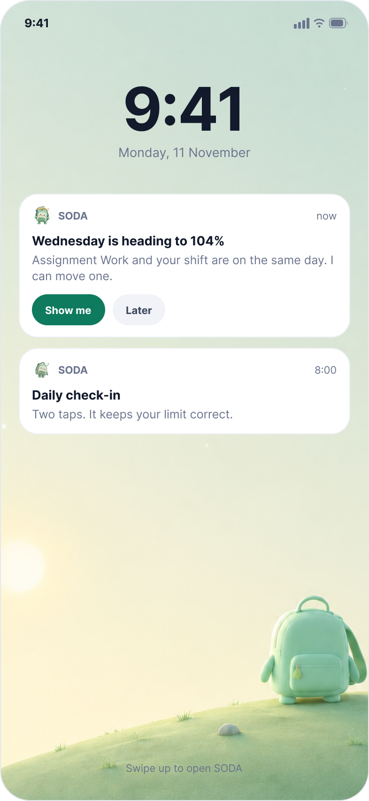 | 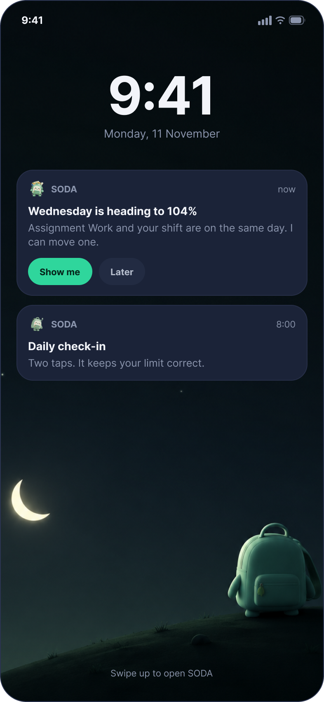 |  |  |

SODA states the problem once and stops. It does not repeat, escalate, or count how many times it was
ignored.

*The lock screen sits outside the demo route, so it will not appear while clicking through the
prototype.*

---

### Design principles

SODA is built around one uncomfortable moment: the second before a student
says "yes" to something they do not have room for. Seven rules shape every
screen.

**1. Show the cost before the commitment.** Most planners tell you what you
agreed to after you agreed. SODA shows the damage first: 82% becomes 112%,
and the day that breaks is named. The primary action is "Fix my week".

**2. Plan, never diagnose.** SODA reports capacity, not health. The
boundary is repeated in plain words: "This is for planning. It is not a
health score." Body signals are compared to the student's own normal, never
to a population baseline, and the app works with no wearable at all.

**3. Nothing is saved until the student approves it.** SODA shows what it
understood and asks before writing anything. When it overrides a number,
estimating 3h 30m where the student typed 3 hours, the change is visible,
explained from the student's own history, and reversible with one tap. If
they keep their own estimate, the Impact Preview uses their number (108%),
not SODA's.

**4. One way in, not a menu.** Adding something is a single screen. Chat
and the manual form live together; neither group has to pick a mode first.

**5. Give the time back, don't just warn.** Every warning is paired with an
action. Smart Rebalance proposes specific changes; Recovery Island turns
owed rest into short options that each state the time they return.

**6. SODA does not move what is not the student's to move.** Every
commitment is tagged Fixed or Flexible. Coursework and club time can be
moved. A paid shift cannot: SODA will draft the message to the manager, but
the swap shows as "waiting for your manager" and is never counted in the
improvement total until it is approved.

**7. Fixed rules do the maths. AI only handles the words.** Capacity,
warnings and rebalance suggestions all come from a deterministic rules
engine: the same numbers always give the same answer. AI is used only to
read what the student types in their own words and to write SODA's notes
back to them. It never decides.

---

### User flow, end to end

Four flows. Every screen below is in the Figma file and wired.

---

**1. First run: from install to a number you can trust**

<table>
<tr>
<th width="210">Screen</th>
<th width="42%">What it does</th>
<th width="26%">What the student does</th>
</tr>
<tr>
<td align="center">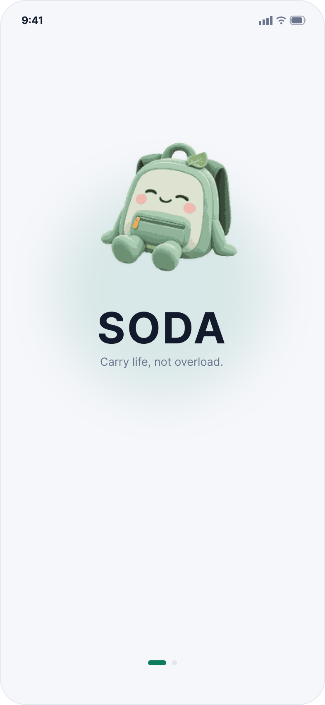<br><b>Splash</b></td>
<td>Opens the app.</td>
<td>Nothing. It passes.</td>
</tr>
<tr>
<td align="center">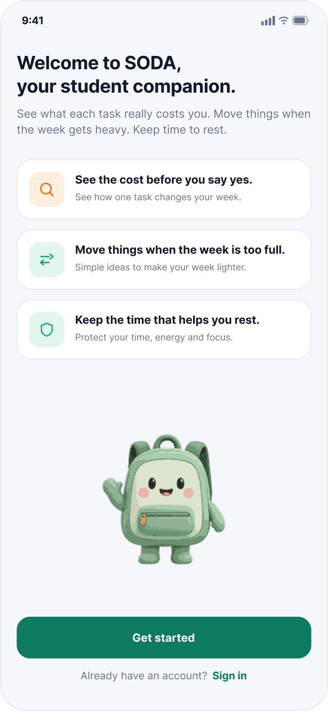<br><b>Welcome</b></td>
<td>Three lines explain the whole product: see the cost before you say yes, move things when the week is full, keep time to rest.</td>
<td>Taps <b>Get started</b>, or signs in.</td>
</tr>
<tr>
<td align="center"><br><b>Capacity Baseline</b></td>
<td>Four questions set the student's own limit: how a normal week feels, focus hours a day, rest kept a day, and whether they recover alone or with people.</td>
<td>Taps one answer per question, then <b>Continue</b>.</td>
</tr>
<tr>
<td align="center">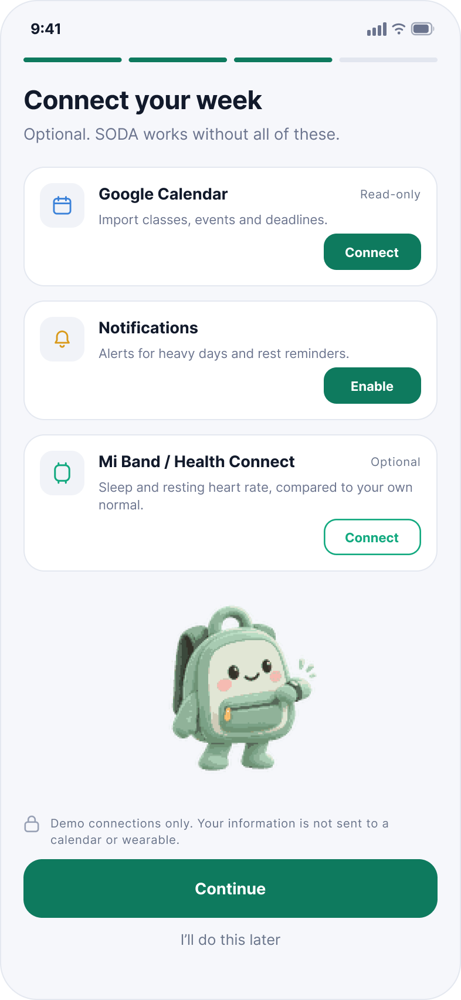<br><b>Connect Your Week</b></td>
<td>Offers calendar, notifications and a wearable. All three are optional and marked read-only.</td>
<td>Connects what they want, or taps <b>I'll do this later</b>.</td>
</tr>
<tr>
<td align="center"><br><b>Calendar Review</b></td>
<td>Shows the 14 imported tasks grouped by category before anything is calculated.</td>
<td>Checks the list, taps <b>Import &amp; continue</b>.</td>
</tr>
<tr>
<td align="center"><br><b>Home · day one</b></td>
<td>Capacity shows "—", not a number. SODA says the limit appears after two check-ins and shows only the calendar until then.</td>
<td>Starts a check-in, or just looks around.</td>
</tr>
</table>

Nothing is calculated from data the student has not seen. Skipping the
calendar still lands on a working Home.

---

**2. Adding a commitment: the core loop**

<table>
<tr>
<th width="210">Screen</th>
<th width="42%">What it does</th>
<th width="26%">What the student does</th>
</tr>
<tr>
<td align="center"><br><b>Home</b></td>
<td>Friday's estimated load at 82% (Heavy), the five parts of the load, the week chart, and a banner naming Wednesday as the day that breaks.</td>
<td>Taps the backpack in the tab bar.</td>
</tr>
<tr>
<td align="center"><br><b>Add</b></td>
<td>One screen. Chat field ready to type, a worked example to tap, and <b>Type it in yourself</b> to open the manual form in place.</td>
<td>Types a sentence, taps the example, or opens the form.</td>
</tr>
<tr>
<td align="center">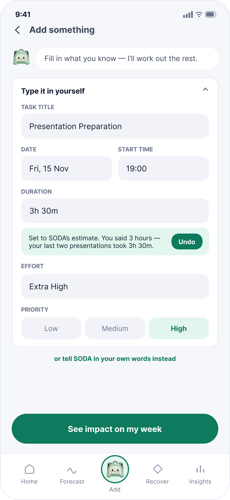<br><b>Add · manual</b></td>
<td>Title, date, time, duration, effort and priority. SODA's duration estimate is applied with a visible <b>Undo</b>.</td>
<td>Fills in what they know, sets priority, taps <b>See impact</b>.</td>
</tr>
<tr>
<td align="center">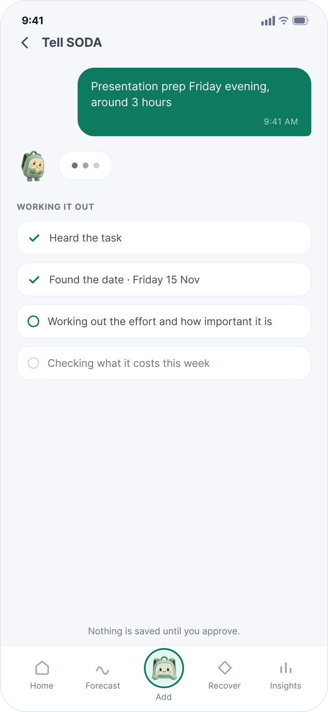<br><b>SODA is reading that</b></td>
<td>Shows its working, one line at a time: heard the task, found the date, worked out the effort and how important it is.</td>
<td>Waits. Nothing is saved yet.</td>
</tr>
<tr>
<td align="center">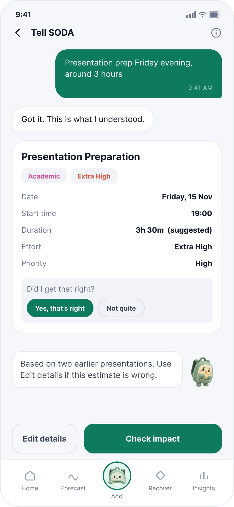<br><b>Tell SODA</b></td>
<td>States what it understood: Friday 15 Nov, 19:00, 3h 30m suggested, Extra High, priority High.</td>
<td>Taps <b>Yes, that's right</b>, or <b>Not quite</b> to correct it.</td>
</tr>
<tr>
<td align="center"><br><b>Impact Preview</b></td>
<td>The decision point. 82% → 112%, Mental 91% → 118%, Time 87% → 109%, rest time left 2h 10m → 25m, and the day that breaks is named.</td>
<td>Taps <b>Fix my week</b>, or <b>Accept anyway</b>.</td>
</tr>
<tr>
<td align="center"><br><b>Smart Rebalance</b></td>
<td>Three named moves, each with its priority and its effect. Low moves first; High only changes time and never gets cut.</td>
<td>Ticks the moves they accept, taps <b>Apply 2 changes</b>.</td>
</tr>
<tr>
<td align="center">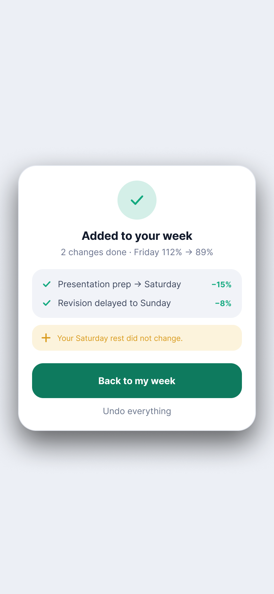<br><b>Changes applied</b></td>
<td>Confirms what changed: Presentation prep → Saturday (−15%), Revision delayed to Sunday (−8%), Friday 112% → 89%.</td>
<td>Taps <b>Back to my week</b>, or <b>Undo everything</b>.</td>
</tr>
<tr>
<td align="center"><br><b>Week Updated</b></td>
<td>The week after the fix, with Friday at 89% and Wednesday still at 104%, because fixing Friday did not fix Wednesday.</td>
<td>Taps <b>Back to my week</b>.</td>
</tr>
<tr>
<td align="center">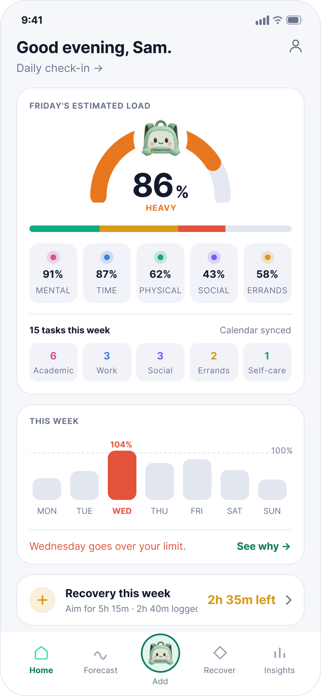<br><b>Home · after the fix</b></td>
<td>Home after the three-move route: 86%, 15 tasks, Friday under the limit. The two-move route ends at 89%; each has its own confirmation and Week Updated screen.</td>
<td>Carries on.</td>
</tr>
</table>

Manual entry skips the confirmation step, because the student typed the
details themselves. **Accept anyway** is a complete path too: it leads to
its own Home and Forecast, both still showing Friday over the limit.

---

**3. Fixing a day that is already overloaded**

<table>
<tr>
<th width="210">Screen</th>
<th width="42%">What it does</th>
<th width="26%">What the student does</th>
</tr>
<tr>
<td align="center"><br><b>Life Forecast</b></td>
<td>Seven days ahead. Wednesday is flagged at 104% OVERLOAD; Thursday is Heavy with a storm warning.</td>
<td>Taps Wednesday, or <b>Fix my Wednesday</b>.</td>
</tr>
<tr>
<td align="center"><br><b>Forecast Day Plan</b></td>
<td>What makes Wednesday heavy, task by task, with each one's share: Assignment Work +18%, Data Structures +12%, Part-time Shift +26%.</td>
<td>Taps <b>Fix Wednesday</b>.</td>
</tr>
<tr>
<td align="center"><br><b>Smart Rebalance · Wednesday</b></td>
<td>Two flexible moves bring 104% to 80%. The part-time shift is tagged fixed and is not touched; asking to swap it is a separate request.</td>
<td>Taps <b>Apply 2 changes</b>, or sends the swap request.</td>
</tr>
<tr>
<td align="center">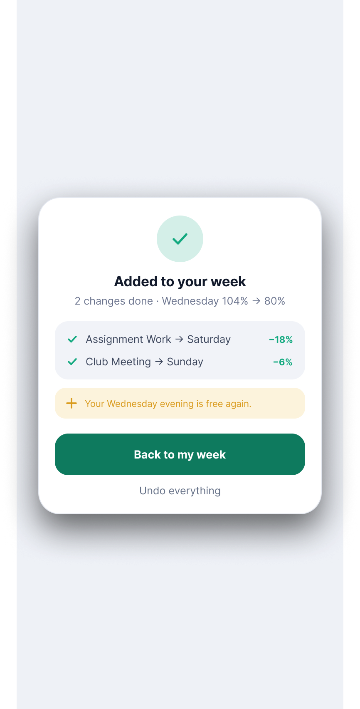<br><b>Changes applied</b></td>
<td>Assignment Work → Saturday (−18%), Club Meeting → Sunday (−6%), Wednesday 104% → 80%.</td>
<td>Taps <b>Back to my week</b>.</td>
</tr>
<tr>
<td align="center"><br><b>Week Updated · Wednesday</b></td>
<td>Wednesday now at 80%, the shift still 6h and marked unchanged.</td>
<td>Taps <b>Back to my week</b>.</td>
</tr>
<tr>
<td align="center">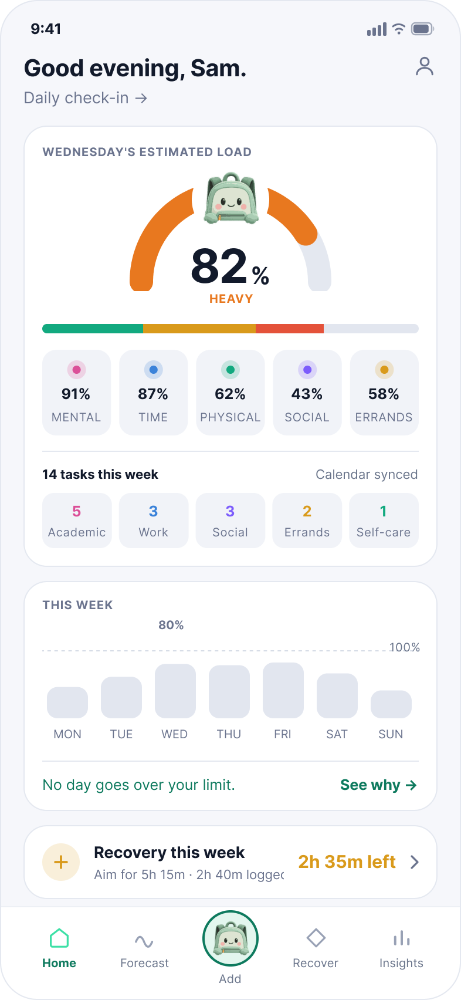<br><b>Home · after the fix</b></td>
<td>Home, day detail and forecast all show the fixed week, not the old numbers.</td>
<td>Carries on.</td>
</tr>
</table>

---

**4. Recovering owed rest**

<table>
<tr>
<th width="210">Screen</th>
<th width="42%">What it does</th>
<th width="26%">What the student does</th>
</tr>
<tr>
<td align="center"><br><b>Recover</b></td>
<td>Recovery debt of 2h 35m against a target of about 5h 15m a week, taken from the 30–60 minutes a day set at onboarding. States plainly that it is a planning signal, not a health score.</td>
<td>Taps <b>Enter Recovery Island</b>.</td>
</tr>
<tr>
<td align="center">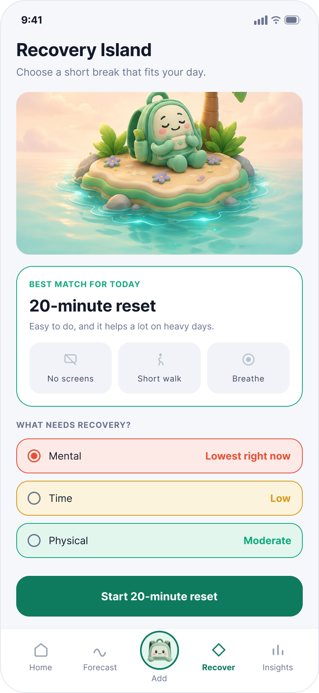<br><b>Recovery Island</b></td>
<td>Names what is actually low, Mental lowest and Social clear, and recommends one option.</td>
<td>Picks Physical, Time or Mental.</td>
</tr>
<tr>
<td align="center"><br><b>Recovery Island · type</b></td>
<td>One screen with all three types as tabs. Each option states the time it gives back.</td>
<td>Switches tabs, picks an option.</td>
</tr>
<tr>
<td align="center"><br><b>Recovery Timer</b></td>
<td>A 20-minute reset with nothing else on screen. Pause and end early both work.</td>
<td>Rests. Or pauses, or ends early.</td>
</tr>
<tr>
<td align="center"><br><b>Recovery Complete</b></td>
<td>Logs 20 minutes against the weekly target. Tasks stay unchanged. Ending early logs nothing.</td>
<td>Taps <b>Back to my week</b>, or logs how it felt.</td>
</tr>
<tr>
<td align="center">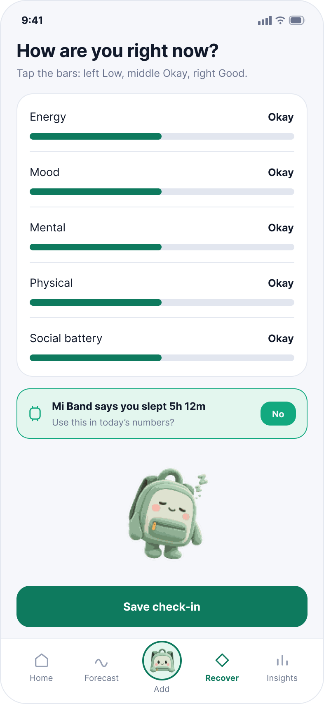<br><b>Daily Check-In</b></td>
<td>Five bars: energy, mood, mental, physical, social battery. Wearable sleep data is offered, not assumed.</td>
<td>Taps a level per bar, chooses whether to use the sleep figure, saves.</td>
</tr>
</table>

---

### Screens beyond the main route

84 screens in light mode, each mirrored in dark mode, 168 in total. The
[screen-by-screen walkthrough](#user-flow-end-to-end) further down covers the demo route in
order. These are the other screens that sit outside it: how SODA explains itself, and how it holds
together when something fails. Named
prototype starting points reach all of them without lengthening the main judging route.


**Explaining itself: insight, honesty and trust**

Insights → Body Signals → Settings → How SODA Calculates.

Insights shows the capacity trend, three pattern cards, and a weekly
review. The pattern cards use the same Time / Physical / Mental colours as
Recovery Island, so a student who sees a pink "Your mind fills up first"
card and then opens the pink Mental tab is following one colour through the
app. Body Signals has a version for students with no wearable, and Insights
has a version for students without enough data yet, and neither is an empty
screen with nothing in it.

How SODA Calculates is written for a sceptical reader. Each confirmed task
first produces a five-axis demand vector from its duration, effort and
category. SODA divides the accumulated demand by the student's corresponding
axis ceilings, then combines the result as `0.6 × the busiest axis + 0.4 ×
the weighted average of all five axes`. The visible explanation introduces
the task weights and assumptions; the versioned formula and reproducible
worked example are set out in full under [How the estimate works](#how-the-estimate-works).

| Insights | Body Signals | How SODA Calculates | The maths |
|---|---|---|---|
|  |  |  |  |

---

**When something fails**

A failure is a banner on the working screen, never a separate error page. The week the student last
saw stays where it is, the draft they were typing survives, and the app keeps accepting tasks. SODA
says what broke, what still works, and what it will do about it on its own.

| Calendar sync failed | Offline | Could not save |
|---|---|---|
| 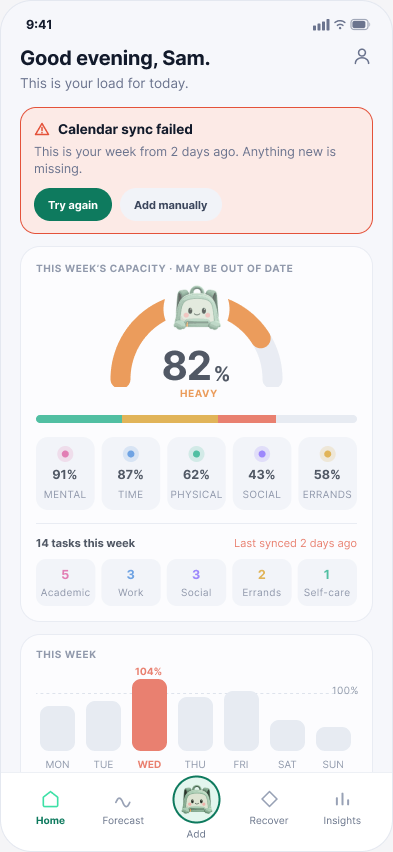 | 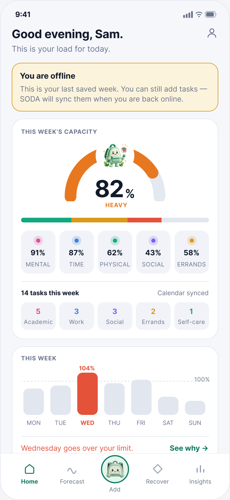 | 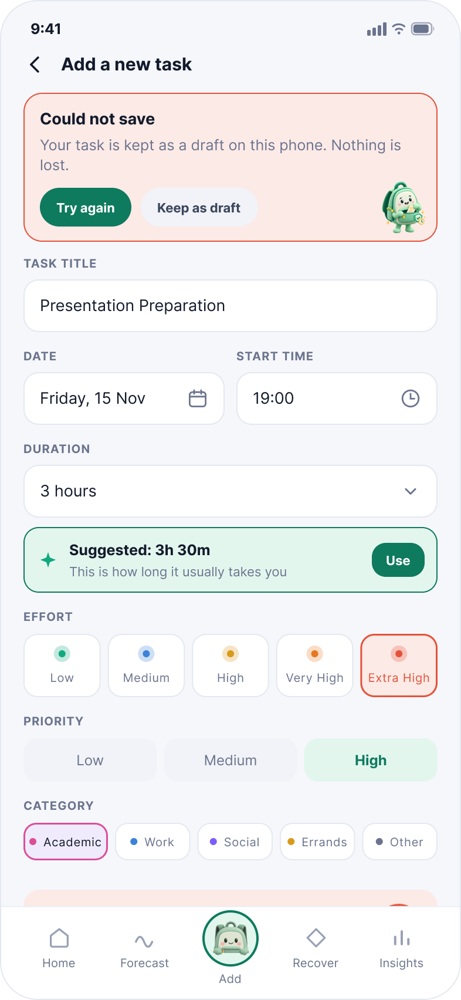 |

Offline is the clearest case: the banner reads *"This is your last saved week. You can still add tasks,
SODA will sync them when you are back online"*, and the whole week is still on screen behind it, 82%,
five axes and Wednesday at 104%. Nothing is hidden while the connection is missing, and nothing is
recalculated from data that did not arrive.

---

### Six friction points we designed around

1. **Being asked to choose a mode before you start.** The old Add flow made
   students pick "chat" or "manual" before typing anything. That screen was
   removed; both now live on one screen.
2. **Being told you are overloaded, with nothing to do about it.** Every
   over-limit state routes into a concrete set of changes with named tasks
   and stated percentages.
3. **Silent edits by the system.** When SODA changes a number, the screen
   says so, gives the reason from the student's own history, and offers
   Undo.
4. **Losing work when something fails.** Failures are banners, not dead
   ends. The draft survives; the last known week stays on screen.
5. **Rest feeling like one more task.** Recovery options run from two to
   twenty minutes and each states what it gives back, so resting is a
   decision with a visible payoff rather than an open-ended obligation.
6. **Reading when you are too tired to read.** Insights provides a
   four-sentence text summary that can be read at the student's own pace.

---

### Accessibility: what is designed, what is still unverified

**✅ Designed.** A full dark mode for every screen, with accent colours
re-picked rather than filtered. Insights includes a four-sentence text
summary for students who find the full charts tiring to read. The current
prototype does not play audio. Plain language is used throughout, with
numbers always paired with a word ("89%", "Heavy") so meaning never rests
on colour alone.
Category colour is consistent across Insights and Recovery Island, but
always carries a text label beside it.

**⚠️ Not yet verified.** Contrast ratios have not been measured against
WCAG AA. Screen-reader labels and reading order have not been authored, and
the prototype has not been tested with VoiceOver or TalkBack. Tap-target
sizes have not been audited. Dynamic type and reduced-motion settings are
not handled. The text summary is a fatigue-reduction feature, not a substitute
for assistive-technology support.


## 4. ✨ What Makes It Different

**Every other planner models the work. SODA models what the student has left.**

That is the whole difference. A task list answers *what do I have to do*. A calendar answers *when does it happen*. Neither answers the question a student actually asks at the moment a request arrives: *can I take this on, and what would have to change?* SODA is built to answer that one.

### Four things nobody else does

Each of these exists because one of the [three experiences](#three-core-experiences) needed it, not
as a feature added for its own sake.

| | The twist | Why it is unusual |
|---|---|---|
| **1** | **The simulation runs before the task is saved.** Impact Preview shows `82% → 112%`, the axes that move and the rest it costs, while the student can still walk away. Nothing is written. | Planners report overload after you have already agreed. Moving that information to the only moment it can change the answer is the product. |
| **2** | **Recovery debt survives the week.** Planned-versus-logged rest is carried across 28 completed days, so a shortfall from three weeks ago is still visible. Missing logs do not prove missing rest, extra rest does not erase an earlier daily shortfall, and the ledger never lowers the capacity baseline. | Every planner resets on Monday. Students do not. The ledger refuses to pretend the week is a clean slate, without turning rest into another score to chase. |
| **3** | **A paid shift is never quietly moved.** Commitments are tagged Fixed or Flexible. SODA will draft the message to a manager, but the swap shows as *waiting for your manager* and is excluded from the improvement total until approved. | Auto-schedulers treat every block as movable. A student who loses a shift loses income, so an unapproved swap is not an improvement. |
| **4** | **It learns how wrong the student's own estimates are.** Two taps after a task record whether it ran long and felt heavier; repeated answers within a category prompt an approved adjustment to future estimates. | Task managers record that something was completed, never whether the estimate was right, so they cannot correct the planning fallacy they inherit ([Buehler et al., 1994](https://doi.org/10.1037/0022-3514.67.3.366)). Repeated answers prompt an adjustment the student approves; this is not automated learning. |

### Comparison with existing solutions

The capability comparison is in [Section 1](#existing-approaches-and-the-remaining-opportunity). This one is narrower on purpose: it takes the single moment the club request arrives on Aina's Thursday and asks what each kind of tool would tell her. These are capability-level examples from public documentation, not a hands-on benchmark.

| Approach | What it would tell Aina when the request arrives | What SODA adds at that moment |
|---|---|---|
| Task-list view | The request and the assignment both exist, and the assignment is due Friday at noon. | That the request lands on the same two hours as the drafting, and what each of them costs across five kinds of demand rather than in hours alone. |
| Calendar / adaptive scheduling | Thursday 13:00 is double-booked, and laundry is the nearest flexible block. | Whether moving laundry still leaves the deadline reachable and the 20:30 recovery block intact, shown before anything is saved. |
| Self-care view | That she has not rested much this week. | The same recovery block sitting inside the plan she just approved, with the shortfall carried into next week instead of resetting. |

### What changes for the student

**Aina is a fictional working undergraduate.** On Thursday she has class from 09:00–11:00, laundry from 12:00–13:00, two hours of assignment drafting from 13:00–15:00, a fixed shift from 16:00–20:00 and protected recovery from 20:30–21:00. Her assignment is due Friday at noon. A club asks her to help on Thursday from 13:00–14:00.

| Experience | What Aina sees or does | Concrete outcome in this synthetic case |
|---|---|---|
| **My Backpack** | Reviews the combined demand and the commitments behind it. | Recognises that the new request competes with existing assignment work. |
| **Impact Preview** | Reviews moving laundry to an available Saturday slot and splitting drafting into 12:00–13:00 and 14:00–15:00. | Can accept with explicit changes: two drafting hours remain, the deadline is met, and class and shift do not move. |
| **Recovery Island** | Chooses a quiet reset for the protected interval and records completion when it happens. | Keeps 30 minutes available for recovery; the ledger distinguishes a plan from a completed action. |

The trade-off is explicit: **laundry moves to Saturday; it does not disappear from the week.** If laundry cannot move or the assignment cannot be split, that option is rejected. Aina can defer, decline or knowingly accept the conflict rather than receive an impossible “fixed” schedule.

This example establishes an intended decision path, not an observed benefit. It is deliberately a scheduling case rather than a scored one: it shows which commitment moves and what is preserved, and carries no load percentage, because a percentage needs a complete set of recorded inputs rather than the six commitments listed here. The same case is also run with laundry made immovable and splitting disallowed, where no feasible plan exists and SODA has to say so rather than move a fixed commitment.

**Why the mechanism is plausible:** Study Demands–Resources theory links demands, resources and proactive adjustment ([Bakker & Mostert, 2024](https://doi.org/10.1007/s10648-024-09940-8)). SODA brings those decisions together rather than leaving recovery separate from planning. The theory tells us the mechanism is worth building; only testing will tell us we built it well.

### The same week, with and without

The case above carries no percentage. The demo fixture is complete, so it can. This is the designed
path through it, not a measured outcome.

| | Without SODA | With SODA |
|---|---|---|
| **The decision** | Says yes. Finds out on Friday. | Sees `82% → 112%` and the rest it costs, before the task is saved. |
| **The overloaded day** | Friday runs over. Rest is the first thing dropped, because it is the only thing with no deadline. | Two approved moves bring Friday to `89%`, and the line confirms 1h 50m of rest is kept. |
| **The paid shift** | Shortened or skipped to make room, at a real cost to income. | Never proposed as a move. A swap needs the manager and is not counted until approved. |
| **The following Monday** | Starts clean. Three weeks of missed rest are invisible. | `2h 35m` is still on the Recover screen, against a 5h 15m weekly target. |

The claim is bounded. SODA does not prevent overload, and this shows a designed route rather than an
observed benefit. What it changes is when the student finds out, and whether anything can still be
done about it. Whether that holds outside a fixture is what the study below is for.

### What early feedback already changed

Before any structured testing we put the prototype in front of three people: a practising lawyer, an
HR professional, and a teammate who had not worked on the design. None of them is a target user and
we kept no task script or notes, so this is early reaction rather than evaluation. It was still the
first time anyone outside the team had to make sense of the screens without us talking over them.

One reaction recurred: **the first screen did not explain itself.**

| What they hit | What we changed | Where it shows |
|---|---|---|
| The capacity meter was read but not understood. They could see the percentage and the five areas, and some read the number as **task completion** rather than load carried. | Named the number and the band on the screen itself: *Friday's estimated load, 82%, Heavy*, with the five areas labelled beneath. | [Key screens](#user-flow-end-to-end), and the [display rules](#how-the-estimate-works) that define the band |
| Impact Preview caused hesitation. They could not tell whether it was showing information or asking them to decide. | Made the decision explicit rather than implied. The primary action is **Fix my week**, with **Accept anyway** beside it as a real alternative. | The Impact Preview and Smart Rebalance rows in the walkthrough |
| Smart Rebalance felt unfinished. They expected to see which task had actually moved and did not. | Added a confirmation that lists every change and its effect: *Presentation prep to Saturday, −15%. Revision to Sunday, −8%. Friday 112% to 89%.* | The Changes applied screen |

One reaction we have **not** acted on: two of them could not say why My Backpack and Life Forecast are
separate screens. That is a real question about whether the week view earns its place, and it is open.

This is not a usability study. Three people, two of them outside the target group, no task script and
no recorded notes. It tells us where first-time understanding broke, not whether the loop works. That
is what the study below is for.

### How we would evaluate it

First, recruit **8 consenting students** who combine coursework with work, leadership or caring. Compare a calendar-only task with a SODA task using two matched synthetic weeks. Counterbalance the interface order and week assignment to reduce practice effects. Ask students to identify pressure, explain the estimate and choose a feasible response.

| Question | Proposed first-study gate | What would challenge the design |
|---|---|---|
| Can students use the core loop? | At least 6 of 8 complete it without help. | Repeated confusion, abandoned entry or unusable suggestions. |
| Do they understand the percentage? | At least 6 of 8 explain that it depends on recorded tasks and assumptions. | Treating it as a health measurement or overlooking missing commitments. |
| Are the changes actually feasible? | Zero approved changes violate a fixed event, deadline or protected block. | Any constraint breach blocks release. |
| Does the preview support a decision? | Record accept/modify/defer/decline choices and participants' reasons. | Students cannot explain the trade-off or find the information irrelevant. |

A later longitudinal evaluation would track estimate overruns, completed recovery, missed commitments and continued use during busy periods. Lower model scores alone are insufficient: they can result from missing tasks or a changed baseline. **Neither study has been run.**

### Reach and scalability

Start with students at one campus through societies and student-support channels. Expand to other universities only after checking that the workflow remains useful across different timetables and assessment patterns. Supporting postgraduate or early-career users would require revalidating the assumptions, not simply changing the labels. Institutional analytics are outside the first build and would require separate consent and governance; individual wellbeing records are not a default institutional data source.

---

## 5. 🔧 Technical Architecture & Feasibility

### Tech stack

The proposed build uses **Flutter → FastAPI → Supabase**, with a pure Python calculation engine. The main workflow must work with language assistance disabled.

| Component | Selection and reason | Constraint we plan for |
|---|---|---|
| **Flutter / Dart** | Shared Android and web UI; custom workload visuals. | Test layout, permissions and accessibility on each target. |
| **Riverpod + fl_chart** | Separate application state from widgets; common charts plus a custom Backpack visual. | Charts need readable text values and semantic labels, not colour alone. |
| **FastAPI + Python** | Validated API requests and deterministic calculations using the same confirmed inputs. | Fresh previews require the server; model assumptions require evaluation. |
| **Supabase Auth + PostgreSQL** | Authentication and user-owned data with Row Level Security. | Free-tier limits and inactivity pausing; verify isolation with two accounts. |
| **Google Calendar API** | Optional read-only event import to reduce repeated entry. | OAuth, deduplication and student review; imported events lack effort information. |
| **Drift / SQLite** | Client cache and structured draft queue. | Mark stale results; recalculate after reconnect before applying a plan. |
| **Firebase Hosting + Railway** | Host the Flutter web build and FastAPI service respectively. | Provider quotas, backend usage costs and network availability. |
| **Optional Gemini / local Ollama** | Synthetic task-entry demonstrations; Ollama `qwen3:4b` remains a local experiment. | No real student text in the external demo adapter; no model-generated load scores. |

### System architecture

<p align="center">
  
</p>

*Figure 5.2: Logical components and data hand-offs. FastAPI mediates database access; the engine itself has no network calls. The dashed outlines group components rather than indicating optional connections.*

**A preview request, end to end:** the app sends a confirmed candidate and user token to FastAPI; the API reads the authorised schedule and capacity; Python simulates the before/after result; the app displays it without saving a task. A separate approval saves the candidate and selected adjustments atomically against the schedule revision. If the schedule changed, the student receives a fresh preview instead of overwriting newer edits.

**Language boundary:** the diagram's “ONE sentence” refers to an allowlisted synthetic example for the optional Gemini demonstration. Real student entry uses structured fields or server rules. Gemini's unpaid terms exclude personal or sensitive submissions, so a small payload alone would not make real task text suitable. The adapter remains disabled unless the demo's audience, region and provider access are eligible. [Gemini API terms](https://ai.google.dev/gemini-api/terms)

**Offline boundary:** cached views and drafts remain available with their last-update time. The client cannot produce a fresh Python preview or safely apply an old rebalance while disconnected. Local notifications are an Android implementation task; web behaviour requires separate testing.

### How the estimate works

1. **Describe the task:** duration, effort and category produce a five-axis demand vector. A priority of Low, Medium or High is recorded at the same time but is deliberately kept out of this step, so calling something important can never inflate its load figure.
2. **Set the baseline:** onboarding supplies an editable focus budget and relative capacity assumptions. Check-ins do not silently reduce capacity.
3. **Compare demand with capacity:** combine the axis utilisation values into a daily planning estimate while preserving separate axis warnings.
4. **Simulate a change:** recalculate the candidate and any proposed moves across the week; check actual time overlaps independently of weighted demand. This is the only step that reads priority: fixed and completed commitments are excluded, and feasible Low-priority work is considered before Medium and High.

**The arithmetic, in full.** Every figure in the app comes from this. Nothing is learned or inferred.

```
effort multiplier          Low 0.6      Medium 1.0     High 1.4

category weight w[c]       (mental, time, physical, social, errands)
  Academic                 (0.55, 0.30, 0.05, 0.05, 0.05)
  Work                     (0.25, 0.35, 0.25, 0.10, 0.05)
  Social                   (0.10, 0.25, 0.10, 0.50, 0.05)
  Errands                  (0.10, 0.30, 0.25, 0.05, 0.30)

task demand                L = duration x effort x w[c]        (load-hours per axis)
day demand                 L_day = sum of L over that day's tasks

capacity ceiling           C = B x H x k
  B  baseline              Light 1.15 | Moderate 1.00 | Heavy 0.85
  H  focus budget          3 / 5 / 7 / 8 hours, editable
  k  relative axis ceiling (0.40, 0.40, 0.25, 0.25, 0.20)

axis utilisation           U = L_day / C
day estimate               100 x ( 0.6 x max(U) + 0.4 x sum(lambda x U) )
  lambda                   (0.30, 0.30, 0.15, 0.15, 0.10)
```

The `max` term lets one saturated axis dominate a day, because a student whose mental load is at 118%
is not fine merely because their physical load is low. It does **not** guarantee the blended figure
passes 90%, so any axis reaching 100% raises its own warning rather than hiding behind the total.

**Worked example you can check on paper.** Baseline Moderate, focus budget 5 hours, so
`C = (2, 2, 1.25, 1.25, 1)`. A three-hour high-effort Academic task contributes
`3 x 1.4 x (0.55, 0.30, 0.05, 0.05, 0.05) = (2.31, 1.26, 0.21, 0.21, 0.21)`, giving
`U = (1.155, 0.63, 0.168, 0.168, 0.21)` and a day estimate of **93.576%, displayed as 94%**. Add one
hour of medium-effort errands and it becomes **101.616%, displayed as 102%**, with a mental-axis
warning at 120.5%. The same confirmed inputs, capacity, timezone and model version always reproduce
the same number.

| Display rule | Meaning |
|---|---|
| **Light / Manageable / Heavy / Overload** | Respectively below 50%, 50–<70%, 70–<90%, and 90% or more, classified before rounding. |
| **Any axis reaches 100%** | Show its own warning even if the combined score is below the overload threshold. |
| **Peak day this week** | Maximum daily estimate in the displayed week, not a weekly average. |
| **Recovery Debt** | Duration of planned-versus-logged shortfalls over 28 completed local days; overlaps count once and history coverage is visible. |
| **Weekly recovery target** | An editable starting value of 5h 15m, from 45 minutes a day under the Moderate baseline. Shown beside Recovery Debt as a planning default, never as advice about how much rest a person needs. |
| **Task priority** | Low, Medium or High. It orders what Smart Rebalance may move and never enters the load calculation, so the two cannot be confused. |

These are proposed planning rules. Recovery Debt does not lower the capacity baseline, and low social demand does not imply loneliness. Recovery choices follow explicit preferences and context.

### Build plan & scope

**The three-week goal is a complete path through the three main experiences:** My Backpack → Impact Preview with feasible adjustments → Recovery Island with a completed recovery record.

Product hierarchy and build priority are different. Task entry, Smart Rebalance and recovery logging are supporting functions, but the core experience cannot work without them. The first release includes a small, usable Recovery Island; more activity choices can follow.

| Priority | Building-phase scope |
|---|---|
| **Must** | Authenticated manual entry; five-axis model and My Backpack; Impact Preview; Protection Mode; constrained Smart Rebalance with safe undo; a basic Recovery Island with recovery choice, protected time, completion logging and Debt; text alternatives; synthetic demo data. |
| **Should** | Calendar review; richer Life Forecast; Daily Check-in; Reality Check Lite; expanded Recovery Island choices and guided timer; offline drafts and local notifications. |
| **Could** | Optional language demonstration, expanded Insights and additional recovery content. |
| **Outside this build** | Friend circle, university dashboard, clinical assessment, and the wearable connection. Body Signals is designed and shown in the prototype, but the three-week build ships its no-wearable version; the Mi Band screens are design intent, not scope. |

<p align="center">
  
</p>

*Figure 5.3: Four workstreams, one named owner each, and a gate at the end of every week that can be demonstrated rather than reported. The hours are planning estimates, not recorded time.*

**Cut order:** optional language → extra Insights/content → Reality Check Lite → calendar import and enhanced offline sync. Preserve all three main experiences, including their required task entry, feasible adjustments and recovery logging. A schedule with no feasible improvement must be handled honestly rather than treated as a failed demo.

### Minimum completion standard

| Main experience | Must be demonstrable | Failure state that must also work |
|---|---|---|
| **My Backpack** | A confirmed task appears in the breakdown; editing its inputs updates the estimate; coverage and assumptions are readable. | Missing data and dated offline results are visibly labelled. |
| **Impact Preview** | Preview saves nothing; approval applies the candidate and selected feasible changes together; safe undo is available. | No-feasible-plan, stale approval and conflicting undo are explained without overwriting newer work. |
| **Recovery Island** | Select an action, protect its time, record completion once and see the recovery history update. | Cancellation does not count as recovery; overlapping or retried logs do not inflate it. |

These are build acceptance criteria, not completed tests. Prototype screens illustrate the states; executed fixtures and integration checks must establish the behaviour during the build.

### Team, time and cost

The building-phase responsibilities give each member a defined implementation or verification workstream.

| Team Member | Primary Responsibility | Key Deliverables |
|---|---|---|
| **Samantha Chan Pei Yin** | **Recovery Island Development & Submission Integration** | Develop the recovery activity selection, protected-time and completion-recording interfaces; integrate Recovery Debt data with the backend; coordinate the final README, slides and demonstration using contributions from all members. |
| **Lee Jia Yin** | **Frontend Development & UI/UX** | Build shared Flutter components and navigation, task-entry screens, My Backpack and Impact Preview interfaces; maintain consistency with the Figma design and implement accessible interaction states. |
| **Yeap Boon Shen** | **Backend Development & Calculation Engine** | Implement the five-dimensional load model, database and APIs, Impact Preview calculations, Smart Rebalance constraints, recovery data services, and safe save/undo behaviour. |
| **Muhammad Ikhlas bin Mohd Faizal** | **Testing & Quality Assurance** | Prepare test plans and synthetic data; perform functional, integration and regression testing; verify calculation outputs, scheduling constraints and account isolation; track defects, retest fixes and validate the complete demonstration flow. |

**Shared responsibility:** each developer checks and fixes their own module. Ikhlas coordinates independent QA throughout all three weeks, rather than receiving the entire testing workload at the end. Every member supplies and verifies their own technical or design content for the submission; Samantha coordinates the final assembly.

The building-phase estimate remains **120 additional team hours**: backend 36, frontend 36, UX/accessibility 18, integration/testing 18 and contingency 12. These are planning estimates, not recorded hours or equal allocations per member. Frontend work is shared between Samantha and Jia Yin; actual capacity is reviewed at kickoff, and optional scope is reduced if necessary. Independent verification runs in all three weeks rather than arriving at the end: Ikhlas agrees acceptance cases in week one, regression-tests the decision loop in week two, and runs the accessibility and no-AI rehearsal in week three.

| Resource | Demo budget and constraint |
|---|---|
| Open-source app/backend libraries | USD 0 licence budget. |
| Supabase Free | USD 0 within quotas; 500 MB database allowance per project and inactivity pausing. [Current plan](https://supabase.com/pricing) |
| Firebase Hosting | USD 0 within free quotas: 10 GB storage and 10 GB monthly transfer. [Hosting quotas](https://firebase.google.com/docs/hosting/usage-quotas-pricing) |
| Railway Hobby | USD 5 monthly minimum including USD 5 usage; additional metered usage can increase the bill. [Pricing](https://docs.railway.com/pricing) |
| Figma / optional language demo | Education access and unpaid API use depend on eligibility; language assistance can be disabled. |
| **Planning allowance** | **USD 5–10/month for a small hosted demo**, subject to actual usage, taxes and quotas. This is not a measured bill or a spending cap. |

The current Figma prototype does not require these deployments. Provider terms and quotas must be checked again at integration; the Python backend budget excludes hosted local-model inference.

### Risks and release gates

| Risk | Required response before the build demo |
|---|---|
| **Misleading or inconsistent estimates** | Reproduce versioned fixtures, check threshold labels and expose missing input coverage. Illustrative screen values are replaced by computed results before any figure is presented as live. |
| **Impossible or stale adjustments** | Preserve fixed tasks, deadlines and protected intervals; check destination days, atomic apply and safe undo. A constraint breach blocks release. |
| **Exposed personal records** | Validate user tokens; enforce RLS for reads and writes; test isolation with a second account. Keep service-role keys outside normal user requests. |
| **Missing logs or duplicate imports** | Show recovery history coverage, count overlapping recovery once and deduplicate calendar events. |
| **AI, network or hosting failure** | Complete the main loop without AI; label cached views; test on another network and prepare a backup recording. |
| **Entry or accessibility friction** | Test core actions with target students, keyboard and TalkBack; expose chart values and severity in text. |

### Data handling

Sign-in and cross-device sync require a database, so the data question has to be answered before the
build, not after.

| Area | What SODA does |
|---|---|
| **Stored** | Account identifier and email; tasks and deadlines; category, estimated duration, effort and priority; the five load values; check-in answers; recovery history; completion feedback. If, and only if, the student connects a wearable, the daily sleep and activity summaries it exposes through Health Connect, kept as daily figures compared against that student's own recent normal. |
| **Never collected** | Contact lists, message content, precise location, continuous sensor streams or heart-rate traces from a wearable, medical diagnoses, or anything belonging to another person. Calendar import takes title, date and times only, never descriptions, attendees or locations. |
| **Protected by** | Supabase Auth with Row Level Security on every user-owned table, so a policy at the database refuses cross-account reads and writes. Service-role keys stay server-side and are never used for a normal user request. Isolation is tested with a second account before release. |
| **Student controls** | Disconnect the calendar or the wearable, correct any value, export the record, delete the account and its data. Body Signals keeps a full version for students who connect nothing. |
| **Never leaves the backend** | Student-written text. The optional language demo resolves a fixed synthetic example on the server, so free-form entry never reaches an external model, and no schedule, check-in or load figure is ever sent to one. |

These practices are guided by Malaysia's seven Personal Data Protection Principles: general, notice and
choice, disclosure, security, retention, data integrity, and access. We state that the design is guided
by them rather than claiming legal compliance, which would need a proper legal and security review.

#### What sign-in and cross-device sync mean for student data

Sign-in is required only when a student wants account recovery or cross-device synchronisation. Supabase Auth handles authentication, so SODA's application tables do not store passwords. Each backend request must carry a signed user token whose issuer, audience, signature and expiry are validated before any student-owned record is read or changed.

Cross-device sync necessarily uploads the data listed in the table above, so it would be inaccurate to claim that no personal or potentially sensitive information reaches the database. What SODA does instead is minimise it: that table is the complete set of fields it asks for, and nothing outside it is collected in order to make the estimate work.

“Sanitised” does not mean that a record becomes anonymous. Before storage, the backend validates data against an allowlist of accepted categories, effort and priority values; checks text-length, date, time and duration limits; rejects unexpected fields; and uses parameterised database operations rather than constructing SQL from student input. Text is safely encoded when displayed, and task bodies are excluded from infrastructure logs. These controls reduce malformed-input, injection and accidental-logging risks but do not remove the personal nature of a student's schedule.

Beyond the Row Level Security described above, transport must use HTTPS and stored data and backups must use the hosting provider's encryption controls. Release is blocked until two-account isolation, deletion, export, retention and recovery-from-backup behaviour have all been tested.

A 2024 systematic review covering 33 studies found that privacy, confidentiality and security concerns affected users' perceptions and adoption of mobile health applications. It particularly emphasised explaining what data are collected and why, alongside implementing technical safeguards ([Alhammad et al., 2024](https://doi.org/10.2196/50715)). SODA therefore communicates both its safeguards and their limits rather than claiming that sanitisation alone guarantees privacy or legal compliance.

**Safeguarding.** SODA never contacts another person on a student's behalf. Doing so automatically would
create consent and duty-of-care obligations we are not equipped to carry, so lecturers, employers and
family are never notified about a student's load. Students needing support beyond planning are pointed to
appropriate services without any diagnostic claim. Any future emergency-contact feature would require
explicit opt-in, defined escalation rules and review by qualified student-support staff.

### Supporting detail

The essential case is above. These documents retain the material needed to examine the proposal more closely:

- [Demonstration and validation pack](docs/DEMO-AND-VALIDATION.md): the shared case, team responsibilities, the evidence to capture for each experience, and an unfilled participant observation sheet.
- [Research, evaluation and references](docs/EVIDENCE.md): research-to-design mapping, proposed measures, stakeholder context and source list.
- [Calculation and architecture specification](docs/MODEL.md): formulas, worked example, recovery rules, constrained adjustments and language modes.
- [Build specification](docs/BUILD.md): proposed repository layout, starter SQL/RLS, API contracts, fixtures and integration checks.

---

<div align="center">

**SODA: Carry life, not overload.**

Built for CodeNection 2026 · Lifestyle Track: Beating the Burnout

</div>
