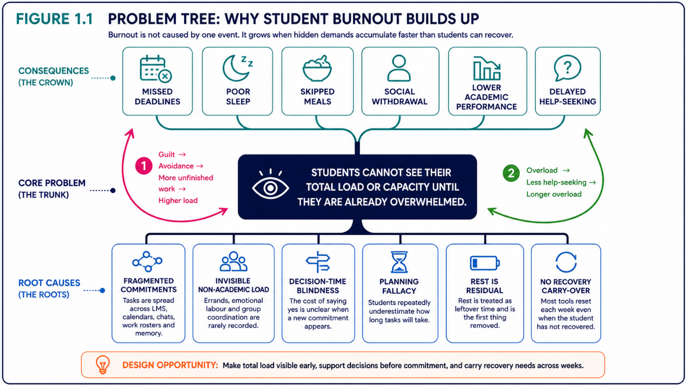
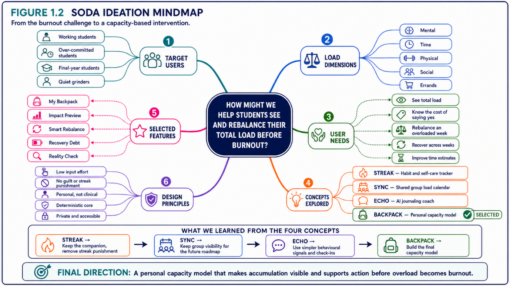
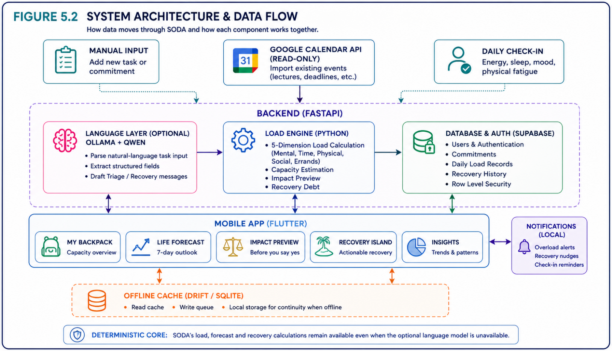

# SODA CodeNection

Complete Markdown conversion of `SODA CodeNection (revised).docx`.

# SODA (Student Overloaded by Deadlines and Activities) by Soda

Team: SAMANTHA CHAN PEI YIN, LEE JIA YIN, YEAP BOON SHEN, IKHLAS FULL NAME

Problem Statement: [Stress & Workload Manager]

Video Presentation: [Unlisted Youtube Link]

Presentation Slides: [Public Link]

# Executive Summary

Keep this first, but write it last. Include:

- Problem

- Target users

- Solution

- Originality

- Current build status

- Expected impact

University students rarely collapse from one thing. They collapse from an accumulation nobody is measuring — coursework, a shift job, a committee role, errands, and the quiet cost of never resting, all landing in the same week. Every tool a student already owns measures one slice of that: tasks, or hours, or mood. None of them measures capacity, and none intervenes at the moment the damage is done — the moment of saying yes to one more thing.

SODA models every commitment as a five-dimensional load — mental, time, physical, social and errands — against a capacity ceiling the app learns from the individual student. It shows what they are carrying, forecasts where the week breaks, and then does three things nothing else on the market does: it simulates a commitment before it is accepted, it tracks recovery debt that carries across weeks instead of resetting every Monday, and it learns how far each student underestimates their own tasks and corrects the forecast accordingly.

Build status. Live: the load model, capacity meter, task capture, Life Forecast, Impact Preview, Smart Rebalance, Recovery Debt and Reality Check — deployed as a hosted web app and an Android APK running against a cloud API, not a local build. Planned: the friend circle, faculty-level cohort analytics and a Wear OS companion, each listed in §6.1 with the reason it sits outside the build window.

Our claim is deliberately bounded. SODA does not prevent burnout. It makes accumulation visible and actionable weeks earlier than a student would otherwise notice, which is the point at which the burnout literature says intervention is cheapest. Section 7 sets out the mechanism, the modelled effect, and the results that would prove us wrong.

# Section 1 - Ideation

## 1.1 Problem Exploration and Root Cause Analysis

The challenge brief describes student burnout as an accumulation problem. Students manage coursework, employment, social commitments, errands, and recovery at the same time. These demands can build up together, making the overall workload difficult to manage. Research similarly identifies academic stress as a combination of pressures and highlights how workload affects students’ wellbeing and learning experiences (Iqra, 2024; Thornby et al., 2023).

We therefore ponder the question: why can overload build up before students recognise that their week is becoming unmanageable? This separates the demands students face from the outcomes they may experience. Study overload and burnout are related but distinct concepts; a busy schedule alone does not establish that a student is experiencing burnout (Carmona-Halty et al., 2024).

Our exploration identified a gap between knowing individual commitments and understanding their combined demands. A student may remember every assignment, work shift, and society activity but still struggle to judge whether they have enough time and energy for all of them. Research on student workload reinforces the importance of examining both its amount and distribution, rather than considering tasks separately (Thornby et al., 2023).

Hence, SODA’s focus is defined as a workload visibility and decision-making problem. Time management, motivation, and mood awareness may help, but students also need to understand how accepting, postponing, or removing a commitment changes the rest of their week.

Figure 1.1: The problem tree explaining main causes of student overload.

Figure 1.1 groups the contributing factors into six areas:

- Fragmented commitments: tasks are spread across different systems.

- Unrecorded responsibilities: errands and other non-academic demands are easily overlooked.

- Underestimated duration: tasks take longer than the schedule allows.

- Unclear commitment costs: students accept new tasks without seeing their combined impact.

- Postponed recovery: rest is reduced when other demands appear more urgent.

- Accumulated recovery needs: missed rest carries into the following weeks.

Together, these factors can make it difficult to recognise an overloaded week while there is still time to adjust it. This matters because perceived heavy workload is associated with students’ learning behaviour and wellbeing (Thornby et al., 2023).

The diagram also proposes two reinforcing cycles. In the avoidance cycle, growing workload may encourage avoidance, leaving more unfinished work and increasing the load further. In the help-seeking cycle, continued overload may make it harder to seek support, allowing difficulties to persist. These are design hypotheses to investigate, rather than relationships already established through SODA’s testing.

The resulting design direction is straightforward: help students see their combined workload, preview a new commitment before accepting it, and identify practical adjustments and recovery opportunities while they still have choices.

## 1.2 Stakeholders and User Needs

### Primary Users

SODA’s primary users are undergraduates balancing coursework with at least one substantial responsibility outside class, such as paid work, society leadership, structured sport, or caring duties. These students must manage both fixed and flexible commitments, so reducing their workload is not always as simple as cancelling an activity.

We identified four workload patterns: working students, over-committed students, final-year students, and quiet grinders. These names match the ideation mindmap in Section 1.3. They describe situations rather than fixed personality types; one student may belong to several groups.

| User Segment | Typical Situations | Decision they need help with | Relevant SODA feature |
| --- | --- | --- | --- |
| Working students | Coursework must fit around paid shifts. | “Which day is becoming too full, and what can I move?” | Life Forecast and Smart Rebalance |
| Over-committed students | Meetings and requests accumulate across groups. | “What changes if I agree to this?” | Impact Preview |
| Final-year students | An open-ended project competes with other deadlines. | “Have I allowed enough time, and where is the pressure building?” | Editable task estimates and Life Forecast |
| Quiet grinders | Most tasks get completed, but rest is repeatedly postponed. | “How much recovery have I been putting off?” | Recovery Debt and Recovery Island |

Table 1.1: Primary users.

Research supports considering how academic workload interacts with other parts of student life. In a qualitative study of 209 university students, academic workload was the most frequently identified influence on daily wellbeing and was connected to academic stress, social isolation, and study–life balance (O’Keeffe et al., 2025). This informed SODA’s decision to include academic and non-academic demands in the same overview.

The Study Demands–Resources framework also explains student wellbeing through the interaction between demands, available resources, and student behaviours (Bakker & Mostert, 2024). For SODA, this means considering opportunities for adjustment and recovery alongside the tasks a student needs to complete.

### Other Stakeholders

Although the student is the direct user, workload difficulties can affect people around them.

| Stakeholder | Relevant Need | Relationship to the proposed solution |
| --- | --- | --- |
| Group project teammates | Reliable contributions and early notice of difficulties | Could benefit from earlier conversations about task allocation. |
| Lecturers and tutors | Participation, progress, and timely communication | Could benefit when students recognise conflicts before requesting last-minute adjustments. |
| Part-time employers | Predictable availability and shift coverage | Could benefit from earlier scheduling discussions. |
| Friends, housemates, and family | Connection and awareness of the student’s circumstances | May support recovery or practical adjustments when the student chooses to involve them. |
| Campus support services | Appropriate support for students experiencing difficulties | Provide help beyond SODA’s planning role. |
| Universities | Student engagement and continuation | Potential partners for future evaluation. |

Table 1.2: Other stakeholders.

Research on an ACT-based university course found changes in time and effort management alongside changes in study-burnout risk (Räihä et al., 2024). This supports investigating planning behaviours, although it does not establish the effectiveness of SODA or Reality Check.

A fifth requirement, Reality Check, is also identified, whereby students are asked to compare a task’s duration and effort with their expectations, then confirms their responses. This demonstrates how feedback would be collected; its effect on future estimates still requires implementation and evaluation.

Together, these requirements keep SODA focused on one purpose: help students understand their workload, consider the effect of another commitment, and choose feasible adjustments. SODA is a planning and decision-support tool, not a clinical or crisis service. Students needing professional support require appropriate services beyond the app.

## 1.3 Ideation Mindmap

After understanding the root causes, we explored the problem from different directions. We considered the target users, their different types of load, their main needs, possible product concepts and important design principles.

The mindmap begins with one question: “How might we help students see and rebalance their total load before burnout?”

We identified four main user groups: working students, over-committed students, final-year students and quiet grinders. Although their situations are different, they all experience a combination of mental, time, physical, social and errand load.

The team explored four possible concepts. Streak was a habit and self-care tracker. Sync was a shared group load calendar. Echo was an AI journaling coach. Backpack was a personal capacity model.

Backpack was selected because it addressed the main problem directly. It could show everything the student was carrying and compare it with their personal capacity. However, useful ideas from the other concepts were not completely discarded. The companion idea from Streak was retained without guilt-based rewards. Group visibility from Sync was moved to the future roadmap. Echo influenced the use of simple check-ins and behavioural signals.

These ideas were combined into SODA’s main features: My Backpack, Impact Preview, Smart Rebalance, Recovery Debt and Reality Check. The final concept follows five principles: low input effort, no guilt-based punishment, personal rather than clinical guidance, deterministic calculations, and strong privacy and accessibility.

### 1.3.1 From the Selected Idea to the User Flow

After selecting the Backpack concept, we converted it into a complete user journey. The purpose was to make sure that SODA would not only display information but would also help students make a decision and take action.

The user journey begins when the student enters a task, imports a calendar event or completes a daily check-in. SODA then calculates the student’s five-dimensional load, personal capacity and recovery balance.

The student can understand the result through My Backpack and Life Forecast. When a new commitment appears, Impact Preview shows what may happen before the task is added. If the commitment fits within the student’s capacity, it can be accepted. If it creates overload, the student can decline it or use Smart Rebalance to move, reduce or remove a lower-priority task.

SODA then recommends a suitable recovery action and records any remaining Recovery Debt. Finally, Reality Check compares the student’s estimated and actual task duration. This information is returned to the calculation stage to improve future estimates.

Together, the three diagrams show the complete ideation process:

Problem Tree → Ideation Mindmap → Core User Flow

The problem tree explains why the problem happens. The mindmap shows the different solutions considered. The user flow demonstrates how the selected idea became a practical product experience.

## 1.4 Alternative Concepts and Breadth of Exploration

Before selecting SODA, the team explored four distinct approaches: personal capacity modelling, habit reinforcement, group coordination, and reflective journaling.

We compared them against five criteria: fit to the challenge, relevance to the root problem, originality, feasibility, and ease of demonstration. The table lists the selected concept first and explains which elements of the other ideas were retained.

| Idea | Why It Was Kept or Dropped |
| --- | --- |
| Backpack — Chosen as the core concept | Models combined demands across mental, time, physical, social, and errand areas against a personal capacity estimate. It most directly addressed the identified need: understanding total workload and checking the effect of another commitment before accepting it. Its main challenge is making the estimates understandable and useful despite incomplete or uncertain inputs. |
| Streak — Companion retained; reward system dropped | Proposed a habit and self-care tracker with streaks, XP, badges, and a companion. The companion was retained to communicate workload visually. The reward system was dropped because rewarding uninterrupted participation could conflict with allowing students to rest or step away without losing progress. |
| Sync — Deferred to the roadmap | Proposed a shared calendar for group availability and task distribution. It could support project teams and societies, but its value depended on multiple users participating. Sharing permissions, synchronisation, and privacy requirements also increased the scope. The team prioritised individual workload decisions and retained group visibility as a possible future extension. |
| Echo — Brief check-ins retained; journaling approach dropped | Proposed an AI journaling coach using written reflections and prompts. It could support self-awareness but did not directly show which commitments could change. The team also anticipated that repeated writing could burden already-overloaded students. Brief check-ins were retained as a simpler way to collect personal feedback. |

Table 1.3: Initial idea concepts
 

Why Backpack Was Selected

Backpack offered the clearest connection between understanding the problem and taking action. A student could view their combined workload, preview a proposed task, and consider adjustments before confirming it. This became the foundation for My Backpack, Impact Preview, and Smart Rebalance.

The choice also involved a trade-off. A personal capacity estimate is more difficult to justify than a task list or calendar. SODA therefore needs transparent calculations, editable inputs, and clear explanations of uncertainty. Selecting Backpack meant accepting this challenge because its proposed benefit matched the problem more closely.

How the Ideas Became SODA

The final concept combined Backpack’s workload model with selected elements from the alternatives:

- Backpack provided the core workload overview and decision support.

- Streak contributed the visual companion, without streaks or penalties for absence.

- Echo informed brief check-ins that support reflection without requiring continuous journaling.

- Sync remained a future direction for collaborative workload visibility.

This exploration shaped both what SODA includes and what it leaves out. The resulting concept focuses on a practical sequence: understand the workload → preview a commitment → choose adjustments → make room for recovery.

## 1.5 Iteration and Idea Evolution

SODA developed through six stages. Each stage addressed a specific concern about the concept, user effort, scope, or usefulness. The table shows what changed, why it changed, and what the team removed or postponed..

| Version | Changes | Trigger/Reasoning | What we Dropped |
| --- | --- | --- | --- |
| v0.1 | Generated Backpack, Streak, Sync, and Echo. | Compare different approaches before selecting a solution. | — |
| v0.2 | Chose Backpack’s capacity model and retained the visual companion. | Connect combined workload visibility with decisions about new commitments. | Streaks, XP and badges |
| v0.3 | Replaced separate workload-dimension inputs with familiar task details, including duration, effort, and category. | Reduce repeated input effort while retaining the workload model. | Mandatory five-slider entry |
| v0.4 | Focused the prototype on individual workload management. | Group sharing required additional permissions, synchronisation, and privacy controls. | The Crew / friend circle |
| v0.5 | Narrowed forecast claims and introduced Reality Check’s duration-and-effort feedback. | Make assumptions clearer and give students a way to report when their experience differs from the estimate. | Unqualified AI prediction claims. |
| v0.6 | Developed recovery choices for different workload areas, alongside recovery tracking and a timer. | Give students concrete actions beyond a general reminder to rest. | One-size-fits-all recovery nudges. |

Table 1.4: Iteration versions.
 

### Simplifying Task Entry

The initial concept required students to assign values to five workload dimensions for every task. The team identified a concern: repeated abstract judgements could make recording commitments feel like additional work. Missing entries would then weaken the workload overview.

The revised A3 — Add New Commitment screen asks for title, date, start time, duration, effort, and category. Students can review a suggested duration before checking the task’s impact. This preserves the model’s detail while reducing the number of separate workload judgements required from the student.

The current screen demonstrates the simplified interaction. A dated comparison with the original five-slider design would show the change directly; any claim about faster entry should be supported by timing records.

### Focusing on the Individual Student

The Crew explored sharing workload information with friends or groups. However, it introduced multi-user coordination and privacy requirements before the individual planning flow had been demonstrated.

The team moved this feature to the roadmap and concentrated on a complete personal journey: recording tasks, viewing workload, previewing a commitment, reviewing adjustments, and choosing recovery activities. This kept the prototype focused on the primary user’s needs.

### Making Estimates Open to Correction

The team recognised that forecast wording should match what the underlying calculation can support. SODA therefore presents workload as an estimate based on recorded information and introduces Reality Check as a way to collect feedback.

With Reality Check, students indicate whether a task took less time, about the expected time, or more time, and whether its effort felt lighter, as expected, or heavier. A feedback sheet is used to confirms their responses. Feedback is optional, allowing students to skip it.

Hence, Reality Check demonstrates how estimation feedback is collected. They do not yet establish how accurately a learning mechanism improves future recommendations.

### Turning Recovery Advice into Practical Choices

The original recovery direction relied on general reminders such as “take a break.” The revised design provides specific options: R6 — Physical Recovery offers activities such as walking, napping, or stretching, while R8 — Mental Recovery offers a reset, a brain dump, or reduced notifications.

Recovery Island helps students choose an activity, while Recovery Debt makes estimated missed recovery visible across weeks. This gives recovery a clear place in the planning flow, although the usefulness of the recommendations and numerical estimates still requires evaluation.

Together, these iterations show how SODA became more focused: simpler input, a manageable scope, clearer estimates, and more actionable recovery support.

## 1.6 Mentor Consultation and Feedback Integration

| Date | Mentor | Feedback | What was Changed |
| --- | --- | --- | --- |
| 7/9/2026 | Khor Jia Quan | Recommended for documentation Simplify the ideation mindmap Figure 1.2 by separating into three different mindmaps (User Need + Target User, Selected Features + Remaining in current) and explain them in detail Include logos of the backend technology selected on the figure in Section 5.2 Can include alternate text explanations on diagrams and bars (in app design) and explain/research more on how screen reader and color blind design can help target users Recommended for design Simplify the user flow for Impact Preview, for example remove the Add page that allows users to choose between Chat input and Manual Input and let users access the Chat one directly while putting the Manual Input option on the Chat – Impact Preview page. Utilise the SODA backpack companion by adding dialog-like interactions on certain notes, etc Change the Add icon on the bottom navigation bar to SODA Backpack icon |  |
|  |  |  |  |

Table 1.5: Mentor feedback.
 

# Section 2 – Creativity and Novelty

## 2.1 Originality

SODA helps students answer a practical question:

“Can I realistically take on one more task?”.

It considers workload across five areas—mental, time, physical, social, and errands—using task duration, effort, and personal inputs. The combined estimate helps students identify which days and areas need attention.

Its originality lies in connecting four actions:

- See combined academic and non-academic demands.

- Preview a new commitment before accepting it.

- Choose practical, reversible adjustments.

- Review completed tasks and track recovery needs across weeks.

This approach is consistent with Study Demands–Resources theory, which explains student wellbeing through the interaction between demands, available resources, and proactive adjustments (Bakker & Mostert, 2024).

SODA also makes its assumptions visible. New users initially see “LEARNING,” while an explanation screen presents the calculation and its inputs. The displayed percentages are personal planning estimates, not clinical measurements or diagnoses.

## 2.2 Novel Features and Product Twists

### 2.2.1 Five-Dimensional Capacity View

My Backpack combines recorded commitments into one overview while retaining a breakdown across the five workload areas.

This allows tasks of equal duration to have different estimated demands. A three-hour assignment and a three-hour social event take the same time but may require different levels of effort.

The overview answers three questions:

- How full is my week?

- Which workload area is heaviest?

- Which day needs attention?

The intended benefit is to make the combined demands easier to understand than viewing each task separately.

### 2.2.2 Impact Preview and Smart Rebalance

Impact Preview shows how a proposed task would change the day before the student confirms it. For example, the prototype displays:

Friday: 82% → 112%

It identifies the affected workload areas and explains why the day would exceed the estimated limit. The student can edit or decline the task, review suggested adjustments, or accept the overloaded day.

Smart Rebalance then offers specific changes, such as moving a flexible task, shortening an activity, or removing a lower-priority commitment. Students review the expected effects and approve the changes they want.

Afterwards, SODA lists what changed and provides an “Undo everything” option. The distinctive feature is the connection between seeing a consequence before committing and immediately choosing a response. The percentages illustrate the prototype’s planning model; they do not establish whether a schedule is medically safe.

### 2.2.3 Recovery Debt and Recovery Island

Recovery Debt tracks the difference between estimated recovery needs and recorded recovery over a rolling four-week period. The balance carries across weeks, making repeated shortfalls visible.

This balance influences recovery suggestions rather than directly lowering the student’s normal capacity. Recovery Island then offers actions related to the area needing attention.

| Area | Example Actions |
| --- | --- |
| Mental | Take a short reset, write a brain dump, or reduce notifications. |
| Physical | Walk, stretch, or take a rest period. |
| Time | Group small tasks, protect a buffer, or remove a task. |
| Social | The proposed direction includes reconnecting with someone when appropriate; an active social-recovery flow is not established in the app documentation reviewed. |

Table 2.1: Areas covered by Recovery Debt and Recovery Island.

The distinction is the connection between the identified pressure, a practical response, and the recovery record. Recovery Debt remains a planning estimate, not a physiological measurement.

### 2.2.4 Reality Check

Reality Check collects feedback when a completed task differs from the student’s expectations. The prototype asks two short questions:

| Feedback Area | Choices Given |
| --- | --- |
| Duration | Less time, about right, a little more, or much more |
| Effort | Lighter, as expected, or heavier |

Table 2.2: Feedback area focus by Reality Check.

Students can submit their responses or skip the feedback. A confirmation screen shows what was recorded. The proposed learning rule uses repeated, confirmed responses within the same task category to inform future suggestions. Skipped responses and automatically completed tasks would be excluded. For example:

“Your recent assignments often took longer and required more effort than planned. Would you like to allow more time?”

This addresses the planning fallacy: people may underestimate completion time by focusing on their current plan while making insufficient use of relevant past experience (Buehler et al., 1994).

Because the feedback uses broad categories, it supports directional suggestions rather than precise claims such as “you always take 1.6 times longer.” Students still decide whether to change their estimates.

The intended cycle is:

Estimate → complete → give feedback → review the next estimate

The prototype demonstrates the feedback interaction. Its effect on future recommendations requires implementation and testing.

### 2.2.5 Transparent and Limited Automation

Students can describe a task in ordinary language, then review the extracted title, date, duration, effort, and category before confirming it. Automation supports entry, while the workload calculation follows defined rules: the same confirmed inputs should produce the same result.

Wearables are optional. Additional body signals may inform the experience, but the main planning, forecasting, rebalancing, and recovery functions are designed to work through task records and check-ins.

## 2.3 Differentiation from Existing Solutions

SODA shares features with productivity, scheduling, and wellbeing applications. Its intended distinction is how those features work together around student workload decisions.

| Existing Solution | Main Documented Capability | SODA’s Intended Distinction |
| --- | --- | --- |
| Todoist | Organises tasks and displays calendar events beside them. It can also synchronise scheduled tasks with Google or Outlook Calendar (Todoist, 2026). | SODA translates commitments into five load dimensions and previews whether another task would exceed the student’s personal capacity. |
| Reclaim | Automatically schedules tasks, meetings, habits and breaks while allowing users to preview schedule changes (Reclaim.ai, n.d.). | SODA explains pressure through student-specific mental, time, physical, social and errand-related load, while also carrying recovery needs across weeks. |
| Finch | Supports self-care through mood checks, journaling, goals, exercises and a virtual companion (Finch Care, 2026). | SODA connects recovery suggestions directly to the demands recorded in the student’s schedule. |

Table 2.3: Differentiation table for existing solutions in market.

SODA’s claim is not that scheduling, break protection, or previews are new. Its proposed contribution is the connected process:

See total load → preview a new task → identify what breaks → choose a fix → recover → improve the next estimate

Reality Check extends this process beyond scheduling by collecting feedback after completion. Comparative usability testing is still needed before claiming that SODA is more accurate, effective, or useful than existing products.

## 2.4 Defensible Product Identity

SODA’s product identity comes from connecting its features through shared task, workload, recovery, and feedback information.

| Information or Action | Connected Features |
| --- | --- |
| Recorded commitments and capacity estimates | My Backpack, Life Forecast, and Impact Preview |
| Approved schedule adjustments | Smart Rebalance and the updated weekly plan |
| Recorded recovery activities | Recovery Debt and Recovery Island |
| Confirmed completion feedback | Reality Check, future task suggestions, and Personal Insights |

Table 2.4: Information or action connected to features.

For example, adding a commitment changes the projected workload. Approving an adjustment changes the plan. Recording recovery updates the recovery balance. Completion feedback is intended to inform later estimates.

Four principles keep this experience consistent:

- Wait for sufficient information before displaying personal patterns.

- Explain the basis of results.

- Let students review and reverse schedule changes.

- Keep the main experience usable without a wearable.

Together, these choices create a coherent product that combines planning, decisions, and recovery. They establish a recognisable design direction, but not yet a proven technical barrier or competitive advantage.

# Section 3 — Design

SODA is used by people who are already depleted. That single fact drives every decision below: the interface has to be readable in ten seconds, honest about what it does not know, and incapable of making a tired student feel worse for opening it.

## 3.1 Design principles (add screen here)

SODA is built around one uncomfortable moment: the second before a student says "yes" to something they do not have room for. Every screen in the prototype is shaped by five rules.

**1. Show the cost before the commitment.**
Most planners tell you what you agreed to after you agreed. SODA shows the damage first. Adding a task opens an Impact Preview that puts the week's load before and after side by side — 82% becomes
112%, and the day that breaks is named. The primary action is not "Save", it is "Fix my week".

**2. Plan, never diagnose.**
SODA reports capacity, not health. Copy throughout the app repeats the boundary in plain words: "This is for planning. It is not a health score." Body signals are compared to the student's own
normal, never to a population baseline, and the app states that it works with no wearable connected at all.

**3. Nothing is saved until the student approves it.**
When a task is typed in conversationally, SODA shows what it understood and asks "Did I get that right?" before anything is written. The same line — "Nothing is saved until you approve" — sits under the input field. The system proposes; the student decides.

**4. One way in, not a menu.**
Adding something is a single screen. The chat input is there immediately, with a "Type it in yourself" option that expands the manual form in place. Students who prefer forms are never forced through a conversation, and neither group has to pick a mode before they start.

**5. Give the time back, don't just warn.**
Flagging an overloaded week is not help. Every warning is paired with an action: Smart Rebalance proposes specific changes, and Recovery Island turns owed rest into short, concrete options with
the time each one returns.

## 3.2 User Flow

The flow, end to end:

Sample:

Install → Onboarding (3-question capacity calibration) → Permissions (notifications, optional health) → Import timetable (.ics) / add first tasks → My Backpack → [ Add New Task → Impact Preview → accept / decline / rebalance ] → Life Forecast → Smart Rebalance → Apply → Daily check-in → Recovery Island → Weekly review → Insights (debt + trend)

Unhappy paths covered in the diagram: no wearable connected; the student ignores the overload warning; no tasks entered yet; and the student overrides a warning and accepts anyway — SODA records the override and surfaces the outcome later rather than nagging.

## 3.3 Core Screens and Mockups

Show screens.

Document from the mockup: full palette with hex values and the meaning of each (base indigo, surface, primary purple, and the six category hues); the load severity ramp (Light / Manageable / Heavy / Overload) with hex and the non-colour cue attached to each; type scale with sizes and weights; spacing scale; corner radii; the card, chip, bar and nav components; icon style; the mascot's defined states and what triggers each.

## 3.4 Usability and UX Decisions

Six friction points we designed around. Each was a real change, and each cost us something.

- Five-field entry → one-tap category defaults. Timed at 40–55 seconds per task in our own logging exercise (§2.5 v0.3), which is unusable at eight tasks a week; now about 8 seconds. The vector still exists — pre-filled and collapsed. Traded: per-task precision, in exchange for the model actually being populated.

- Activity view alone → dual view toggle. The category breakdown showed where hours go, which quietly contradicted our "capacity, not time" claim. By activity ⇄ By what it costs you makes the model visible without losing the view students find readable. Traded: one extra control on the home screen.

- Effort as a single chip → chip that pre-fills a vector. Kept the one-tap speed, restored the five dimensions underneath.

- Generic nudges → axis-matched recovery. "Take a break" replaced by recovery matched to the depleted dimension — including social contact when social is under-loaded, which no generic wellbeing nudge would ever produce (§2.5 v0.6).

- Warning-only → warning plus the swaps. An overload warning with no action is just anxiety. Every red state routes to concrete moves with their savings attached.

- Confident percentage → percentage plus coverage. We first displayed the headline figure alone, which looked more authoritative and was less honest. Traded: visual cleanliness, in exchange for a number a student can trust. This is the same reasoning that governs Section 7: a bounded claim is worth more than a broad one.

//original

Five friction points we designed around:

- Five-field entry → one-tap category defaults. Timed at 40–55 seconds per task in our own logging exercise (§1.5); now about 8 seconds. The vector still exists — it is pre-filled and collapsed.

- Activity view alone → dual view toggle. The category breakdown showed where hours go, contradicting our "capacity, not time" claim. By activity ⇄ By what it costs you makes the model visible without losing the readable activity view.

- Effort as a single chip → chip that pre-fills a vector. Kept the one-tap speed, restored the five-dimension model underneath.

- Generic nudges → axis-matched recovery. "Take a break" replaced by recovery matched to the depleted dimension — including "text someone" when social is under-loaded, which no generic wellbeing nudge would ever produce.

- Warning-only → warning plus the swaps. An overload warning with no suggested action is just anxiety. Every red state on every screen routes to a concrete list of moves with their savings attached.

## 3.5 Accessibility

Implemented versus designed-only:

- Colour-blind safe: severity carries label + numeral + fill treatment, never hue alone

- Screen reader: the Backpack radar/bubble chart has a text alternative summarising each dimension and the headline figure — a chart is otherwise invisible to a screen reader

- Contrast: WCAG AA verified for body and label text; re-check the small percentage figures in Today's Schedule

- Dynamic type, minimum 44×44pt targets, prefers-reduced-motion respected

- Light theme designed (one sample frame; full implementation on roadmap)

- No time-limited interactions and no flashing — this app is used by people who are exhausted

# Section 4 — Impact

## 4.1 Understanding the Problem Context and Target Users

Student overload can develop when coursework, employment, extracurricular activities, personal responsibilities, and insufficient recovery accumulate. Academic stress involves multiple pressures rather than academic tasks alone (Iqra, 2024), while research links academic workload and other study-related factors with student burnout and engagement (Olson et al., 2023).

A review of 44 studies involving 26,500 university students found substantial burnout symptoms during the COVID-19 period, with considerable variation across contexts (Abraham et al., 2024). These findings establish the importance of the problem but should not be interpreted as a current burnout rate for all students.

SODA focuses on an earlier, actionable question:

How can students recognise their combined workload and adjust it before their options become limited?

Three considerations shape this approach:

- Visibility: knowing individual commitments does not necessarily reveal their combined demands. SODA brings recorded responsibilities into one workload overview.

- Planning: a meta-analysis of 31 studies involving 13,506 participants found a positive association between time management and learning outcomes, particularly among undergraduates (Liu et al., 2026). This supports investigating better planning decisions, not assuming that SODA itself improves academic performance.

- Recovery: effort–recovery theory explains how incomplete recovery can leave residual strain when further demands begin (Meijman & Mulder, 1998). This informs SODA’s recovery tracking, without validating its numerical recovery estimates.

The intended intervention is therefore:

See combined demands → preview a commitment → choose adjustments → protect recovery → review experience.

SODA addresses workload visibility and decision-making. It does not claim to prevent or diagnose burnout.

## 4.2 Target Users and User-Group Alignment

SODA targets undergraduates balancing coursework with at least one substantial non-academic responsibility, such as paid work, society leadership, structured sport, or caring duties.

Research involving working students found that different work–study arrangements were associated with different levels of conflict and study burnout. This supports considering students’ actual flexibility rather than assuming that every commitment can be moved (Creed et al., 2023).

| User Segment | Main Difficulty | SODA’s Intended Response |
| --- | --- | --- |
| Working student | Fixed shifts compete with coursework and recovery. | Life Forecast identifies demanding days; Smart Rebalance suggests changes around fixed obligations, |
| Over-committed Student | Additional requests are accepted without seeing their effect on the week. | Impact Preview makes the trade-offs visible before confirmation. |
| Final-year student | Open-ended projects are difficult to estimate. | Reality Check collects estimation feedback; Recovery Debt keeps missed recovery visible. |
| Quiet grinder | Work continues to get completed while recovery is repeatedly postponed. | My Backpack reveals accumulated demands; Recovery Debt and Recovery Island support recovery planning. |

Table 4.1: Target user segment.

These groups share six practical needs:

| Job to Be Done | Feature |
| --- | --- |
| J1: Understand the cost of another commitment before agreeing. | Impact Preview |
| J2: Make future estimates reflect previous task experience. | Reality Check |
| J3: Identify which workload area needs attention. | My Backpack |
| J4: Find commitments that can be moved, reduced, or removed. | Smart Rebalance |
| J5: Recognise recovery shortfalls across weeks. | Recovery Debt |
| J6: Choose a relevant recovery activity. | Recovery Island |

Table 4.2: Practical needs of target user segment.

Students with light, easily coordinated workloads may gain less additional value. Students needing clinical or crisis support require appropriate professional services beyond SODA’s planning role.

## 4.3 Effectiveness of the Solution

SODA’s current case for effectiveness is theory-informed and testable, rather than based on demonstrated improvements in wellbeing. The prototype shows the intended interaction; sustained behavioural effects require evaluation.

### 4.3.1 From Research to Intervention

| Problem | Research Basis | SODA Intervention and Expected Change |
| --- | --- | --- |
| Combined load is difficult to recognise. | Self-regulation depends on detecting a difference between the current state and a reference state (Carver & Scheier, 1982). | My Backpack makes workload concentration visible, giving students a basis for adjustment. |
| The future cost of accepting a task is less immediate than its benefits. | Decision-making can underweight delayed consequences (Thaler & Sunstein, 2008). | Impact Preview brings the projected consequence into the current decision. |
| Task estimates are optimistic. | People may underestimate completion times despite previous overruns (Buehler et al., 1994). | Reality Check collects feedback intended to improve later estimates. |
| Recovery remains an unprotected intention. | Specifying when and where an action will occur can support follow-through (Gollwitzer, 1999). | Smart Rebalance proposes explicit recovery time where feasible. |
| Missed recovery persists across periods. | Incomplete recovery can leave residual load reactions (Meijman & Mulder, 1998). | Recovery Debt keeps estimated shortfalls visible across weeks. |
| Recovery needs differ. | Recovery research distinguishes detachment, relaxation, mastery, and control (Sonnentag & Fritz, 2007). | Recovery Island offers varied activities rather than one generic reminder. |

Table 4.3: Problem identified in user, research basis, and SODA intervention and expected changes.

These theories support the design rationale. They do not validate SODA’s five dimensions, weights, recovery percentages, or the effectiveness of any specific recommendation.

### 4.3.2 Illustrative Before-and-After Scenario

The following scenario describes intended behaviour, not observed user outcomes. It assumes that relevant commitments are recorded and some adjustments are feasible.

| Day | Without SODA | With SODA |
| --- | --- | --- |
| Monday | A club responsibility is accepted without reviewing the week. | Impact Preview shows its projected effect before confirmation. |
| Tuesday | Presentation preparation is estimated mainly from intuition. | Available completion feedback informs a suggestion to reconsider the estimate. |
| Wednesday | Several deadlines begin competing for the same time. | Smart Rebalance identifies flexible tasks that could move. |
| Thursday | Work remains concentrated on one demanding day. | Approved changes redistribute some demand to other days. |
| Friday | Rest is displaced by unfinished work. | Protected recovery remains visible in the revised plan. |
| Saturday | The student has free time but no clear recovery plan. | Recovery Island offers a concrete activity to consider. |

Table 4.4: Sample intended behaviour for day to day activities. 

### 4.3.3 Why the Features Work Together

Each major signal leads to a possible action. My Backpack identifies pressure, Impact Preview exposes a trade-off, Smart Rebalance proposes changes, and recovery features support follow-through. Reality Check then collects feedback for future planning.

This connection matters because recognising overload does not automatically explain what to change. SODA aims to reduce that gap while allowing students to reject suggestions or accept necessary high-load commitments.

### 4.3.4 Limits of the Claim

The model depends on recorded information; missing commitments can produce false confidence. Capacity and Recovery Debt are personal estimates, not universal thresholds. Several supporting theories also originate outside student settings, so their application requires testing.

Reality Check currently demonstrates broad duration-and-effort feedback. It should not be described as a validated numerical learning multiplier.

Students may also have limited freedom to act because of income, deadlines, or responsibilities. Evaluation must therefore distinguish unusable recommendations from informed decisions to accept a demanding schedule.

## 4.4 Expected User and Real-World Outcomes

SODA aims to produce four immediate changes:

- More informed commitment decisions. Students can consider accepting, deferring, declining, or modifying a task with clearer trade-offs.

- Lower workload concentration. Flexible tasks can be redistributed without assuming that all responsibilities should be removed.

- More realistic planning. Repeated completion feedback may help students reconsider optimistic estimates. Research supports the relevance of time management to learning outcomes, but SODA’s effect requires separate testing (Liu et al., 2026).

- More deliberate recovery. Recovery time becomes visible, planned, and connected to practical activities.

If these changes occur, students could identify deadline conflicts earlier, plan around paid shifts, make more selective extracurricular commitments, and maintain recovery more consistently. Longer-term improvements in wellbeing or academic functioning remain hypotheses.

The intended behavioural shift is from:

“How do I manage everything I already accepted?”

To

“Should I accept this, and what would need to change?”

## 4.5 Measuring Success

Success should be measured by changes in decisions and behaviour, not app openings alone. All measures below are proposed for an implemented evaluation; they are not current results.

### 4.5.1 Success Metrics and Falsifiable Predictions

The following predictions make SODA's mechanism testable. A prediction is considered unsuccessful when the corresponding behaviour does not change despite sufficient exposure to the relevant feature.

| Prediction | Success Indicator | Finding That Would Challenge It |
| --- | --- | --- |
| P1 — Lower workload peaks | Lower peak daily load and fewer days above the estimated limit. | Peaks remain unchanged despite feasible adjustments. |
| P2 — Better commitment decisions | Some previewed tasks are modified, deferred, or declined. | Previews rarely influence decisions where alternatives exist. |
| P3 — Better estimates | Fewer repeated “longer than expected” responses within comparable task categories. | Feedback produces no change in estimates or reported overruns. |
| P4 — More completed recovery | Protected recovery blocks are completed more often than comparable unscheduled intentions. | Scheduling produces no improvement in follow-through. |
| P5 — Reduced recovery accumulation | Estimated debt stabilises or falls when recovery opportunities exist. | Shortfalls continue growing despite usable recommendations. |
| P6 — Reduced exhaustion | A future controlled study finds greater improvement on a validated exhaustion measure. | An adequately powered study finds no meaningful difference. |
| P7 — Better data coverage | More relevant commitments are captured, with fewer major late additions. | Important tasks remain missing and repeatedly alter forecasts. |
| P8 — Retention during high load | Target users continue using the app during demanding periods. | Students abandon it when workload rises. |

Table 4.5: Predictions. 

Model-based improvements must be checked against behaviour. A lower workload percentage could result from missing tasks or a changed limit rather than a better schedule. Recovery Debt should likewise be interpreted alongside recorded recovery and user feedback.

## 4.6 Reach and Scalability

Digital delivery allows SODA to reach students without requiring an individual coach for every user. However, availability does not guarantee adoption. Research on college digital mental health interventions identifies reach, uptake, implementation, and maintenance as important constraints on impact (Taylor et al., 2024). This offers an implementation lesson rather than evidence that SODA is a mental health treatment.

| Stage | Expansion Goal | Conditions Before Progressing |
| --- | --- | --- |
| 1 — Initial campus | Recruit through societies, orientation, and student-support channels. | Confirm that students understand the estimates, maintain task records, and find recommendations usable. |
| 2 — Other universities | Reuse the core application with local calendar integration, terminology, and support information. | Verify usefulness across different assessment patterns and student circumstances. |
| 3 — Similar populations | Explore postgraduate researchers, trainees, and early-career workers. | Revalidate assumptions and workload categories rather than simply relabelling the student model. |
| 4 — Optional institutional insights | Identify recurring aggregate workload peaks, such as overlapping assessments. | Establish consent, aggregation safeguards, governance, and protection against re-identification. |

Table 4.6: Four stages of application scalability.

Individual workload and check-in records should remain under student control. Institutional analytics are a future possibility, not a current prototype capability.

The scaling strategy is validate → expand → adapt: first establish usefulness for the intended students, then test whether that usefulness survives broader deployment.

# Section 5 — Feasibility

## 5.1 Technology Stack

SODA uses a lightweight and practical technology stack that can support the core prototype within the hackathon development period. The technologies were selected based on development speed, team familiarity, cost, cross-platform support and ease of deployment.

| Component | Technology | Why We Chose It | Expected Constraints |
| --- | --- | --- | --- |
| Frontend | Flutter | Flutter allows us to build the SODA interface using a single codebase and support both Android and web. It is suitable for creating interactive screens such as My Backpack, Impact Preview, Smart Rebalance and Recovery Debt. | Some platform-specific behaviours, especially calendar permissions and notifications, may require separate testing on Android and web. |
| Backend API | FastAPI (Python) | FastAPI is lightweight, fast to develop and works well with Python-based workload calculations. It allows the frontend to communicate with the workload engine, database and external services through REST APIs. | The backend requires separate cloud hosting and proper API validation. Network dependency may also affect features that require server access. |
| Workload Calculation Engine | Python | The main SODA workload calculations are implemented using deterministic Python logic. This makes the five-dimensional workload score, Impact Preview and Smart Rebalance easier to explain, test and reproduce. | Workload values are planning estimates rather than medical measurements. The model must avoid presenting its results as exact predictions of stress or burnout. |
| Database | Supabase PostgreSQL | Supabase provides a managed PostgreSQL database with a free tier suitable for a hackathon prototype. It can store user profiles, commitments, workload information, check-ins and recovery-related data. | Free-tier usage is limited, and database access policies must be configured correctly to prevent users from accessing other users' data. |
| Authentication | Supabase Auth | Supabase Auth reduces the amount of authentication infrastructure that needs to be developed from scratch and integrates directly with the database. | Authentication requires internet access and secure handling of user sessions and access tokens. |
| Calendar Integration | Google Calendar API | Calendar integration reduces repeated manual entry by allowing users to import existing timetable or calendar events into SODA. The integration is read-only for the prototype to reduce risk and complexity. | Users must grant permission through Google OAuth. Imported calendar events may not contain enough information to automatically estimate all five workload dimensions, so users may still need to review some values. |
| Offline Storage | Drift / Local Storage | Local storage allows important task and workload information to remain available when the user temporarily loses internet access. It also improves the responsiveness of the mobile experience. | Synchronisation conflicts may occur when local information and cloud information are updated separately. The prototype will therefore keep offline behaviour limited to essential data. |
| Web Hosting | Firebase Hosting | Firebase Hosting provides a simple way to deploy the Flutter web version and generate a public link that judges can access without installing the application. | The web version may not provide exactly the same behaviour as the Android version, particularly for mobile-specific permissions and notifications. |
| Backend Hosting | Railway | Railway allows the FastAPI backend to be deployed quickly without managing a full server environment. It is suitable for a small prototype and REST API service. | Free or low-cost plans may have usage, sleep or resource limitations. The team will therefore keep backend services lightweight. |
| AI Support | LLM API / AI Service | AI may be used only for optional features such as converting natural-language task descriptions into structured task information or drafting simple suggestions. Core workload calculations do not depend on AI. | AI responses may be inconsistent, introduce latency and require external API access. Therefore, AI is treated as an enhancement rather than a dependency for the core SODA experience. |

## 5.2 System Architecture & Implementation Flow

Figure 5.2 shows how data moves through SODA. Students can add commitments manually, import events through a read-only Google Calendar connection, or complete a daily check-in. FastAPI receives and validates the input before sending it to the appropriate backend component.

The optional language layer processes natural-language input and extracts structured task information. The Python load engine calculates the five load dimensions: mental, time, physical, social and errands. It also produces the capacity estimate, Impact Preview and Recovery Debt. User accounts and records are stored in Supabase and protected through authentication and Row Level Security (Supabase, n.d.-d).

The results are returned to the Flutter application and displayed through My Backpack, Life Forecast, Impact Preview, Recovery Island and Insights. Drift provides a local cache and write queue when the internet connection is weak or unavailable. Local notifications provide overload alerts, check-in reminders and recovery nudges.

SODA’s core calculations are deterministic and do not depend on the language model. Therefore, the main functions remain available even if the optional AI service is unavailable.

## 5.3 Scope and Build Plan

The prototype scope is controlled using the MoSCoW method.

| Priority | Features |
| --- | --- |
| Must Have | Task entry, Google Calendar read-only import, five-dimensional load model, capacity display, My Backpack, Impact Preview, Smart Rebalance, Recovery Debt, daily check-in and a prepared demo account |
| Should Have | Life Forecast, Reality Check Lite, Recovery Island, local notifications, basic offline storage, accessibility support and a responsive web layout |
| Could Have | Natural-language task entry, AI-drafted Triage messages and additional Insights |
| Will Not Have in This Prototype | Friend circle, university analytics dashboard, wearable application and clinical diagnosis |

Together, the Must Have features demonstrate SODA’s core intervention loop: capture the student’s load, calculate its impact, preview a new commitment, rebalance the week and support recovery.

Build Plan

| Phase | Main Work | Expected Output |
| --- | --- | --- |
| Phase 1: Research and Ideation | Study the problem, users and alternative ideas | Problem tree, mindmap and selected concept |
| Phase 2: Product Design | Define the load model and user journey | User flow and low-fidelity wireframes |
| Phase 3: Visual Design | Build the design system and main screens | High-fidelity Figma prototype |
| Phase 4: Core Implementation | Connect the Flutter interface, FastAPI and Supabase | Working task-to-dashboard flow |
| Phase 5: Feature Completion | Build Impact Preview, Smart Rebalance and Recovery Debt | Complete core intervention loop |
| Phase 6: Testing and Deployment | Test the main flow and prepare the demonstration | Public web link, Android APK and backup recording |
| Phase 7: Submission and Presentation | Finalise the report, slides and presentation | Complete submission package and live demonstration |

The team will stop adding new features before the final testing phase. If development takes longer than expected, optional AI features and additional Insights will be removed first. The core load model, Impact Preview, Smart Rebalance and Recovery Debt will remain the highest priorities.

## 5.4 Team, Time, Resources and Cost

Team Responsibilities

| Member | Main Responsibility | Key Deliverables |
| --- | --- | --- |
| Ikhlas | Ideation and creativity | Research, alternative concepts, idea evolution and mentor feedback |
| Jiayin | UI/UX and Figma | Design system, core screens and interactive prototype |
| Boonshen | Feasibility and diagrams | Technology plan, architecture, mindmaps and technical diagrams |
| Samantha  | Impact, presentation and integration | Impact section, final report, slides, demo flow and Figma support |

Estimated Workload

The following is a planning estimate for the prototype period.

| Member | Estimated Hours | Main Work |
| --- | --- | --- |
| Ikhlas | 22 hours | Research, ideation and written content |
| Jiayin | 30 hours | UI/UX design and interactive prototype |
| Boonshen | 26 hours | Feasibility, architecture and diagrams |
| Samantha | 28 hours | Impact, Figma support, presentation and final integration |
| Total | 106 hours | Approximately 26.5 hours per member |

Prototype Cost

| Item | Expected Cost |
| --- | --- |
| Flutter, FastAPI, Riverpod, Drift and fl_chart | USD0 |
| Supabase Free plan | USD0 within free-plan limits |
| Firebase Hosting | USD0 within free hosting limits |
| Railway backend | Minimum USD5 per month on the Hobby plan, plus additional usage |
| Figma Education | USD0, subject to account eligibility |
| Optional cloud language model | Not included in the core budget |
| Estimated core prototype cost | From USD5 per month, depending on actual Railway usage |

The prototype mainly uses open-source tools and free service tiers. Supabase currently provides a free plan with a 500 MB database limit and up to 50,000 monthly active users, which is sufficient for a small prototype (Supabase, n.d.-b).

Firebase Hosting provides no-cost quotas of 10 GB for hosting storage and 10 GB per month for data transfer (Firebase, 2026). Railway’s Hobby plan has a minimum cost of USD5 per month, but additional CPU, memory and network usage may increase the final cost (Railway, n.d.).

The optional language model is not required for the core demonstration. If the team deploys the model online, its additional hosting cost will be measured and reported separately.

## 5.5 Deployment and Demonstration Readiness

SODA will not rely only on a developer’s laptop. The planned deployment has three main parts:

- The Flutter web application is hosted on Firebase Hosting.

- The FastAPI backend is hosted on Railway.

- User accounts and data are stored in Supabase.

- The Android version is exported as an APK for installation on a judge’s device.

The demonstration will use a prepared account with sample tasks and several weeks of recovery history. This allows judges to see Recovery Debt and Reality Check without waiting for new data to build up.

Demonstration Flow

- Open the web application or Android app.

- Sign in to the prepared demo account.

- View the current five-dimensional workload and capacity.

- Add a new commitment and preview its impact.

- Use Smart Rebalance to reduce the overload.

- Review Recovery Debt and confirm that the updated data has been saved.

Demo Readiness Checklist

Before judging, the team will verify that:

- The public web link and Android APK work on another device.

- The demo account contains complete sample data.

- The FastAPI service and Supabase database are reachable.

- The main user flow works without the optional language model.

- A backup video and prototype QR code are ready.

Free Supabase projects may pause after a period of low activity (Supabase, n.d.-c). The team will therefore open and test the project before judging day. The live demonstration will also be tested using a different device and internet connection.

## 5.6 Risks, Limitations and Mitigation

| Risk | Likelihood | Impact | Mitigation |
| --- | --- | --- | --- |
| The scope is too large for the available time | High | High | Protect the Must Have features and remove optional AI features first |
| The backend becomes unavailable during the demonstration | Medium | High | Test before judging, keep cached sample data and prepare a backup video |
| The demo account has insufficient historical data | Medium | Medium | Prepare a dataset with several weeks of tasks and recovery history |
| Users find task entry tiring | Medium | High | Provide category defaults and avoid requiring five manual sliders |
| Student data is exposed | Low | High | Use authentication, Row Level Security and access-control testing |
| SODA appears to make medical claims | Medium | High | Present the results as personal trends and not as a diagnosis |
| Users treat the capacity score as an exact measurement | Medium | Medium | Explain that the score is a decision-support estimate based on user input |

Limitations

SODA depends on the information entered by the student. If tasks are missing, the capacity result will also be incomplete. The system should therefore show a simple coverage message, such as “Five days imported, two days may be incomplete.”

The five load scores are personal estimates. A mental load score of eight does not mean the same thing for every student. SODA compares each student with their own history instead of comparing them with a clinical threshold.

Recovery Debt is also an estimate. It helps students notice a pattern of insufficient rest, but it cannot prove that a student is experiencing burnout.

SODA is a preventive planning tool. It is not a medical device, diagnostic system, counselling service or emergency service. If a student reports serious distress, the app should display relevant university and national support contacts without making a diagnosis.

## 5.7 Data Privacy and Safeguarding

SODA handles schedules, workload estimates and wellbeing check-ins. This information is sensitive even when it is not classified as medical data. The system therefore collects only the information needed for its core functions.

Data Collected

SODA may store:

- User account identifier and email address

- Tasks, commitments and deadlines

- Task categories and estimated duration

- Five-dimensional load scores

- Daily check-in answers

- Recovery history

- Actual-versus-estimated task feedback

Information imported from Google Calendar should be limited to the fields required to create a commitment, such as the event title, date, start time and end time.

Data Not Required

The prototype does not need to collect:

- Contact lists

- Private messages

- Exact location

- Raw wearable records

- Medical diagnoses

- Information belonging to friends or family members

Protection Measures

Each user must sign in before accessing personal data. Supabase Row Level Security should be enabled on every user-owned table. The policies should check that the signed-in user identifier matches the owner of each record (Supabase, n.d.-d).

Publishable keys may be used in the Flutter client only when Row Level Security is correctly configured. Secret and service-role keys must remain on the backend because they can bypass Row Level Security (Supabase, n.d.-a).

SODA will follow these privacy practices:

- Explain what information is collected and why.

- Ask for consent before collecting optional information.

- Use personal data only for the stated SODA functions.

- Allow users to access, correct, export and delete their information.

- Keep personal data only for as long as it is required.

- Do not sell student data.

- Do not share wellbeing information with lecturers, employers, friends or family members.

- Do not send sensitive information to an external language-model API.

- Test database access policies before the demonstration.

These practices are guided by Malaysia’s seven Personal Data Protection Principles: general, notice and choice, disclosure, security, retention, data integrity and access (Personal Data Protection Commissioner Malaysia, n.d.).

The prototype should state that its privacy design is guided by these principles. It should not claim full legal compliance unless the completed system has received an appropriate legal and security review.

Safeguarding

SODA does not automatically contact another person when a student appears overloaded. Automatic contact could create consent, privacy and duty-of-care risks.

Instead, the application provides neutral recovery suggestions and information about relevant support services. Any future emergency-contact feature would require clear opt-in consent, defined escalation rules and review by qualified student-support professionals.

# References

Abraham, A., Chaabna, K., Sheikh, J. I., Mamtani, R., Jithesh, A., Khawaja, S., & Cheema, S. (2024). Burnout increased among university students during the COVID-19 pandemic: A systematic review and meta-analysis. Scientific Reports, 14, 2569. https://doi.org/10.1038/s41598-024-52923-6

Bakker, A. B., & Mostert, K. (2024). Study Demands–Resources Theory: Understanding student well-being in higher education. Educational Psychology Review, 36, Article 92. https://doi.org/10.1007/s10648-024-09940-8

Buehler, R., Griffin, D., & Ross, M. (1994). Exploring the "planning fallacy": Why people underestimate their task completion times. Journal of Personality and Social Psychology, 67(3), 366–381. https://doi.org/10.1037/0022-3514.67.3.366

Carmona-Halty, M., Alarcón-Castillo, K., Semir-González, C., Sepúlveda-Páez, G., & Schaufeli, W. B. (2024). Burnout Assessment Tool for Students (BAT-S): evidence of validity in a Chilean sample of undergraduate university students. Frontiers in Psychology, 15, 1434412. https://doi.org/10.3389/fpsyg.2024.1434412

Carver, C. S., & Scheier, M. F. (1982). Control theory: A useful conceptual framework for personality–social, clinical, and health psychology. Psychological Bulletin, 92(1), 111–135. https://doi.org/10.1037/0033-2909.92.1.111

Creed, P. A., Hood, M., Bialocerkowski, A., Machin, M. A., Brough, P., Kim, S., Winterbotham, S., & Eastgate, L. (2023). Students managing work and study role boundaries: a person-centred approach. Frontiers in Psychology, 14, 1116031. https://doi.org/10.3389/fpsyg.2023.1116031

Demerouti, E., Bakker, A. B., Nachreiner, F., & Schaufeli, W. B. (2001). The job demands–resources model of burnout. Journal of Applied Psychology, 86(3), 499–512. https://doi.org/10.1037/0021-9010.86.3.499

FastAPI. (n.d.). Features. Retrieved September 2, 2026, from https://fastapi.tiangolo.com/features/

Finch Care. (2026, September 3). Finch: Self-care pet [Mobile app]. Google Play. https://play.google.com/store/apps/details?id=com.finch.finch

Firebase. (2026, September 1). Learn about usage levels, quotas, and pricing for Hosting. https://firebase.google.com/docs/hosting/usage-quotas-pricing

Flutter. (n.d.). Build apps for any screen. Retrieved September 2, 2026, from https://flutter.dev/

Geurts, S. A. E., & Sonnentag, S. (2006). Recovery as an explanatory mechanism in the relation between acute stress reactions and chronic health impairment. Scandinavian Journal of Work, Environment & Health, 32(6), 482–492. https://doi.org/10.5271/sjweh.1053

Gollwitzer, P. M. (1999). Implementation intentions: Strong effects of simple plans. American Psychologist, 54(7), 493–503. https://doi.org/10.1037/0003-066X.54.7.493

Hobfoll, S. E. (1989). Conservation of resources: A new attempt at conceptualizing stress. American Psychologist, 44(3), 513–524. https://doi.org/10.1037/0003-066X.44.3.513

Iqra. (2024). A systematic – Review of academic stress intended to improve the educational journey of learners. Methods in Psychology, 11, 100163. https://doi.org/10.1016/j.metip.2024.100163

Kahneman, D., & Tversky, A. (1982). Intuitive prediction: Biases and corrective procedures. In D. Kahneman, P. Slovic, & A. Tversky (Eds.), Judgment under uncertainty: Heuristics and biases (pp. 414–421). Cambridge University Press. https://doi.org/10.1017/CBO9780511809477.031

Liu, B., Ma, P., & Jia, F. (2026). Systematic review and meta-analysis of the impact of time management on college students' learning outcomes. Frontiers in Psychology, 17, 1700298. https://doi.org/10.3389/fpsyg.2026.1700298

Meijman, T. F., & Mulder, G. (1998). Psychological aspects of workload. In P. J. D. Drenth, H. Thierry, & C. J. de Wolff (Eds.), Handbook of work and organizational psychology (2nd ed., Vol. 2, pp. 5–33). Psychology Press.

O'Keeffe, P., et al. (2025). Australian university student perspectives on the factors influencing student wellbeing: A content and relational analysis. Higher Education Research & Development, 44(4). https://doi.org/10.1080/07294360.2024.2442636

Ollama. (n.d.). Qwen2.5. Retrieved September 2, 2026, from https://ollama.com/library/qwen2.5

Olson, N., Oberhoffer-Fritz, R., Reiner, B., & Schulz, T. (2023). Study related factors associated with study engagement and student burnout among German university students. Frontiers in Public Health, 11, 1168264. https://doi.org/10.3389/fpubh.2023.1168264

Personal Data Protection Commissioner Malaysia. (n.d.). Principles of personal data protection. Retrieved September 2, 2026, from https://www.pdp.gov.my/ppdpv1/en/principles-of-personal-data-protection/

Räihä, K., Asikainen, H., & Katajavuori, N. (2024). Changes in university students’ behaviour and study burnout risk during ACT-based online course intervention: A mixed methods study. Journal of Contextual Behavioral Science, 34, 100845. https://doi.org/10.1016/j.jcbs.2024.100845

Railway. (n.d.). Pricing. Retrieved September 2, 2026, from https://railway.com/pricing

Reclaim.ai. (n.d.). Reclaim: AI calendar for work and life. Retrieved September 5, 2026, from https://reclaim.ai/

Schaufeli, W. B., Martínez, I. M., Pinto, A. M., Salanova, M., & Bakker, A. B. (2002). Burnout and engagement in university students: A cross-national study. Journal of Cross-Cultural Psychology, 33(5), 464–481. https://doi.org/10.1177/0022022102033005003

Sonnentag, S., & Fritz, C. (2007). The Recovery Experience Questionnaire: Development and validation of a measure for assessing recuperation and unwinding from work. Journal of Occupational Health Psychology, 12(3), 204–221. https://doi.org/10.1037/1076-8998.12.3.204

Supabase. (n.d.-a). API keys. Retrieved September 2, 2026, from https://supabase.com/docs/guides/getting-started/api-keys

Supabase. (n.d.-b). Pricing. Retrieved September 2, 2026, from https://supabase.com/pricing

Supabase. (n.d.-c). Project pausing. Retrieved September 2, 2026, from https://supabase.com/docs/guides/platform/free-project-pausing

Supabase. (n.d.-d). Row level security. Retrieved September 2, 2026, from https://supabase.com/docs/guides/database/postgres/row-level-security

Thaler, R. H., & Sunstein, C. R. (2008). Nudge: Improving decisions about health, wealth, and happiness. Yale University Press.

Thornby, K., Brazeau, G. A., & Chen, A. M. (2023). Reducing student workload through curricular efficiency. American Journal of Pharmaceutical Education, 87(8), 100015. https://doi.org/10.1016/j.ajpe.2022.12.002

Todoist. (2026, September 4). Use the Calendar integration. https://www.todoist.com/help/todoist/integrations/use-the-calendar-integration-rCqwLCt3G

[TO COMPLETE: the Malaysian or Southeast Asian prevalence source cited in §1.4, with its DOI.]
