# SODA (Student Overloaded by Deadlines and Activities) by Team Soda

<table>
<tr><td><b>Team</b></td><td>Samantha Chan Pei Yin, Lee Jia Yin, Yeap Boon Shen, Muhammad Ikhlas bin Mohd Faizal</td></tr>
<tr><td><b>Problem Statement</b></td><td>Stress &amp; Workload Manager</td></tr>
<tr><td><b>Video Presentation</b></td><td><i>pending</i></td></tr>
<tr><td><b>Presentation Slides</b></td><td><i>pending</i></td></tr>
</table>

---

**Explore:** [Overview](#1-project-overview) · [Ideation](#2-ideation--process) · [Prototype](#3-design--prototype) · [Difference & impact](#4-what-makes-it-different) · [Feasibility](#5-technical-architecture--feasibility)

## 1. Project Overview

### The Problem

An assignment, a paid shift and a club request can each look manageable. When they all land in the same week, students need to see the combined demand and decide what can change before recovery becomes the leftover.

**SODA addresses a workload visibility and decision-making gap.** Students may know their individual commitments while struggling to judge their combined demand. The challenge therefore calls for more than tracking: students need help recognising pressure, finding feasible adjustments and making space for recovery.

Research informs this direction. A study analysing **209 open-text responses** found academic workload was the most frequently mentioned influence on students' daily wellbeing, with links to stress and balance between study and life ([Gilmore et al., 2025](https://doi.org/10.1080/07294360.2024.2442636)). Research on working students also highlights differences in conflict between work and study, supporting a design that distinguishes fixed responsibilities from flexible tasks ([Creed et al., 2023](https://doi.org/10.3389/fpsyg.2023.1116031)). These findings support the problem framing; they do not validate SODA's calculations.

> **Our design question:** How might we help students see their combined workload and adjust it while they still have options?

  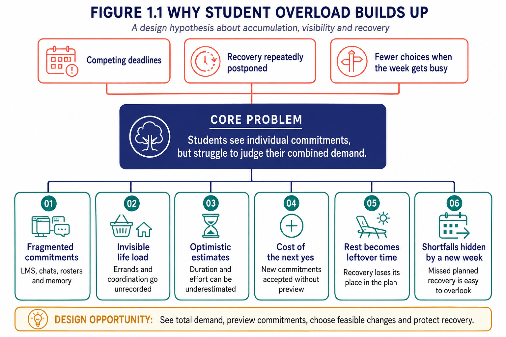

*Figure 1.1: The problem tree connects six contributing causes to the shared visibility problem and its possible consequences. It is a design hypothesis about accumulation, not a diagnostic model.*

### Who we are designing for

Our primary users are **undergraduates balancing coursework with substantial responsibilities outside class**, such as paid work, society leadership or caring. The four situations below can overlap; they are not personality labels.

| Student situation | Decision SODA should make easier |
|---|---|
| **Working student** | Fit coursework around a fixed shift without quietly sacrificing recovery. |
| **Over-committed student** | Understand the effect of a new request before agreeing. |
| **Final-year student** | Allow realistic time for open-ended project work alongside deadlines. |
| **Quiet grinder** | Notice when finishing the work repeatedly means postponing rest. |

Teammates, lecturers and employers may benefit from earlier conversations about conflicts. Campus support services remain the source of help beyond planning. **Personal schedules and check-ins are not automatically shared with any of these stakeholders.**

### Existing approaches and the remaining opportunity

| Existing approach | Useful strength | What SODA adds to the decision |
|---|---|---|
| [Todoist](https://www.todoist.com/help/todoist/integrations/use-the-calendar-integration-rCqwLCt3G) | Organises tasks alongside calendar events. | An editable estimate of five kinds of demand, not just a list of commitments. |
| [Reclaim](https://reclaim.ai/) | Adaptive scheduling, workload visibility and preview/approval. | A student-focused five-axis estimate connected to planned versus logged recovery. |
| [Finch](https://finchcare.com/) | Self-care activities, check-ins and a companion. | A planning loop that previews an additional commitment and offers schedule adjustments. |

These are selected product comparisons, not an exhaustive benchmark. SODA's distinction is the **connection between demand, the next decision and recovery**, rather than the invention of scheduling or self-care.

### Our Solution

SODA is a proposed student workload planner that combines recorded commitments across **mental, time, physical, social and errands** demand. It compares these with an editable personal baseline and previews the effect of a new task before the student accepts it. When the plan is too demanding, it proposes changes that respect fixed commitments, deadlines and protected recovery. Recovery logging and optional completion feedback then inform the student's next planning decision.

> **See total load → preview a commitment → choose a feasible change → protect recovery → improve the next estimate.**

**Current status:** a Figma prototype and supporting specifications, with exported screens in Section 3. The application and hosted services are proposed for the building phase; effectiveness has not yet been evaluated. SODA provides planning estimates, not diagnoses or burnout-risk measurements.

### Three core experiences

SODA centres on three experiences: **understand what I am carrying, decide what I can take on, and make room to recover.** Supporting functions make these experiences usable without becoming separate product promises.

| Student question | Main feature | Supporting functions |
|---|---|---|
| **“Why does my week feel so heavy?”** | **My Backpack:** see combined demand and identify the main source of pressure. | Task entry and calendar review supply commitments; Life Forecast adds the weekly outlook. |
| **“Can I realistically say yes?”** | **Impact Preview:** see the cost of a new commitment and choose what can change. | Protection Mode sets the response; Smart Rebalance offers feasible adjustments and safe undo. |
| **“What can I do to recover now?”** | **Recovery Island:** choose a suitable recovery action and give it a place in the plan. | Protected time, recovery logging and a timer support action; Recovery Debt keeps planned-versus-logged recovery visible. |

**Support across the journey:** Daily Check-in provides optional reflection and preference context. Reality Check helps students reconsider future estimates; Insights and How SODA Calculates explain patterns and assumptions. These improve the three experiences rather than adding more main features.

---

## 2. Ideation & Process

### 2.1 Ideas We Considered

We compared four approaches against **challenge fit, user need, originality, feasibility and demonstration clarity**. Backpack offered the clearest route from seeing demand to making a decision; parts of the other concepts improved that route.

| Idea | Decision | Reason and trade-off |
|---|---|---|
| **Backpack (personal capacity model)** | **Chosen as the core** | Connects combined demand to the cost of a new commitment. We accepted the need to explain uncertainty and let students correct inputs. |
| **Streak (habit and self-care tracker)** | **Companion retained; rewards dropped** | A companion can communicate state. Streaks, XP and resets could make taking a needed break feel like failure, so they were removed. |
| **Echo (AI journaling coach)** | **Brief check-ins retained; journaling dropped** | Reflection was useful, but daily writing adds effort and does not itself identify which commitment can change. |
| **Sync (shared group calendar)** | **Deferred** | Group coordination needs multiple adopters, permissions and synchronisation. We prioritised a useful individual workflow before adding sharing. |

**Why this selection matters:** SODA retained the companion and reflection without becoming a reward tracker or journal. Its central interaction stayed **My Backpack → Impact Preview → Smart Rebalance**.

### 2.2 Ideation Boards

The problem tree above explains **why** overload can accumulate. The three boards below show **who needs help, what we considered, and how principles shaped the selected features**. They separate the original dense mindmap in response to mentor feedback.

#### Figure 1.2a: Users and needs

  

*Different student situations converge on shared planning needs. This led to one personal model with editable inputs, rather than separate modes for each type of student.*

#### Figure 1.2b: Concepts and selection

  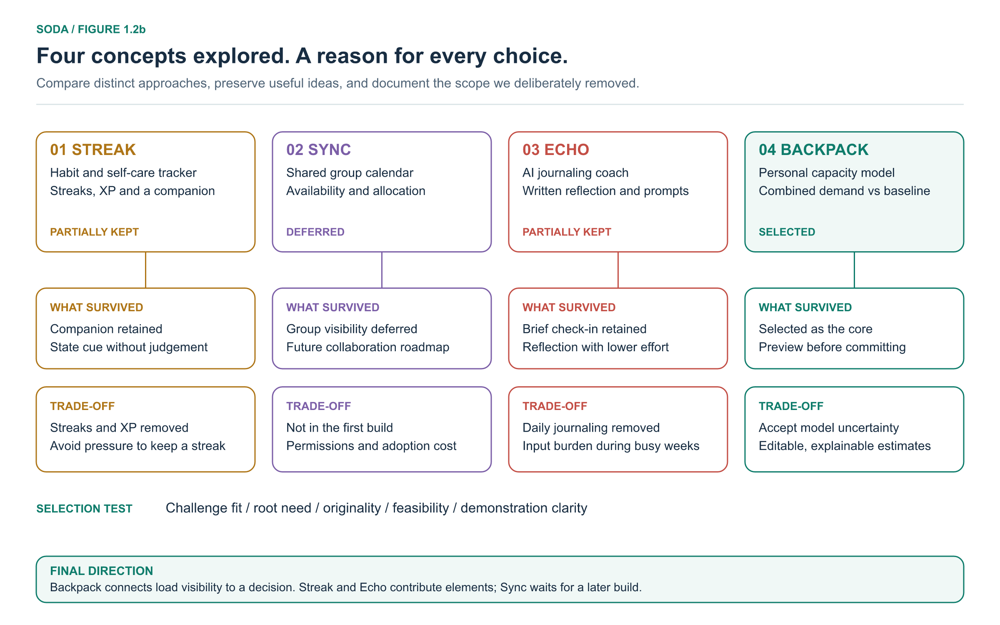

*The arrows trace what survived each concept and the trade-off behind it. Choosing Backpack preserved useful ideas while keeping the first build focused on the individual student.*

#### Figure 1.2c: Principles that shaped the features

  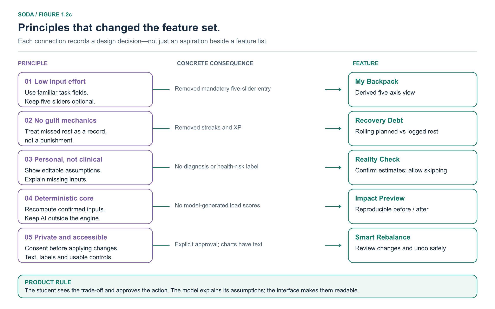

*Each connected row shows a principle changing a concrete design decision. The board includes both main and supporting functions; it is not a list of five main features. Privacy, accessibility and student control apply throughout.*

#### Figure 1.3: From the chosen idea to a usable flow

  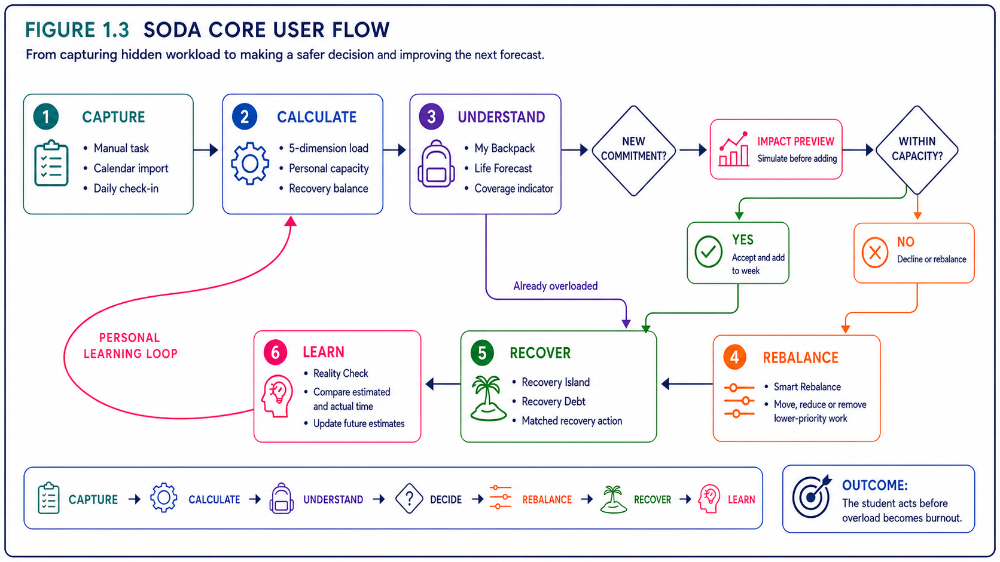

*The student can accept, adjust, defer or decline. Confirmation saves only the chosen changes; optional feedback improves the next estimate without silently rewriting the plan.*

### How the idea evolved

| Stage | Earlier direction | Change and reason | Trade-off accepted |
|---|---|---|---|
| **Explore** | Four separate product concepts | Chose Backpack; retained a companion and short check-ins. | Prioritised decision support over a broad feature collection. |
| **Simplify capture** | Five dimension ratings for every task | Derive defaults from duration, effort and category to reduce repeated input. | Defaults are coarser and must remain inspectable and correctable. |
| **Narrow scope** | The Crew / shared workload | Deferred collaboration until the personal workflow is useful. | Less group coordination in the first release. |
| **Correct estimates** | Strong forecast and “AI prediction” wording | Added visible assumptions and optional Reality Check feedback. | Present an estimate rather than promising prediction accuracy. |
| **Make recovery actionable** | Generic “take a break” reminders | Added choices, protected time, a reset timer and recovery history. | Requires preferences and logging; a suggestion cannot prove recovery occurred. |
| **Improve the explanation** | One dense ideation board | Split users, concepts and principles into connected diagrams. | More focused figures, each with a short explanation instead of repeated prose. |

**Two changes made concrete**

| Iteration | Earlier proposal → revised design | Why the change matters | Evidence and limit |
|---|---|---|---|
| **Task capture** | Rate five dimensions for every task → enter duration, effort and category, then inspect derived defaults. | Removes repeated abstract ratings while preserving correction. The trade-off is coarser defaults, not proven measurement accuracy. | [Figure 1.2c](#figure-12c-principles-that-shaped-the-features) and the [specified inputs](docs/MODEL.md#step-1-a-task-becomes-a-five-dimensional-vector). The earlier state is documented concept history, not a recovered old screenshot; informal timing claims are not a user benchmark. |
| **Recovery** | General reminder to rest → choose an action, protect time and record completion in Recovery Island. | Gives the student a next step and a visible record. It requires preferences and logging rather than assuming a reminder caused recovery. | [Core flow](#figure-13-from-the-chosen-idea-to-a-usable-flow) and [completion criteria](#minimum-completion-standard). The flow specifies intended behaviour; actual follow-through remains untested. |

### 2.3 Mentor Consultation

The supplied consultation record names **Khor Jia Quan, 7 September 2026**. The table distinguishes documentation changes from design responses that the prototype team must verify in the final screens.

| Feedback received | What was Changed | Evidence / status |
|---|---|---|
| Split the dense ideation mindmap and explain each part. | Separate users/needs, concepts, and principles-to-features. | Figures 1.2a–c above, with visible captions. |
| Include recognisable backend technology logos. | Retain a labelled architecture diagram with the selected technologies. | Figure 5.2 and its accompanying stack table. |
| Explain chart alternatives and the relevance of screen-reader / colour-blind support. | Include text descriptions of diagrams; specify non-colour cues and accessible chart values. | Diagram descriptions here; design documentation in Section 3. Device verification remains a build gate. |
| Remove the separate Chat/Manual chooser before Impact Preview. | Document one entry screen with manual input available in place. | Design response for the prototype team to reconcile with the final capture screens; real text uses forms or rules. |
| Give the backpack companion a more functional role; consider the navigation icon and dialogue. | Use the companion to reinforce load and recovery states, accompanied by text. | Final dialogue, icon treatment and interactions remain with the Section 3 design owner. |

The intent of the capture feedback is fewer unnecessary decisions. Keeping manual entry available also preserves the workflow when optional language assistance is unavailable. Documentation responses are complete here; final screen behaviour and assistive-technology testing are not claimed as verified.

---

## 3. Design & Prototype

**UI Prototype:** [SODA Figma design file](https://www.figma.com/design/izVJIUjNyiSDu0ivUEOtw5/Untitled?node-id=189-1183)

SODA is used by people who are already depleted. That single fact drives
every decision in this section: the interface has to be readable in ten
seconds, honest about what it does not know, and incapable of making a
tired student feel worse for opening it.

### Key screens

77 screens in light mode, each mirrored in dark mode, 154 in total. Every
screen described below exists in the Figma file, and the demo route through
them is wired end to end. Some supporting screens are reachable only from the
file itself rather than from the main demo entry point.

---

**Storyboard 1: Onboarding to the first capacity reading**

Splash → Welcome → Capacity Baseline (three calibration questions: what a
normal week feels like, focused hours per day, protected recovery per day)
→ Connect Your Week (Google Calendar read-only, notifications, optional
health) → Calendar Review (imported commitments grouped by category,
confirmed before anything is calculated) → Home.

Both optional steps can be skipped. A student who declines the calendar and
the review still lands on a working first-run Home, where SODA states that
it has no limit for them yet and shows only their calendar until two
check-ins are done.

Home then shows Friday's estimated load at 82% (Heavy), the five parts of
the student's load (Mental 91%, Time 87%, Physical 62%, Social 43%,
Errands 58%), a week bar chart, and a banner naming the day that breaks:
*Wednesday goes over your limit.*

| Capacity Baseline | Calendar Review | Home · day one | Home |
|---|---|---|---|
| 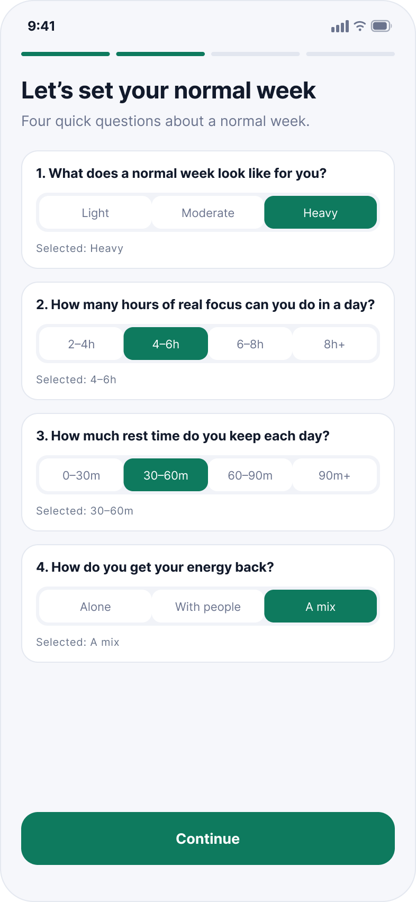 | 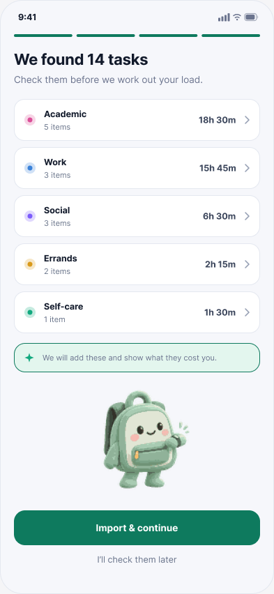 | 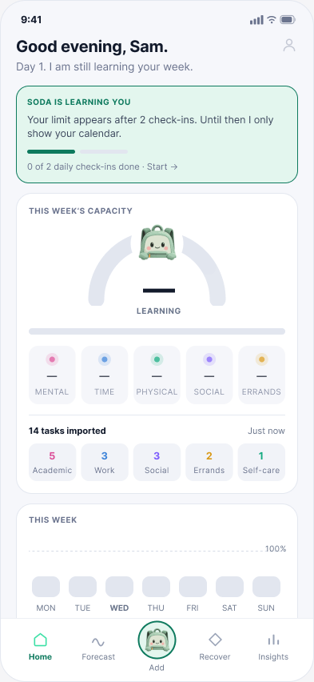 | 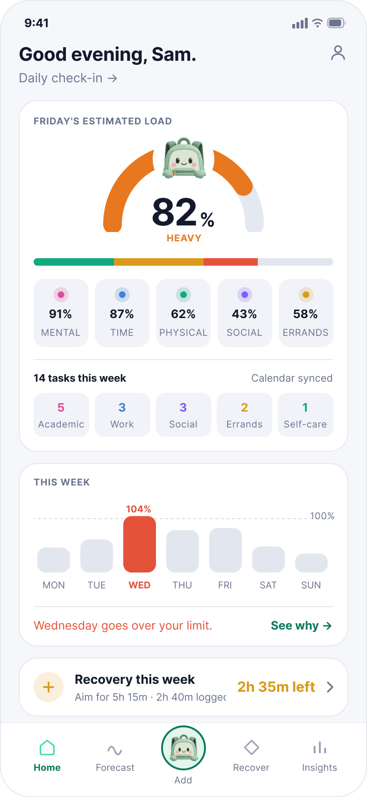 |

---

**Storyboard 2: Capture to decision**

Add → SODA reads it → Confirms understanding → Impact Preview →
Smart Rebalance → Changes applied → Week Updated → Home.

Adding is a single screen. The chat field is there immediately, with a
"Type it in yourself" button that expands the manual form in place. No
screen asks the student to pick a mode first.

Typed input passes two checks before anything is saved. SODA shows its
working (heard the task, found the date, estimated the effort from past
tasks), then states what it understood (*Friday 15 Nov, 19:00, 3h 30m
suggested, Extra High*) and asks "Did I get that right?"

Impact Preview is the decision point: `82% → 112%`, Mental `91% → 118%`,
Time `87% → 109%`, and rest time left falling from 2h 10m to 25m. The
primary action is not "Save", it is "Fix my week". The alternative,
"Accept anyway", passes through its own confirmation and leads to a Home
that still shows Friday at 112%. The app does not pretend the problem
went away.

Smart Rebalance proposes three named moves and lets the student choose.
Two selected moves total −23%, taking Friday from 112% to 89%, with a line
confirming that 1h 50m of rest is kept. A third move can be added for
−26% and 86%; both outcomes have their own confirmation and Week Updated
screens.

| Add | Impact Preview | Smart Rebalance | Week Updated |
|---|---|---|---|
| 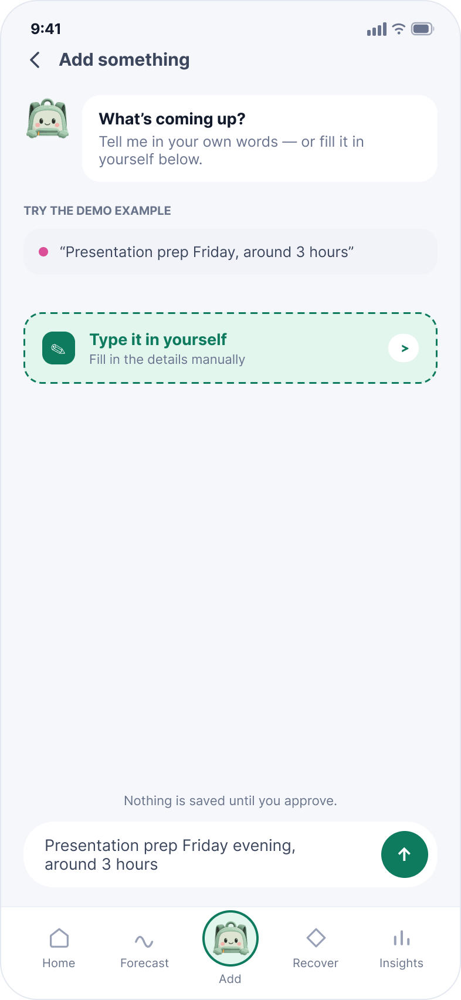 | 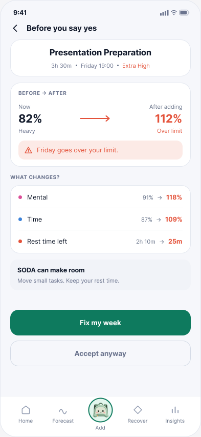 | 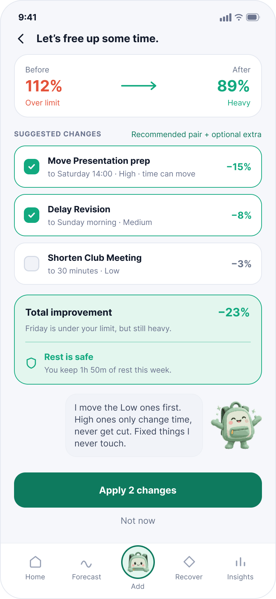 | 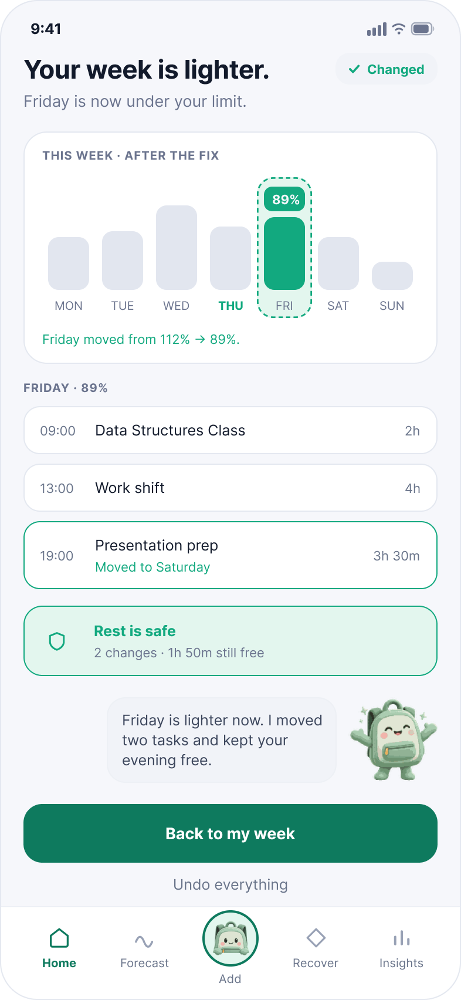 |

---

**Storyboard 3: Fixing a day that is already overloaded**

Wednesday runs at 104% before anything is added. Forecast, the Home
banner, What Breaks and Task Detail all route into the same Wednesday
rebalance screen, so the day the student was told about is the day they
land on.

Two flexible moves, assignment work to Thursday, club meeting to Sunday,
bring Wednesday to 80%. The part-time shift is tagged Fixed and is left
alone. Asking to swap it is offered as a separate request that shows as
"waiting for your manager" and is never counted in the improvement total.

Applying the changes updates Week Updated, Home, the day detail and the
forecast together, so tapping back into any of them shows the fixed week
rather than the old numbers.

| Life Forecast | Day Plan | Smart Rebalance · Wednesday | Week Updated · Wednesday |
|---|---|---|---|
| 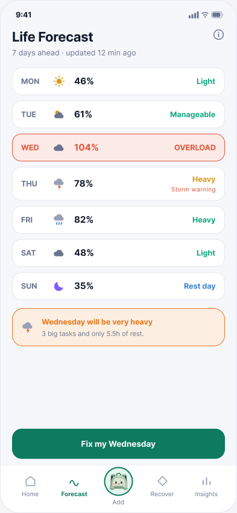 | 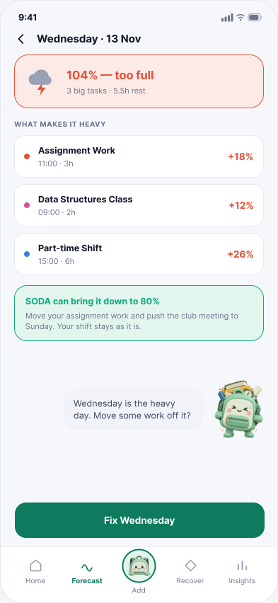 | 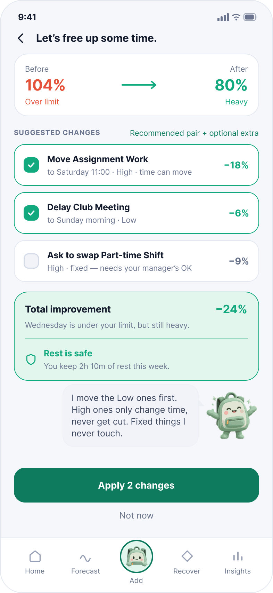 | 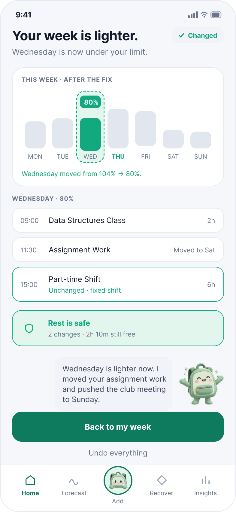 |

---

**Storyboard 4: Check-in and recovery**

Daily Check-in (five sliders: energy, mood, mental, physical, social
battery) → Recover → Recovery Island → pick a type → Timer → Complete.

Recover shows accumulated recovery debt: 2h 35m across four weeks, stated
as rest the student owes themselves, with the explicit line that it is a
planning signal and not a medical score.

Recovery Island reports which parts of capacity are actually low and
recommends one option. Choosing a type opens a single screen with Physical,
Time and Mental as tabs, so switching takes one tap instead of returning to
the menu. Physical and Mental options run a timer; Time options remove work
instead of adding rest and end in a "tasks batched" confirmation. The timer
can be paused or ended early, and ending early logs nothing rather than
crediting rest that was not taken.

| Recover | Recovery Island | Recovery Timer | Recovery Complete |
|---|---|---|---|
| 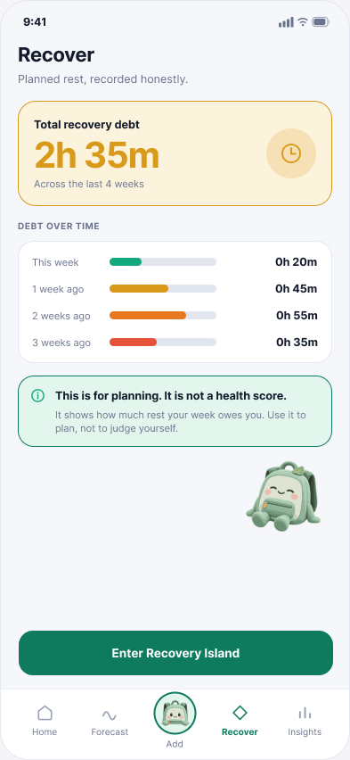 | 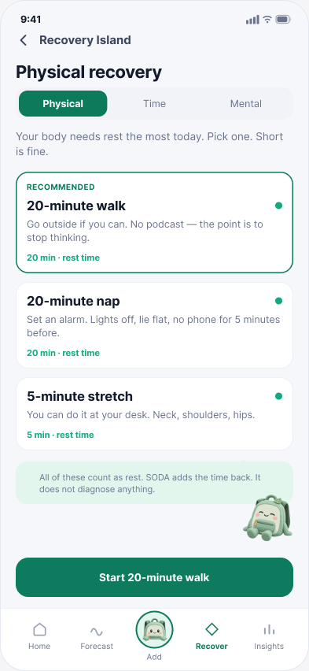 | 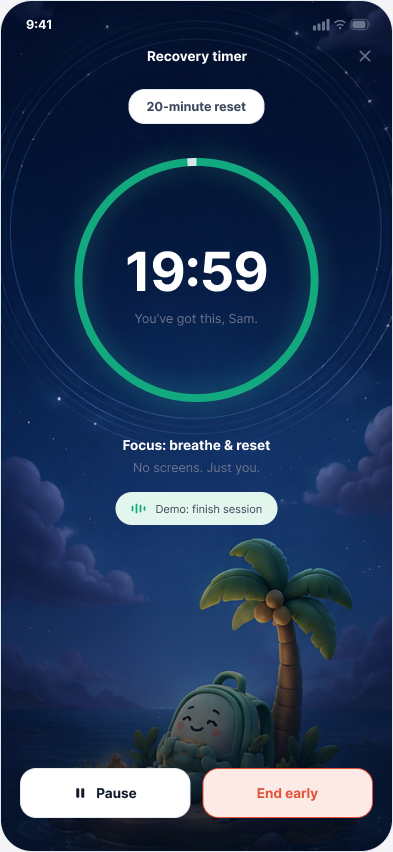 | 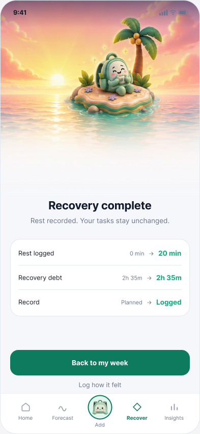 |

---

**Storyboard 5: Insight, honesty and trust**

Insights → Body Signals → Settings → How SODA Calculates.

Insights shows the capacity trend, three pattern cards, and a weekly
review. The pattern cards use the same Time / Physical / Mental colours as
Recovery Island, so a student who sees a pink "Your mind fills up first"
card and then opens the pink Mental tab is following one colour through the
app. Body Signals has a version for students with no wearable, and Insights
has a version for students without enough data yet, and neither is an empty
screen with nothing in it.

How SODA Calculates is written for a sceptical reader. It gives the formula
(`day load = Σ hours × effort × part`, `capacity % = day load ÷ limit × 100`),
the effort weights (Low ×0.5 to Extra high ×2.0), the part weights
(Mental ×1.3 down to Errands ×0.7), the student's limit (14.5 load-hours a
day, moving at most ±0.5 a week so one bad day cannot change it), and a
worked example for Wednesday: 15.13 ÷ 14.5 = 104%.

| Insights | Body Signals | How SODA Calculates | The maths |
|---|---|---|---|
| 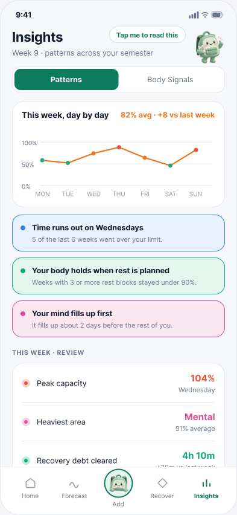 | 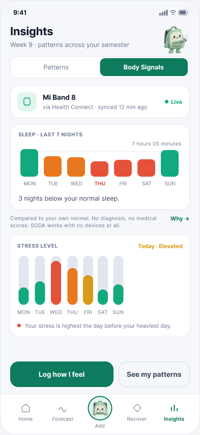 | 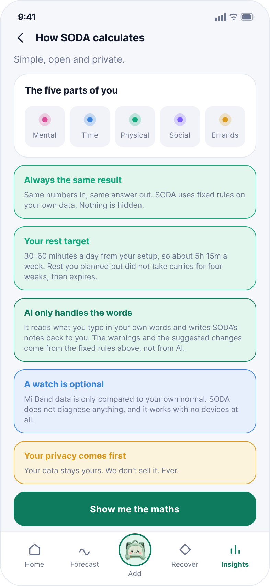 | 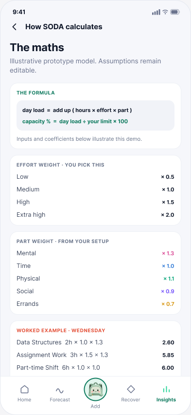 |

---

**Degraded states**

Not a storyboard. Calendar sync failure, offline and save failure are
designed as banners on the working screen, not as separate error pages. The
student keeps the last known data, keeps adding tasks, and SODA syncs when
it can. Nothing is lost and nothing is blocked.

**Dark mode**

Every one of the 77 screens has a dark twin, not a filter. Accent colours
are re-picked for dark backgrounds (the mint green used on buttons is
lighter, and text on those buttons is dark rather than white), so contrast
holds in both modes.

| Home (dark) | Impact Preview (dark) | Recovery Island (dark) | Insights (dark) |
|---|---|---|---|
| 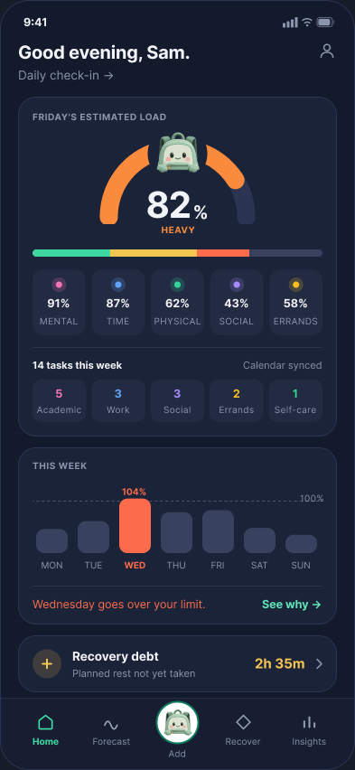 | 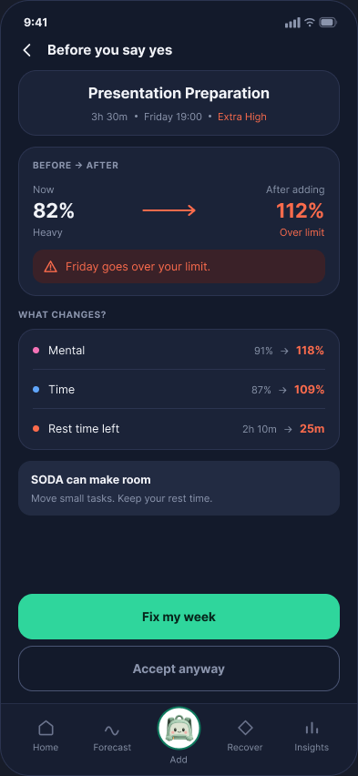 | 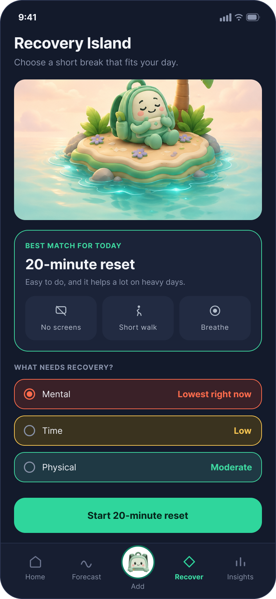 | 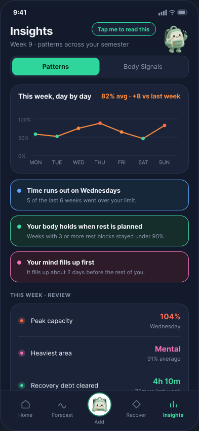 |

---

### Design principles

SODA is built around one uncomfortable moment: the second before a student
says "yes" to something they do not have room for. Seven rules shape every
screen.

**1. Show the cost before the commitment.** Most planners tell you what you
agreed to after you agreed. SODA shows the damage first: 82% becomes 112%,
and the day that breaks is named. The primary action is "Fix my week".

**2. Plan, never diagnose.** SODA reports capacity, not health. The
boundary is repeated in plain words: "This is for planning. It is not a
health score." Body signals are compared to the student's own normal, never
to a population baseline, and the app works with no wearable at all.

**3. Nothing is saved until the student approves it.** SODA shows what it
understood and asks before writing anything. When it overrides a number,
estimating 3h 30m where the student typed 3 hours, the change is visible,
explained from the student's own history, and reversible with one tap. If
they keep their own estimate, the Impact Preview uses their number (108%),
not SODA's.

**4. One way in, not a menu.** Adding something is a single screen. Chat
and the manual form live together; neither group has to pick a mode first.

**5. Give the time back, don't just warn.** Every warning is paired with an
action. Smart Rebalance proposes specific changes; Recovery Island turns
owed rest into short options that each state the time they return.

**6. SODA does not move what is not the student's to move.** Every
commitment is tagged Fixed or Flexible. Coursework and club time can be
moved. A paid shift cannot: SODA will draft the message to the manager, but
the swap shows as "waiting for your manager" and is never counted in the
improvement total until it is approved.

**7. Fixed rules do the maths. AI only handles the words.** Capacity,
warnings and rebalance suggestions all come from a deterministic rules
engine: the same numbers always give the same answer. AI is used only to
read what the student types in their own words and to write SODA's notes
back to them. It never decides.

---

### User flow, end to end

**First run**

`Splash → Welcome → Capacity Baseline → Connect Your Week →
Calendar Review → Home (day one)`

**Adding a commitment: the core loop**

`Home → Add → SODA reads it → Confirms → Impact Preview →
Smart Rebalance → Changes applied → Week Updated → Home (after the fix)`

Manual entry skips the confirmation step, because the student typed the
details themselves. Declining the fix is also a complete path: Accept
anyway leads to its own Home and Forecast, both still showing Friday over
the limit.

**Fixing a day that is already overloaded**

`Forecast / Home → Day Plan → Smart Rebalance (Wednesday) →
Changes applied → Week Updated → Home (after the fix)`

**Recovering owed rest**

`Recover → Recovery Island → pick a type → Timer → Complete →
Daily Check-in`

Pausing and ending early are both wired. Ending early logs no rest.

---

### Six friction points we designed around

1. **Being asked to choose a mode before you start.** The old Add flow made
   students pick "chat" or "manual" before typing anything. That screen was
   removed; both now live on one screen.
2. **Being told you are overloaded, with nothing to do about it.** Every
   over-limit state routes into a concrete set of changes with named tasks
   and stated percentages.
3. **Silent edits by the system.** When SODA changes a number, the screen
   says so, gives the reason from the student's own history, and offers
   Undo.
4. **Losing work when something fails.** Failures are banners, not dead
   ends. The draft survives; the last known week stays on screen.
5. **Rest feeling like one more task.** Recovery options run from two to
   twenty minutes and each states what it gives back, so resting is a
   decision with a visible payoff rather than an open-ended obligation.
6. **Reading when you are too tired to read.** Any dense screen can be
   summarised in four sentences, either read aloud or read on screen with
   sound off.

---

### Accessibility: what is designed, what is still unverified

**Designed.** A full dark mode for every screen, with accent colours
re-picked rather than filtered. A read-aloud summary that also works
silently as text, so it serves a student in a library and a student who
cannot hear it equally. Plain language throughout, with numbers always
paired with a word ("89%", "Heavy") so meaning never rests on colour alone.
Category colour is consistent across Insights and Recovery Island, but
always carries a text label beside it.

**Not yet verified.** Contrast ratios have not been measured against
WCAG AA. Screen-reader labels and reading order have not been authored, and
the prototype has not been tested with VoiceOver or TalkBack. Tap-target
sizes have not been audited. Dynamic type and reduced-motion settings are
not handled. We state this rather than claim the app is accessible, because
the read-aloud feature is a fatigue feature, not a substitute for
assistive-technology support.

## 4. What Makes It Different

**SODA makes the next “yes” a capacity decision.** Its distinctive combination is an editable five-axis estimate, a preview before commitment, feasible adjustments and a recovery record that spans weeks.

### Three experiences, one decision journey

#### My Backpack: “Now I understand what is making the week heavy.”

The student starts with an overview of combined demand, then sees which of the five dimensions needs attention. A three-hour assignment and a three-hour social event occupy the same time but receive different proposed demand vectors. The value is understanding the pressure behind the task list, not simply counting more tasks.

Task entry makes the overview possible, and Life Forecast extends it across the week. The assumptions and recorded-data coverage remain visible so the student can correct an incomplete picture.

#### Impact Preview: “I can decide before I commit.”

**This is SODA's central demonstration moment.** The student previews an unsaved task against the current plan, sees the trade-off, and chooses whether to accept, adjust, defer or decline.

Protection Mode and Smart Rebalance support that same decision. They preserve fixed shifts, deadlines and protected recovery while offering feasible changes to flexible work. Each selected change is checked against the whole week, including its destination. If nothing fits, the app explains why. Nothing moves without approval, and approved changes can be undone when later edits do not conflict.

#### Recovery Island: “I have a manageable next step for recovery.”

The student chooses a recovery action suited to their preferences and current context, protects time for it, and records what they completed. The experience turns a general reminder into a concrete action.

Recovery Debt supports this experience by showing planned-versus-logged recovery across 28 completed days. It keeps postponed recovery visible across calendar boundaries without becoming a separate score to chase. Missing logs do not prove missing rest, extra rest does not erase an earlier daily shortfall, and the ledger does not lower the student's capacity baseline.

**What helps the next visit:** optional Reality Check feedback can prompt an approved estimate adjustment when tasks repeatedly take longer than expected. This follows the planning-fallacy rationale ([Buehler et al., 1994](https://doi.org/10.1037/0022-3514.67.3.366)); it does not establish accurate automated learning. Check-ins, explanations and Insights support understanding and continuity across all three main experiences.

### Comparison with existing solutions

The comparison below uses one synthetic decision rather than comparing feature counts. These are capability-level examples, not a hands-on benchmark or a claim that any named competitor lacks all of SODA's functions.

| Approach | What it helps Aina understand | SODA's proposed addition |
|---|---|---|
| Task-list view | What must be completed and by when. | Explain recorded demand across five dimensions against an editable personal baseline. |
| Calendar / adaptive scheduling | Where events overlap and which flexible work could move. | Connect that scheduling decision to the demand estimate and explicitly protected recovery. |
| Self-care view | Which recovery or reflection activity she might choose. | Keep the chosen action in the same journey as the commitment decision and recovery history. |

### What changes for the student

**Aina is a fictional working undergraduate.** On Thursday she has class from 09:00–11:00, laundry from 12:00–13:00, two hours of assignment drafting from 13:00–15:00, a fixed shift from 16:00–20:00 and protected recovery from 20:30–21:00. Her assignment is due Friday at noon. A club asks her to help on Thursday from 13:00–14:00.

| Experience | What Aina sees or does | Concrete outcome in this synthetic case |
|---|---|---|
| **My Backpack** | Reviews the combined demand and the commitments behind it. | Recognises that the new request competes with existing assignment work. |
| **Impact Preview** | Reviews moving laundry to an available Saturday slot and splitting drafting into 12:00–13:00 and 14:00–15:00. | Can accept with explicit changes: two drafting hours remain, the deadline is met, and class and shift do not move. |
| **Recovery Island** | Chooses a quiet reset for the protected interval and records completion when it happens. | Keeps 30 minutes available for recovery; the ledger distinguishes a plan from a completed action. |

The trade-off is explicit: **laundry moves to Saturday; it does not disappear from the week.** If laundry cannot move or the assignment cannot be split, that option is rejected. Aina can defer, decline or knowingly accept the conflict rather than receive an impossible “fixed” schedule.

This example establishes an intended decision path, not observed benefits or a complete numerical fixture. The [demonstration pack](docs/DEMO-AND-VALIDATION.md#one-case-across-all-three-experiences) records its constraints and failure variant. Do not attach the storyboard's unverified **82% → 107% → 89%** values to this schedule. Any future displayed scores must come from the same complete, versioned inputs; 89% is **Heavy** under the specified bands.

**Why the mechanism is plausible:** Study Demands–Resources theory links demands, resources and proactive adjustment ([Bakker & Mostert, 2024](https://doi.org/10.1007/s10648-024-09940-8)). SODA brings those decisions together rather than leaving recovery separate from planning. The theory informs the design; it does not validate our weights, thresholds or effects on wellbeing.

### How we would evaluate it

First, recruit **8 consenting students** who combine coursework with work, leadership or caring. Compare a calendar-only task with a SODA task using two matched synthetic weeks. Counterbalance the interface order and week assignment to reduce practice effects. Ask students to identify pressure, explain the estimate and choose a feasible response.

| Question | Proposed first-study gate | What would challenge the design |
|---|---|---|
| Can students use the core loop? | At least 6 of 8 complete it without help. | Repeated confusion, abandoned entry or unusable suggestions. |
| Do they understand the percentage? | At least 6 of 8 explain that it depends on recorded tasks and assumptions. | Treating it as a health measurement or overlooking missing commitments. |
| Are the changes actually feasible? | Zero approved changes violate a fixed event, deadline or protected block. | Any constraint breach blocks release. |
| Does the preview support a decision? | Record accept/modify/defer/decline choices and participants' reasons. | Students cannot explain the trade-off or find the information irrelevant. |

A later longitudinal evaluation would track estimate overruns, completed recovery, missed commitments and continued use during busy periods. Lower model scores alone are insufficient: they can result from missing tasks or a changed baseline. **No usability or health outcomes have yet been established.** The [research and evaluation appendix](docs/EVIDENCE.md) retains the fuller rationale and falsifiable predictions.

### Reach and scalability

Start with students at one campus through societies and student-support channels. Expand to other universities only after checking that the workflow remains useful across different timetables and assessment patterns. Supporting postgraduate or early-career users would require revalidating the assumptions, not simply changing the labels. Institutional analytics are outside the first build and would require separate consent and governance; individual wellbeing records are not a default institutional data source.

---

## 5. Technical Architecture & Feasibility

### Tech stack

The proposed build uses **Flutter → FastAPI → Supabase**, with a pure Python calculation engine. The main workflow must work with language assistance disabled.

| Component | Selection and reason | Constraint we plan for |
|---|---|---|
| **Flutter / Dart** | Shared Android and web UI; custom workload visuals. | Test layout, permissions and accessibility on each target. |
| **Riverpod + fl_chart** | Separate application state from widgets; common charts plus a custom Backpack visual. | Charts need readable text values and semantic labels, not colour alone. |
| **FastAPI + Python** | Validated API requests and deterministic calculations using the same confirmed inputs. | Fresh previews require the server; model assumptions require evaluation. |
| **Supabase Auth + PostgreSQL** | Authentication and user-owned data with Row Level Security. | Free-tier limits and inactivity pausing; verify isolation with two accounts. |
| **Google Calendar API** | Optional read-only event import to reduce repeated entry. | OAuth, deduplication and student review; imported events lack effort information. |
| **Drift / SQLite** | Client cache and structured draft queue. | Mark stale results; recalculate after reconnect before applying a plan. |
| **Firebase Hosting + Railway** | Host the Flutter web build and FastAPI service respectively. | Provider quotas, backend usage costs and network availability. |
| **Optional Gemini / local Ollama** | Synthetic task-entry demonstrations; Ollama `qwen3:4b` remains a local experiment. | No real student text in the external demo adapter; no model-generated load scores. |

### System architecture

  

*Figure 5.2: Logical components and data hand-offs. FastAPI mediates database access; the engine itself has no network calls. The dashed outlines group components rather than indicating optional connections.*

**A preview request, end to end:** the app sends a confirmed candidate and user token to FastAPI; the API reads the authorised schedule and capacity; Python simulates the before/after result; the app displays it without saving a task. A separate approval saves the candidate and selected adjustments atomically against the schedule revision. If the schedule changed, the student receives a fresh preview instead of overwriting newer edits.

**Language boundary:** the diagram's “ONE sentence” refers to an allowlisted synthetic example for the optional Gemini demonstration. Real student entry uses structured fields or server rules. Gemini's unpaid terms exclude personal or sensitive submissions, so a small payload alone would not make real task text suitable. The adapter remains disabled unless the demo's audience, region and provider access are eligible. [Gemini API terms](https://ai.google.dev/gemini-api/terms)

**Offline boundary:** cached views and drafts remain available with their last-update time. The client cannot produce a fresh Python preview or safely apply an old rebalance while disconnected. Local notifications are an Android implementation task; web behaviour requires separate testing.

### How the estimate works

1. **Describe the task:** duration, effort and category produce a five-axis demand vector.
2. **Set the baseline:** onboarding supplies an editable focus budget and relative capacity assumptions. Check-ins do not silently reduce capacity.
3. **Compare demand with capacity:** combine the axis utilisation values into a daily planning estimate while preserving separate axis warnings.
4. **Simulate a change:** recalculate the candidate and any proposed moves across the week; check actual time overlaps independently of weighted demand.

**Reproducible example.** With a moderate baseline and five-hour focus budget, a three-hour high-effort academic task produces a daily estimate of **93.576% (displayed as 94%)**. Adding one hour of medium-effort errands produces **101.616% (102%)**. The [model specification](docs/MODEL.md) provides every vector and formula needed to reproduce both results.

| Display rule | Meaning |
|---|---|
| **Light / Manageable / Heavy / Overload** | Respectively below 50%, 50–<70%, 70–<90%, and 90% or more, classified before rounding. |
| **Any axis reaches 100%** | Show its own warning even if the combined score is below the overload threshold. |
| **Peak day this week** | Maximum daily estimate in the displayed week, not a weekly average. |
| **Recovery Debt** | Duration of planned-versus-logged shortfalls over 28 completed local days; overlaps count once and history coverage is visible. |

These are proposed planning rules. Recovery Debt does not lower the capacity baseline, and low social demand does not imply loneliness. Recovery choices follow explicit preferences and context.

### Build plan & scope

**The three-week goal is a complete path through the three main experiences:** My Backpack → Impact Preview with feasible adjustments → Recovery Island with a completed recovery record.

Product hierarchy and build priority are different. Task entry, Smart Rebalance and recovery logging are supporting functions, but the core experience cannot work without them. The first release includes a small, usable Recovery Island; more activity choices can follow.

| Priority | Building-phase scope |
|---|---|
| **Must** | Authenticated manual entry; five-axis model and My Backpack; Impact Preview; Protection Mode; constrained Smart Rebalance with safe undo; a basic Recovery Island with recovery choice, protected time, completion logging and Debt; text alternatives; synthetic demo data. |
| **Should** | Calendar review; richer Life Forecast; Daily Check-in; Reality Check Lite; expanded Recovery Island choices and guided timer; offline drafts and local notifications. |
| **Could** | Optional language demonstration, expanded Insights and additional recovery content. |
| **Outside this build** | Friend circle, university dashboard, wearable companion and clinical assessment. |

| Week | Responsibility and collaboration | Evidence of completion |
|---|---|---|
| **1: Establish the core** | Boon Shen: backend; Jia Yin and Samantha: frontend; Ikhlas: QA | Sign in → save manual task → reproduce the load view; two-account isolation check passes. |
| **2: Complete the decision loop** | Boon Shen: backend; Jia Yin and Samantha: frontend; Ikhlas: QA | Preview → approve selected changes → persist → undo safely; basic Recovery Island choice → protected time → completed log → updated ledger works on fixtures. |
| **3: Integrate and rehearse** | Ikhlas: QA coordination; all developers: fixes; Samantha: submission assembly | Resolve core defects; keyboard/TalkBack review; web deployment and planned Android APK; rehearse without AI and on another network. |

**Cut order:** optional language → extra Insights/content → Reality Check Lite → calendar import and enhanced offline sync. Preserve all three main experiences, including their required task entry, feasible adjustments and recovery logging. A schedule with no feasible improvement must be handled honestly rather than treated as a failed demo.

### Minimum completion standard

| Main experience | Must be demonstrable | Failure state that must also work |
|---|---|---|
| **My Backpack** | A confirmed task appears in the breakdown; editing its inputs updates the estimate; coverage and assumptions are readable. | Missing data and dated offline results are visibly labelled. |
| **Impact Preview** | Preview saves nothing; approval applies the candidate and selected feasible changes together; safe undo is available. | No-feasible-plan, stale approval and conflicting undo are explained without overwriting newer work. |
| **Recovery Island** | Select an action, protect its time, record completion once and see the recovery history update. | Cancellation does not count as recovery; overlapping or retried logs do not inflate it. |

These are build acceptance criteria, not completed tests. Prototype screens illustrate the states; executed fixtures and integration checks must establish the behaviour during the build.

### Team, time and cost

The building-phase responsibilities give each member a defined implementation or verification workstream.

| Team Member | Primary Responsibility | Key Deliverables |
|---|---|---|
| **Samantha Chan Pei Yin** | **Recovery Island Development & Submission Integration** | Develop the recovery activity selection, protected-time and completion-recording interfaces; integrate Recovery Debt data with the backend; coordinate the final README, slides and demonstration using contributions from all members. |
| **Lee Jia Yin** | **Frontend Development & UI/UX** | Build shared Flutter components and navigation, task-entry screens, My Backpack and Impact Preview interfaces; maintain consistency with the Figma design and implement accessible interaction states. |
| **Yeap Boon Shen** | **Backend Development & Calculation Engine** | Implement the five-dimensional load model, database and APIs, Impact Preview calculations, Smart Rebalance constraints, recovery data services, and safe save/undo behaviour. |
| **Muhammad Ikhlas bin Mohd Faizal** | **Testing & Quality Assurance** | Prepare test plans and synthetic data; perform functional, integration and regression testing; verify calculation outputs, scheduling constraints and account isolation; track defects, retest fixes and validate the complete demonstration flow. |

**Shared responsibility:** each developer checks and fixes their own module. Ikhlas coordinates independent QA throughout all three weeks, rather than receiving the entire testing workload at the end. Every member supplies and verifies their own technical or design content for the submission; Samantha coordinates the final assembly.

The building-phase estimate remains **120 additional team hours**: backend 36, frontend 36, UX/accessibility 18, integration/testing 18 and contingency 12. These are planning estimates, not recorded hours or equal allocations per member. Frontend work is shared between Samantha and Jia Yin; actual capacity is reviewed at kickoff, and optional scope is reduced if necessary. The [team responsibility and QA plan](docs/DEMO-AND-VALIDATION.md#implementation-responsibilities) sets out collaboration and weekly testing deliverables.

| Resource | Demo budget and constraint |
|---|---|
| Open-source app/backend libraries | USD 0 licence budget. |
| Supabase Free | USD 0 within quotas; 500 MB database allowance per project and inactivity pausing. [Current plan](https://supabase.com/pricing) |
| Firebase Hosting | USD 0 within free quotas: 10 GB storage and 10 GB monthly transfer. [Hosting quotas](https://firebase.google.com/docs/hosting/usage-quotas-pricing) |
| Railway Hobby | USD 5 monthly minimum including USD 5 usage; additional metered usage can increase the bill. [Pricing](https://docs.railway.com/pricing) |
| Figma / optional language demo | Education access and unpaid API use depend on eligibility; language assistance can be disabled. |
| **Planning allowance** | **USD 5–10/month for a small hosted demo**, subject to actual usage, taxes and quotas. This is not a measured bill or a spending cap. |

The current Figma prototype does not require these deployments. Provider terms and quotas must be checked again at integration; the Python backend budget excludes hosted local-model inference.

### Risks and release gates

| Risk | Required response before the build demo |
|---|---|
| **Misleading or inconsistent estimates** | Reproduce versioned fixtures, check threshold labels and expose missing input coverage; reconcile illustrative screen values before using them as live results. |
| **Impossible or stale adjustments** | Preserve fixed tasks, deadlines and protected intervals; check destination days, atomic apply and safe undo. A constraint breach blocks release. |
| **Exposed personal records** | Validate user tokens; enforce RLS for reads and writes; test isolation with a second account. Keep service-role keys outside normal user requests. |
| **Missing logs or duplicate imports** | Show recovery history coverage, count overlapping recovery once and deduplicate calendar events. |
| **AI, network or hosting failure** | Complete the main loop without AI; label cached views; test on another network and prepare a backup recording. |
| **Entry or accessibility friction** | Test core actions with target students, keyboard and TalkBack; expose chart values and severity in text. |

Collect only task, account, check-in and recovery data needed for the workflow. Calendar import omits descriptions, attendees and locations; provide disconnect, correction, export and deletion controls. Do not automatically contact lecturers, employers or family about a student's load. Students needing support beyond planning should be directed to appropriate services without a diagnostic claim.

### Supporting detail

The essential case is above. These documents retain the material needed to examine the proposal more closely:

- [Demonstration and validation pack](docs/DEMO-AND-VALIDATION.md): the shared case, team responsibilities, 4:30 speaking script and unfilled participant observation sheet.
- [Research, evaluation and references](docs/EVIDENCE.md): research-to-design mapping, proposed measures, stakeholder context and source list.
- [Calculation and architecture specification](docs/MODEL.md): formulas, worked example, recovery rules, constrained adjustments and language modes.
- [Build specification](docs/BUILD.md): proposed repository layout, starter SQL/RLS, API contracts, fixtures and integration checks.

---

**SODA: Carry life, not overload.**

Built for CodeNection 2026 · Lifestyle Track: Beating the Burnout

