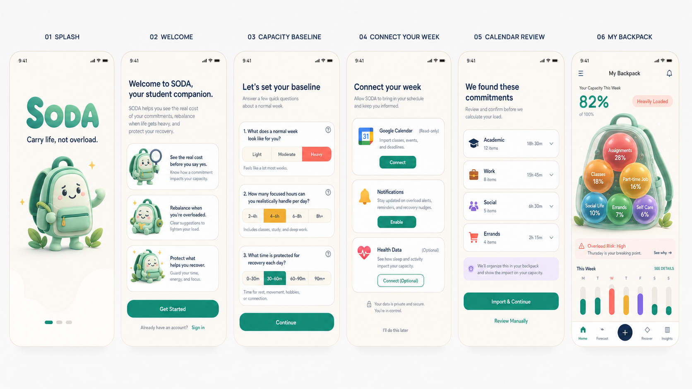
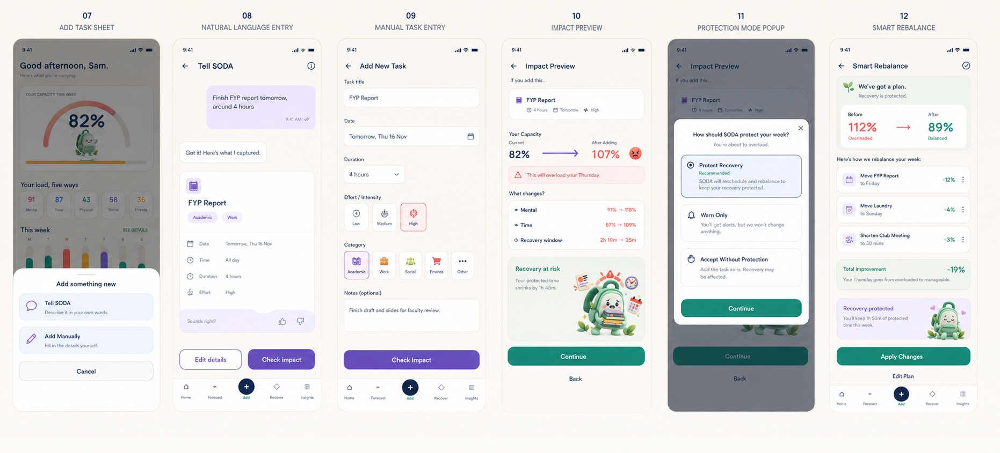
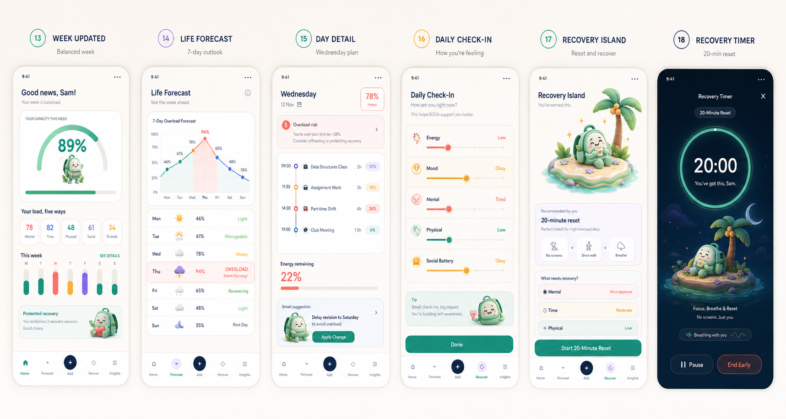
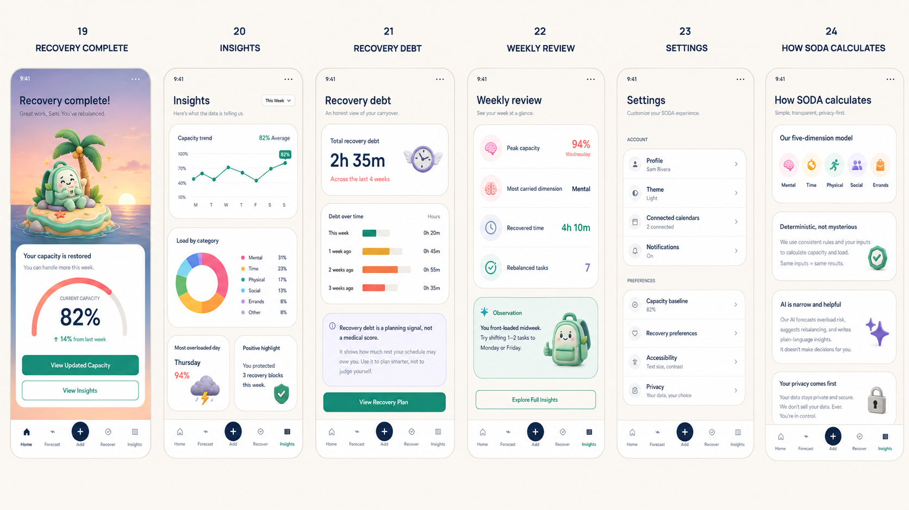
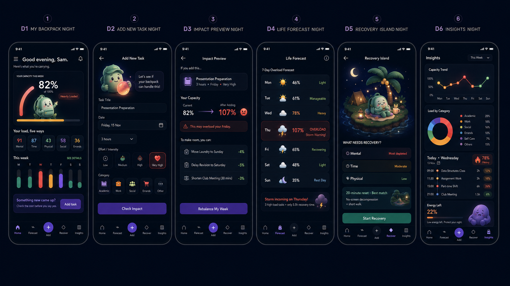
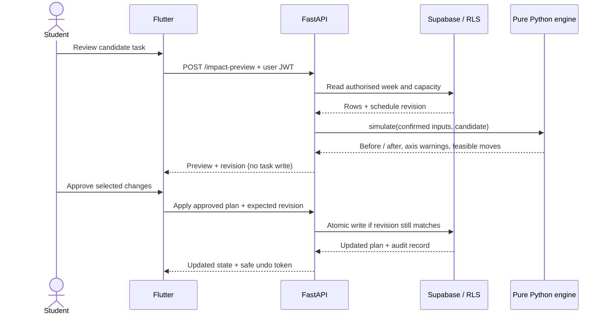

<div align="center">

# SODA by Team Soda

**Student Overloaded by Deadlines and Activities**

### *Carry life, not overload.*

</div>

**A capacity model for students who cannot see how much they are already carrying.**

| | |
|---|---|
| **Team** | Samantha Chan Pei Yin · Lee Jia Yin · Yeap Boon Shen · Muhammad Ikhlas bin Mohd Faizal |
| **Problem Statement** | Lifestyle Track · *Beating the Burnout* · Stress & Workload Manager |
| **Video Presentation** | Pending |
| **Presentation Slides** | Pending |

> [!NOTE]
> **Prototype-round submission.** The screens show the proposed experience. Backend logic, deployment and user outcomes are not built or verified yet.

---

## 1. Project Overview

### The Problem

University students rarely collapse from one thing. They collapse from an accumulation nobody is
measuring: coursework, a shift job, a committee role, errands, and the quiet cost of never resting,
all landing in the same week.

The challenge brief frames burnout as exactly this: an accumulation problem. Research agrees.
Academic stress is a *combination* of pressures rather than coursework alone (Iqra, 2024), and student
workload needs to be examined for both its **amount and its distribution**, not task by task (Thornby
et al., 2023). A [systematic review of pandemic-era studies](https://www.nature.com/articles/s41598-024-52923-6)
reports burnout symptoms with variation across contexts (Abraham et al., 2024). That is enough to establish that the
problem warrants attention, though pandemic-era findings are not a current Malaysian prevalence estimate.

The question we kept returning to was narrower and more useful than "why do students burn out":

> **Why can overload build up before a student recognises that their week has become unmanageable?**

<details>
<summary><strong>▸ Why we framed it as a visibility problem rather than a burnout-detection problem</strong></summary>

That question separates the *demands* a student faces from the *outcomes* they may eventually
experience. Study overload and burnout are related but distinct: a busy schedule alone does not
establish that someone is burning out (Carmona-Halty et al., 2024). We are not trying to detect
burnout. We are trying to make the accumulation visible while the student still has choices.

Our exploration found a specific gap: **students know their individual commitments but cannot see
their combined demand.** A student can recall every assignment, every shift, and every society
meeting and still be unable to judge whether they have the time and energy for all of them.

</details>


#### Root causes (Figure 1.1)

<p align="center">
  
</p>

*Figure 1.1: The problem tree. The crown shows consequences (missed deadlines, poor sleep, skipped
meals, social withdrawal, lower performance, delayed help-seeking); the trunk is the core problem;
the roots are the six causes we designed against.*

| # | Root cause | What it looks like in a student's week |
|---|---|---|
| R1 | **Fragmented commitments** | Tasks live across the LMS, a calendar, three group chats, a work roster and memory. |
| R2 | **Invisible non-academic load** | Errands, emotional labour and group coordination are real work and are almost never recorded. |
| R3 | **Decision-time blindness** | The cost of saying yes is unclear at the exact moment a new commitment appears. |
| R4 | **Planning fallacy** | Students systematically underestimate how long tasks will take (Buehler et al., 1994). |
| R5 | **Rest is residual** | Recovery is treated as leftover time, so it is the first thing removed under pressure. |
| R6 | **No recovery carry-over** | A new weekly view can hide recovery that was repeatedly postponed in previous weeks. |

<details>
<summary><strong>▸ The two reinforcing cycles we treat as hypotheses</strong></summary>

The problem tree also proposes two reinforcing loops we treat as **design hypotheses, not established
findings**: an *avoidance cycle* (guilt → avoidance → more unfinished work → higher load) and a
*help-seeking cycle* (overload → less help-seeking → longer overload).

</details>


**Design opportunity, stated plainly:** make total load visible early, support the decision *before*
the commitment is made, and carry recovery needs across weeks.

<details>
<summary><strong>Stakeholders, target users, and the research behind them</strong></summary>

**Primary users** are undergraduates balancing coursework with at least one substantial responsibility
outside class: paid work, society leadership, structured sport, or caring duties. These students hold
a mix of *fixed* and *flexible* commitments, so "just do less" is not available to them. Research on
working students confirms that different work–study arrangements carry different conflict and
study-burnout levels, which is why SODA never assumes every commitment can be moved (Creed et al., 2023).

<details>
<summary><strong>▸ Four user patterns, the wider stakeholder map, and the research behind them</strong></summary>

We identified four workload patterns. They describe **situations, not personality types**. One student
can be several at once.

| User segment | Typical situation | The decision they need help with | SODA feature |
|---|---|---|---|
| **Working students** | Coursework must fit around paid shifts. | "Which day is becoming too full, and what can I move?" | Life Forecast + Smart Rebalance |
| **Over-committed students** | Meetings and requests accumulate across groups. | "What changes if I agree to this?" | Impact Preview |
| **Final-year students** | An open-ended project competes with fixed deadlines. | "Have I allowed enough time, and where is pressure building?" | Editable estimates + Life Forecast |
| **Quiet grinders** | Everything gets done, but rest is repeatedly postponed. | "How much recovery have I been putting off?" | Recovery Debt + Recovery Island |

In a qualitative study of 209 university students, academic workload was the **most frequently
identified influence on daily wellbeing**, connected to academic stress, social isolation and
study–life balance (O'Keeffe et al., 2025). That is the evidence behind our decision to put academic
and non-academic demands in the *same* overview rather than in separate tabs.

The Study Demands–Resources framework explains student wellbeing through the interaction between
demands, available resources and student behaviour (Bakker & Mostert, 2024). For SODA that means
opportunities for *adjustment* and *recovery* have to sit beside the task list, not in a different app.

**Other stakeholders**

| Stakeholder | Relevant need | Relationship to SODA |
|---|---|---|
| Group project teammates | Reliable contributions, early notice of trouble | Benefit from earlier conversations about task allocation |
| Lecturers and tutors | Participation, progress, timely communication | Benefit when students spot conflicts before last-minute extension requests |
| Part-time employers | Predictable availability | Benefit from earlier scheduling discussions |
| Friends, housemates, family | Connection and awareness | May support recovery when the student chooses to involve them |
| Campus support services | Appropriate support for students in difficulty | Provide help **beyond** SODA's planning role |
| Universities | Engagement and continuation | Potential partners for future evaluation |

> **Scope boundary, stated once and honoured everywhere:** SODA is a planning and decision-support
> tool. It is **not** a clinical service, a diagnostic instrument, or a crisis service. Students who
> need professional support need services beyond this app, and the app says so.

</details>

| Segment | Main difficulty | SODA's response |
|---|---|---|
| **Working student** | Fixed shifts compete with coursework and rest | Life Forecast names the demanding day; Smart Rebalance works *around* immovable shifts |
| **Over-committed student** | Requests accepted without seeing the effect on the week | Impact Preview makes the trade-off visible before confirmation |
| **Final-year student** | Open-ended projects are hard to estimate | Reality Check collects estimation feedback; Recovery Debt keeps missed rest visible |
| **Quiet grinder** | Work gets done; recovery is repeatedly postponed | My Backpack reveals accumulation; Recovery Debt and Recovery Island give rest a place in the plan |

**Jobs to be done**

| | Job | Feature |
|---|---|---|
| J1 | Understand the cost of another commitment before agreeing | Impact Preview |
| J2 | Make future estimates reflect previous experience | Reality Check |
| J3 | Identify which workload area needs attention | My Backpack |
| J4 | Find commitments that can be moved, reduced or removed | Smart Rebalance |
| J5 | Recognise recovery shortfalls across weeks | Recovery Debt |
| J6 | Choose a relevant recovery activity | Recovery Island |

Students with light, easily coordinated workloads will get less from SODA, and that is a correct
targeting decision, not a gap. Students needing clinical or crisis support need services beyond this app.

Student overload develops when coursework, employment, extracurriculars, personal responsibilities and
insufficient recovery accumulate together. Academic stress involves multiple pressures rather than
academic tasks alone (Iqra, 2024), and study-related factors are linked with both burnout and engagement
(Olson et al., 2023).

<details>
<summary><strong>▸ The research framing, and the three considerations that shaped the approach</strong></summary>

SODA deliberately targets an **earlier and more actionable question** than "is this student burning out":

> **How can a student recognise their combined workload and adjust it while they still have options?**

Three considerations shape the approach:

- **Visibility.** Knowing your commitments individually does not reveal their combined demand. SODA puts
  every recorded responsibility into one overview.
- **Planning.** A meta-analysis of 31 studies covering 13,506 participants found a positive association
  between time management and learning outcomes, particularly among undergraduates (Liu et al., 2026).
  That supports investigating better planning decisions; it does **not** license us to claim SODA
  improves grades.
- **Recovery.** Effort–recovery theory explains how incomplete recovery leaves residual strain when the
  next demand arrives (Meijman & Mulder, 1998). That informs Recovery Debt, without validating its
  particular numbers.

</details>

</details>

#### What already exists, and why it falls short

| Existing solution | What it genuinely does well | Where it leaves the student |
|---|---|---|
| **Todoist** | Organises tasks and shows calendar events beside them; syncs scheduled tasks with Google/Outlook Calendar (Todoist, 2026). | Useful for organising commitments; our proposed five-axis capacity estimate addresses a different question from task organisation. |
| **Reclaim.ai** | Auto-schedules tasks, meetings, habits and breaks, and lets you preview schedule changes (Reclaim.ai, n.d.). | Already supports workload-aware scheduling and preview/approval. SODA adds a student-specific five-axis estimate linked to a recovery ledger; this is a design distinction, not a measured superiority claim. |
| **Finch** | Self-care via mood check-ins, journaling, goals, exercises and a virtual companion (Finch Care, 2026). | Strong self-care focus; SODA instead starts from the demand of recorded commitments and previews an additional task. |

Our design focus is the **join between five-dimensional demand, a proposed commitment and a rolling
recovery record**. We do not claim that previews, scheduling or self-care are absent from existing apps;
we explain the specific combination in [the comparison table](#comparison-with-existing-solutions).

### Our Solution

**SODA** models every commitment as a five-dimensional load (*mental, time, physical, social, errands*)
against a ceiling calibrated to the individual student. Its proposed contribution is three connected decisions:

| | The twist | What the student sees |
|---|---|---|
| **1** | **Simulates a commitment before it is accepted** | `Thursday 82% → 107%`, with the affected dimensions and the recovery it would cost, *before* the task is saved |
| **2** | **Carries recovery debt across weeks** | `2h 35m of planned recovery not logged across 4 weeks`, the number that refuses to reset on Monday, because weeks reset and bodies do not |
| **3** | **Helps you revise optimistic estimates** | *"Your assignments often run longer than planned"*, two taps after a task, fed back into the next forecast |

<p align="center">
  
</p>

**One loop, end to end:**

> See total load → **preview a new task** → identify what breaks → choose a fix → recover → improve the next estimate

**Status.** High-fidelity prototype represented in the saved storyboards: **24 screens**, a documented deterministic load-model proposal
([the load model](#system-architecture)), and an initial hosting budget of
**USD 5–10/month, subject to measured usage** ([build plan & scope](#build-plan--scope)). Not built yet; this is the prototype round.

---

SODA models every commitment as a **five-dimensional load** (mental, time, physical, social and
errands) against a capacity ceiling calibrated to the individual student. It shows what they are
carrying now, forecasts which day of the week breaks, simulates a new commitment *before* it is
accepted, offers concrete swaps when the week is over capacity, and tracks the recovery a student
keeps postponing so that it stops disappearing every Monday.

The whole product is one loop:

> **See total load → preview a new task → identify what breaks → choose a fix → recover → improve the next estimate**

#### Feature set

| # | Feature | One line |
|---|---|---|
| F1 | **My Backpack** | Your week as one capacity figure plus a five-dimension breakdown, with a coverage line saying how much of your schedule it is based on. |
| F2 | **Life Forecast** | A 7-day outlook that names the breaking day before you reach it. |
| F3 | **Impact Preview** | Simulates a commitment *before* you accept it: `Thursday 82% → 107%`, which dimensions move, and what it costs your protected recovery. |
| F4 | **Protection Mode** | At the moment of overload you choose how SODA responds: Protect Recovery, Warn Only, or Accept Without Protection. |
| F5 | **Smart Rebalance** | Concrete, reversible swaps with the percentage each one saves, and an "Undo everything" escape hatch. |
| F6 | **Recovery Island** | Recovery matched to the *depleted dimension*, not a generic "take a break", plus a guided reset timer. |
| F7 | **Recovery Debt** | A rolling 4-week ledger of recovery you owe yourself, the number that refuses to reset on Monday. |
| F8 | **Reality Check** | Two taps after a task: did it take longer, and did it feel heavier? Feeds directional corrections into future estimates. |
| F9 | **Daily Check-in** | Energy, mood, mental, physical and social battery. Five sliders, under ten seconds. |
| F10 | **Insights** | Capacity trend, load by category, most overloaded day, and one honest positive highlight. |
| F11 | **Natural-language capture** | "Finish FYP report tomorrow, around 4 hours" → structured task, shown for confirmation before anything is saved. |
| F12 | **How SODA Calculates** | An in-app screen that explains the model, in plain language, to anyone who does not trust the number. |

---

---

## 2. Ideation & Process

### 2.1 Ideas We Considered

Before committing, we generated four genuinely distinct approaches (personal capacity modelling,
habit reinforcement, group coordination and reflective journaling) and compared them against five
criteria: **fit to the challenge, relevance to the root problem, originality, feasibility, and ease of
demonstration.**

| Idea | Verdict | Why it was kept or dropped |
|---|---|---|
| **Backpack** (personal capacity model) | ✅ **Chosen as the core** | Models combined demand across mental, time, physical, social and errand areas against a personal capacity estimate. It addressed the identified root need most directly: understanding total workload and checking the cost of another commitment *before* accepting it. Its hard part, and we accepted this knowingly, is making an estimate understandable and trustworthy when the inputs are incomplete. |
| **Streak** (habit & self-care tracker) | 🟡 **Companion kept, rewards dropped** | Proposed streaks, XP, badges and a companion mascot. We kept the companion because it communicates load state visually and without judgement. We dropped the entire reward system: rewarding uninterrupted participation rewards *never stopping*, and it may discourage pausing when a student needs rest. A student who breaks a 40-day streak could experience the reset as a penalty even when pausing was helpful. |
| **Sync** (shared group load calendar) | 🟡 **Deferred to roadmap** | A shared calendar for group availability and task distribution. Real value for project teams and societies, but its usefulness depends on several people adopting it at once, and it introduces sharing permissions, synchronisation and privacy scope before the single-player loop is even proven. |
| **Echo** (AI journaling coach) | 🟡 **Check-ins kept, journaling dropped** | Written reflections and prompts. It supports self-awareness but never tells a student *which commitment could change*. We also judged that asking an already-overloaded student to write daily is a cost, not a feature. We kept the idea as a fast daily check-in. |

**Why Backpack won.** It offered the shortest path from *understanding the problem* to *taking action*:
see the combined load, preview the proposed task, adjust before confirming. That single sequence became
My Backpack → Impact Preview → Smart Rebalance.

**The trade-off we accepted.** A personal capacity estimate is much harder to justify than a task list
or a calendar. It obliges us to show transparent calculations, editable inputs and honest uncertainty,
which is why "How SODA Calculates" is a real screen and not a footnote.

**How the four ideas became one product**

- **Backpack** → the core load model and decision support.
- **Streak** → the visual companion, with every streak and penalty removed.
- **Echo** → brief check-ins instead of continuous journaling.
- **Sync** → parked on the roadmap as collaborative load visibility.

### 2.2 Ideation Boards

#### Board 1: Problem tree (Figure 1.1)

Shown in [The Problem](#the-problem). It maps consequences → core problem → six root causes, and names the
two reinforcing cycles we treat as hypotheses rather than findings.

#### Board 2: Ideation mindmaps (Figures 1.2a–1.2c)

<details>
<summary><strong>▸ Why we split one mindmap into three</strong></summary>

The mindmap began as a single dense board. Reviewer feedback on 7 Sep 2026 was that one board carrying
users, dimensions, needs, four concepts, features *and* principles was too loaded to read, the same
criticism we make of a student's week, which was not lost on us. We split it into **three boards that
each answer one question**, and kept the original as an overview.

</details>


**Figure 1.2a: Who we are designing for, and what they need**

<p align="center">
  
</p>

*Figure 1.2a: Three branches from the central question. **Target users:** working students,
over-committed students, final-year students, quiet grinders. **Load dimensions:** mental, time,
physical, social, errands, the five axes every one of those groups experiences simultaneously.
**User needs:** see total load, know the cost of saying yes, rebalance an overloaded week, recover
across weeks, improve time estimates.*

<details>
<summary><strong>▸ What Figure 1.2a argues</strong></summary>

Read left to right, this board makes one argument: four visibly different students, one shared
five-dimensional problem, five shared needs. That convergence is what justified building **one** model
rather than four modes. The needs column is deliberately phrased as verbs a student would say out loud,
because each one had to become a button before it could count as solved, and each one does:
*see total load* → My Backpack, *know the cost* → Impact Preview, *rebalance* → Smart Rebalance,
*recover across weeks* → Recovery Debt, *improve estimates* → Reality Check.

</details>


**Figure 1.2b: The concepts we explored, and what survived**

<p align="center">
  
</p>

*Figure 1.2b: The four concepts (Streak, Sync, Echo, Backpack), the verdict on each, and the trail of
what was salvaged from the three we did not pick: Streak's companion without its punishment mechanics,
Sync's group visibility parked on the roadmap, Echo's reflection reduced to a fast check-in, and
Backpack promoted to the core capacity model.*

<details>
<summary><strong>▸ What Figure 1.2b argues</strong></summary>

This is the board that shows the ideation was a *selection*, not a first guess. Nothing was discarded
wholesale: three of four concepts contributed a surviving component, and each rejection has a stated
reason rather than a preference. The most consequential rejection is Streak's reward system: we removed
it not because it was hard but because a streak rewards never stopping, and it may discourage pausing when a student needs rest. That single decision propagates into the "no guilt mechanics" design
principle and into every empty state in the app.

</details>


**Figure 1.2c: The feature set and the principles that constrain it**

<p align="center">
  
</p>

*Figure 1.2c: The five selected features (My Backpack, Impact Preview, Smart Rebalance, Recovery Debt,
Reality Check) mapped against the five design principles that constrain how they may be built: low input
effort, no guilt or streak punishment, personal rather than clinical guidance, a deterministic core, and
private + accessible by default.*

<details>
<summary><strong>▸ What Figure 1.2c argues</strong></summary>

The principles are on the same board as the features on purpose. They are not aspirations; each one
vetoed something concrete. *Low input effort* killed the five-slider entry form. *No guilt punishment*
killed streaks and XP. *Personal, not clinical* is why no screen displays a diagnosis or a risk score.
*Deterministic core* is why the language model can never touch the load calculation. *Private and
accessible* is why the Backpack chart has a text alternative and why severity never rides on colour
alone.

</details>


<details>
<summary><strong>Original combined mindmap (Figure 1.2, kept for reference)</strong></summary>

<p align="center">
  
</p>

*The original single-board version, retained to show the ideation as it actually happened before we
split it for readability.*

</details>

#### Board 3: Core user flow (Figure 1.3)

<p align="center">
  
</p>

*Figure 1.3: Converting the chosen concept into a journey: **Capture → Calculate → Understand →
Decide → Rebalance → Recover → Learn**, with a personal learning loop feeding Reality Check results back
into the calculation stage. The branch points are the interesting part: within capacity → accept; over
capacity → decline or rebalance; already overloaded → go straight to recovery.*

**Read together:** the problem tree explains *why* the problem happens, the mindmap shows *what* we
considered, and the user flow shows *how* the chosen idea became a product.

> Problem Tree → Ideation Mindmap → Core User Flow

#### Board 4: How the idea evolved

SODA went through six documented versions. Each was triggered by a specific concern, and each one
dropped something.

| Version | What changed | Trigger / reasoning | What we dropped |
|---|---|---|---|
| **v0.1** | Generated Backpack, Streak, Sync and Echo. | Compare distinct approaches before committing. | None |
| **v0.2** | Chose Backpack's capacity model; kept the visual companion. | Connect load visibility to the decision about a *new* commitment. | Streaks, XP, badges |
| **v0.3** | Replaced five per-task dimension sliders with familiar task fields (duration, effort, category). | Repeated abstract judgements make logging feel like work; missing entries then starve the model. | Mandatory five-slider entry |
| **v0.4** | Focused the prototype on the individual student. | Group sharing demanded permissions, sync and privacy controls before the single-player loop was proven. | The Crew / friend circle |
| **v0.5** | Narrowed forecast claims; introduced Reality Check duration-and-effort feedback. | Make our assumptions inspectable and give students a way to say the estimate was wrong. | Unqualified "AI prediction" claims |
| **v0.6** | Built axis-specific recovery options, recovery tracking and a reset timer. | "Take a break" is not an action. | One-size-fits-all recovery nudges |

<details>
<summary><strong>▸ The four biggest iterations, and what each one cost us</strong></summary>

Four of those changes are worth explaining properly, because each cost us something.

**Simplifying task entry (v0.3).** The original concept asked students to score five workload dimensions
on every task. In our own logging exercise, full five-field entry took **40–55 seconds per task**,
unusable at the eight or so commitments a student adds in a week. The revised *Add New Task* screen asks only for
title, date, duration, effort and category, and the five-dimension vector is *derived* from category and
effort, pre-filled and collapsed. **Traded:** per-task precision. **Gained:** a model that is actually
populated. A slightly coarse model with real data beats a precise one that is empty.

**Focusing on the individual (v0.4).** The Crew would have let students share load with friends. It
introduced multi-user coordination and privacy obligations before we had demonstrated that the personal
loop works at all. It moved to the roadmap; the personal journey (record, view, preview, adjust,
recover) got finished instead.

**Making estimates correctable (v0.5).** We recognised that our forecast *wording* had drifted ahead of
what the calculation could support. SODA now presents load as an estimate derived from recorded inputs,
and Reality Check gives the student a two-tap way to say "that took longer than you thought". Feedback
is optional and skippable. Reality Check demonstrates *how* correction is collected; it does not yet
establish how accurately it improves future recommendations, and we say so.

**Turning recovery advice into choices (v0.6).** The original direction was a generic reminder to rest.
The revised design offers **physical** recovery (walk, stretch, nap), **mental** recovery (reset, brain
dump, reduced notifications), and **time** recovery (batch small tasks, protect a buffer, drop a task),
selected by whichever dimension is most depleted. Recovery Island helps choose; Recovery Debt keeps the
shortfall visible across weeks.

**Net effect of six iterations:** simpler input, a scope we can finish, claims we can defend, and
recovery advice a tired person can actually act on.

</details>

### 2.3 Mentor Consultation

| Date | Consultation | Response and evidence |
|---|---|---|
| 7 Sep 2026 | **Khor Jia Quan** · simplify capture; give the companion a functional role | **Adopted in full.** The mode chooser was removed: Add is now one screen, chat-first, with manual entry expanding in place. Companion states now carry load severity. Details below, and in the user-flow and key-screen sections. |
| 7 Sep 2026 | **Judging panel** (team handoff) · split the mindmap; add technology marks; improve text alternatives | Three separate boards in Ideation Boards, a revised architecture figure, and a fuller accessibility specification. |

<details>
<summary><strong>▸ Specific feedback, the partial disagreement, and how to verify each response</strong></summary>

**Capture flow.** Khor Jia Quan recommended removing the intermediate Chat/Manual chooser, entering chat
directly, and moving manual input into the confirmation flow. The team **adopted this in full**. Our
first response was partial: we kept a lightweight add-sheet, reasoning that calendar-imported and
hand-typed commitments still needed a shared entry point. Testing the click path against the mentor's
actual objection changed our mind: any chooser shown *before* the student has typed anything is a
decision tax levied on someone who only wanted to log a task. **Add is now a single screen**: the chat
field is present immediately, and a *"Type it in yourself"* control expands the manual form **in place**,
so neither group is asked to pick a mode first and neither is forced through a conversation (see the user-flow fold).
Verify against Screens 07–10 in the public prototype.

**Companion.** The mentor asked for fuller use of the backpack. The documented response assigns it calm,
strained and resting states across the overview, overload preview and Recovery Island. It reinforces
the visible severity label rather than replacing it; see the exported storyboards under Key screens.

**Readable evidence.** Panel feedback in the supplied team record requested separate ideation boards,
recognisable backend technology logos and stronger alternate-text explanations. The revised README
now includes Figures 1.2a–c and architecture v3, with text descriptions beside the figures. Chart
alternatives are specified, but screen-reader and final contrast verification remain build tasks.

Each row records the same chain: **feedback → decision → artifact**, so every response above can be
checked against something we actually changed.

</details>

---

---

## 3. Design & Prototype

**UI Prototype:** [SODA Figma design file](https://www.figma.com/design/izVJIUjNyiSDu0ivUEOtw5)

SODA is used by people who are already depleted. That single fact drives every decision in this
section: the interface has to be readable in ten seconds, honest about what it does not know, and
incapable of making a tired student feel worse for opening it.

### Key screens

> [!IMPORTANT]
> **Storyboard consistency note.** The saved screens contain separate illustrative states: Impact
> Preview 82% → 107%, Rebalance 112% → 89%, and Forecast 94%. They are not a continuous computed run.
> The intended demo story below uses **82% → 107% → 89%**; the designer must update those screens to
> one fixture before recording. Earlier move labels also totalled 19, although 112 − 89 = 23.
> All headline, per-axis and screen-reader values must be generated from the same fixture in the build.


24 screens across five storyboards. Every screen below exists in the Figma prototype.

**Storyboard 1: Onboarding to first capacity reading (Screens 01–06)**

<p align="center">
  
</p>

*Splash → Welcome → **Capacity Baseline** (three calibration questions: what a normal week feels like,
focused hours per day, protected recovery per day) → Connect Your Week (Google Calendar read-only,
notifications, optional health) → Calendar Review (imported commitments grouped by category, confirmed
before anything is calculated) → **My Backpack** (82% capacity, the five-dimension bubble chart inside
the backpack, overload risk banner naming Thursday, and the week bar chart).*

**Storyboard 2: Capture to decision (Screens 07–12)**

<p align="center">
  
</p>

*Add sheet → **Tell SODA** (natural-language capture, parsed fields shown for confirmation with a
thumbs up/down) → Manual entry (reached via "Edit details") → **Impact Preview** (`82% → 107%`, per-dimension
deltas, recovery window shrinking by 1h 45m) → **Protection Mode** (Protect Recovery / Warn Only / Accept
Without Protection) → **Smart Rebalance** (saved screen: `112% → 89%`; intended fixture: `107% → 89%`, three named moves and a protected-recovery line; the old −19% total is inconsistent and must be replaced).*

<details>
<summary><strong>▸ Storyboards 3–5: week, day detail, check-in, recovery, insights, trust screens and dark mode (Screens 13–24)</strong></summary>

**Storyboard 3: Week, day, check-in and recovery (Screens 13–18)**

<p align="center">
  
</p>

*Week Updated (89%, Heavy but below the warning threshold) → **Life Forecast** (7-day curve with Thursday at 94% flagged OVERLOAD) →
Day Detail (timeline with per-item load share and energy remaining) → **Daily Check-in** (five sliders) →
**Recovery Island** (matched to the most depleted dimension) → **Recovery Timer** (20-minute reset, dark,
no screens).*

**Storyboard 4: Insight, honesty and trust (Screens 19–24)**

<p align="center">
  
</p>

*Recovery Complete → **Insights** (capacity trend, load by category, most overloaded day, positive
highlight) → **Recovery Debt** (2h 35m across four weeks, with the explicit disclaimer that it is a
planning signal and not a medical score) → Weekly Review → Settings → **How SODA Calculates** (the model,
its determinism, the narrow role of AI, and the privacy position, all in plain language).*

**Storyboard 5: Dark mode**

<p align="center">
  
</p>

</details>

### Design principles

SODA is built around one uncomfortable moment: the second before a student says "yes" to something they do not have room for. Every screen in the prototype is shaped by five rules.

**1. Show the cost before the commitment.**
Most planners tell you what you agreed to after you agreed. SODA shows the damage first. Adding a task opens an Impact Preview that puts the week's load before and after side by side: 82% becomes
107%, and the day that breaks is named. The primary action is not "Save", it is "Fix my week".

**2. Plan, never diagnose.**
SODA reports capacity, not health. Copy throughout the app repeats the boundary in plain words: "This is for planning. It is not a health score." Body signals are compared to the student's own
normal, never to a population baseline, and the app states that it works with no wearable connected at all.

**3. Nothing is saved until the student approves it.**
When a task is typed in conversationally, SODA shows what it understood and asks "Did I get that right?" before anything is written. The same line, "Nothing is saved until you approve", sits under the input field. The system proposes; the student decides.

**4. One way in, not a menu.**
Adding something is a single screen. The chat input is there immediately, with a "Type it in yourself" option that expands the manual form in place. Students who prefer forms are never forced through a conversation, and neither group has to pick a mode before they start.

**5. Give the time back, don't just warn.**
Flagging an overloaded week is not help. Every warning is paired with an action: Smart Rebalance proposes specific changes, and Recovery Island turns owed rest into short, concrete options with
the time each one returns.

<details>
<summary><strong>User flow, end to end</strong></summary>

The prototype covers five flows. Every screen listed here exists in the Figma file and is wired, in both light and dark mode.

#### First run

`Splash → Welcome → Capacity Baseline → Connect Your Week → Calendar Review → Home (day one)`

Onboarding asks for two things only: a rough sense of how much the student can take on, and permission to read their calendar. Both optional steps can be skipped: "Later" on the calendar step and "I'll check them later" on the review step both land on the same first-run Home, so a student who declines everything still reaches a working app. Day-one Home carries a Learning Card that opens a short check-in, because SODA has no history to work from yet.

#### Adding a commitment: the core loop

`Home → Add → SODA reads it → Confirms understanding → Impact Preview → Smart Rebalance → Week Updated`

The backpack button in the tab bar opens a single Add screen. The student can type in their own words, tap a worked example, or open "Type it in yourself" to expand a manual form in place; no screen asks them to choose a mode first.

Typed input goes through two checks before anything is saved. SODA shows its working (found the date, estimated the effort from past tasks), then states what it understood and asks the student to confirm or correct it. Manual entry skips the confirmation step and goes straight to Impact Preview, because the student typed the details themselves.

Impact Preview is the decision point. It shows the week's load before and after, names the day that breaks, and offers two routes: Smart Rebalance, which proposes specific changes, or Accept anyway, which requires the student to pass through a confirmation overlay. Either way the outcome is visible before the commitment is real.

#### Seeing the week ahead

`Forecast → Day Plan → Smart Rebalance`

The forecast is read-only until something looks wrong. Any day opens its plan, and an overloaded day routes into the same Smart Rebalance screen used by the add flow: one repair mechanism, not
several. The same is true of "What Breaks" on Home.

#### Recovering owed rest

`Recover → Recovery Island → pick a type → Timer → Complete → Daily Check-in`

Recover shows accumulated recovery debt. Recovery Island reports which parts of the student's capacity are actually low and recommends one option. Choosing a type opens a single screen with Physical, Time and Mental as tabs, so switching between them takes one tap instead of returning to the menu. Each option states the time it gives back. Physical and Mental options run a timer; Time options remove work instead of adding rest, and end in a "tasks batched" confirmation rather than a timer.

#### Degraded states

Calendar sync failure, offline, and save failure are designed as banners on the working screen rather than separate error pages. The student keeps the last known data, keeps adding tasks, and SODA syncs when it can. Nothing is lost and nothing is blocked.

</details>

<details>
<summary><strong>Six friction points we designed around</strong></summary>

Six friction points we designed around. Each was a real change, and each cost us something.

| # | Change | Why | Traded |
|---|---|---|---|
| 1 | Five-field entry → **one-tap category defaults** | The team’s own logging exercise reported 40–55s for full entry and ~8s for the revised path; this is not a user benchmark. The vector still exists, pre-filled and collapsed. | Per-task precision, for a populated model. |
| 2 | Activity view only → **dual view toggle** | The category breakdown showed *where hours go*, quietly contradicting our "capacity, not time" claim. *By activity ⇄ By what it costs you* makes the model visible without losing the readable view. | One extra control on the home screen. |
| 3 | Effort as a single chip → **chip that pre-fills a vector** | Kept one-tap speed, restored the five dimensions underneath. | Nothing; this one was free. |
| 4 | Generic nudges → **axis-matched recovery** | "Take a break" replaced by recovery matched to the depleted dimension, with social suggestions guided by an explicit preference/check-in, not inferred from low recorded social demand. | A larger recovery content set to author. |
| 5 | Warning-only → **warning plus the swaps** | An overload warning with no action is just anxiety. Every red state routes to concrete moves with savings attached. | Screen density on the preview. |
| 6 | Confident percentage → **percentage plus coverage** | We first displayed the headline figure alone. It looked more authoritative and was less honest. | Visual cleanliness, for a number a student can trust. |

</details>

<details>
<summary><strong>Accessibility: what is designed, what is still unverified</strong></summary>

Accessibility is not a compliance annex here; it is load-bearing. Our users are, by definition, tired,
and fatigue degrades exactly the capacities (sustained attention, colour discrimination under low
contrast, working memory) that a careless interface assumes are intact. Designing for permanent
impairment produces an interface that also works for someone reading it at 1 a.m. after a shift.

<details>
<summary><strong>▸ Why colour-blind and screen-reader design specifically matters for these users (with the exact announcements)</strong></summary>

#### Why colour-blind design matters for *this* product specifically

Roughly **8% of men and 0.5% of women** have a colour vision deficiency, overwhelmingly red–green
([insightsoftware](https://insightsoftware.com/blog/visualizing-for-the-color-blind/);
[Rigor Data Solutions](https://www.rigordatasolutions.com/post/visualizing-data-inclusively-addressing-color-blindness-in-data-visualizations)).
In a mixed cohort of engineering and computing undergraduates (a substantial slice of our target
users) that is not an edge case; it is one or two students in a tutorial group.

The specific hazard in SODA is that **our entire severity system is natively red–green**: Light /
Manageable / Heavy / Overload maps to green → amber → orange → red. For a student with deuteranopia or
protanopia, the Life Forecast curve and the weekly bar chart would collapse into a set of
indistinguishable muddy bars, and the single most important message in the product, *Thursday is the
day that breaks*, would be silently lost. The failure would be invisible to us and invisible to them:
they would simply see a chart and take no action.

Our rule, therefore, is **colour is never the only carrier of meaning**. Every severity state is
encoded three times over:

| Severity | Colour | Text label | Numeral | Non-colour cue |
|---|---|---|---|---|
| Light | Green | "Light" | 0–49% | Short bar, no icon, flat mascot posture |
| Manageable | Amber | "Manageable" | 50–69% | Medium bar |
| Heavy | Orange | "Heavy" | 70–89% | Tall bar + weather icon (cloud) |
| Overload | Red | "OVERLOAD" | 90%+ | Full bar + storm icon + warning glyph + strained mascot |

This is why Life Forecast shows `Thu · 94% · OVERLOAD · ⛈ Storm Warning` rather than a red row: the
word, the number, the icon and the mascot each independently carry the message, so removing colour
entirely removes nothing. This satisfies WCAG **1.4.1 Use of Colour** and, for the chart strokes and
bar fills themselves, **1.4.11 Non-text Contrast**, colour is the most commonly cited accessibility
failure in data visualisation, and the fix is not avoiding colour but never *relying* on it
([DubBot](https://dubbot.com/dubblog/2024/charts-graphs.html);
[216digital](https://216digital.com/creating-accessible-data-for-charts-and-graphs/)).

#### Why screen-reader support matters for *this* product specifically

SODA's core value is delivered through three charts: the Backpack bubble chart, the weekly bar chart
and the Life Forecast curve. **To a screen reader, an unlabelled chart is nothing at all.** A blind or
low-vision student using TalkBack or VoiceOver would hear "image" and receive zero information from the
single screen the whole product is built around. Under WCAG, charts count as complex images: the text
alternative must convey the same information and function as the visual, which for data means naming
the chart type, summarising the trend, and exposing the underlying values
([Penn State](https://accessibility.psu.edu/images/charts/); [W3C WCAG 2.2](https://www.w3.org/TR/WCAG22/)).

Each chart has a proposed text alternative. The samples below illustrate wording; the build must generate labels from the same data as the chart:

| Element | What a screen reader announces |
|---|---|
| Backpack bubble chart | *"Peak day this week: Thursday, 94%, overload. Five dimensions: mental 115.5%, time 63%, physical 16.8%, social 16.8%, errands 21%. Mental exceeds its axis ceiling. Based on 9 of your 12 calendar events."* |
| Weekly bar chart | *"Week load by day. Monday 46% light. Tuesday 61% manageable. Wednesday 78% heavy. Thursday 94% overload, highest day. Friday 65%. Saturday 48%. Sunday 35%."* |
| Life Forecast curve | *"7-day overload forecast, line chart. Rises from 46% Monday to a peak of 94% on Thursday, then falls to 35% Sunday. Thursday exceeds your limit."* |
| Load-by-category donut | *"Recorded load by task category: academic 31%, work 23%, social 17%, errands 13%, other 16%. Illustrative shares; not capacity utilisation."* |
| Recovery Debt bars | *"Recovery debt by week. Most recent completed seven-day block 20 minutes. Previous blocks 45, 55 and 35 minutes. Total 2 hours 35 minutes."* |

Each chart should expose a **visible, keyboard-focusable data table button** (not a long-press-only route), which
is the recommended fallback where the actual values matter more than the shape
([Tableau best practice](https://help.tableau.com/current/pro/desktop/en-us/accessibility_best_practice.htm)).

</details>


#### Full accessibility position

| Requirement | Status | Detail |
|---|---|---|
| Colour-blind safe | **Implemented in design** | Severity carries label + numeral + fill treatment + icon; never hue alone. Deuteranopia/protanopia simulation must be documented before calling the palette verified. |
| Screen-reader chart alternatives | **Implemented in design** | Text alternatives above; Flutter `Semantics` widgets specified per chart in the implementation notes in the accessibility fold. |
| Text contrast | **Verification pending** | Target 4.5:1 for normal text and 3:1 for large text. Retain measured colour-pair evidence; re-check small Day Detail figures. |
| Non-text contrast (1.4.11) | **Verification pending** | Target 3:1 for essential chart boundaries and controls. Measure final foreground/background pairs. |
| Dynamic type | **Specified; build verification pending** | Test 200% text scaling, reflow and clipped labels on real devices. |
| Touch targets | **Implemented in design** | Target ≥48×48 logical pixels for Android controls; verify web target sizes and spacing separately. |
| Reduced motion | **Implemented in design** | `prefers-reduced-motion` respected; the mascot's idle animation and the recovery timer's breathing ring both degrade to static states. |
| No time limits, no flashing | **Implemented in design** | Nothing in SODA expires or flashes. This app is used by people who are exhausted. |
| Light theme | **Partial** | Designed and shown in the storyboards; full token coverage on the roadmap. |
| Screen-reader testing on device | **Planned, not done** | TalkBack pass scheduled in Phase 6. We are not claiming a verified screen-reader experience until it has been run. |

> **Honest limits.** Everything marked *Implemented in design* exists in the Figma prototype and in the
> component specification, not yet in shipped Flutter code. We have not run a TalkBack audit or tested
> with a colour-blind or screen-reader user. The partial-implementation allowance in the challenge
> stipulations is the reason we can say that plainly instead of overclaiming.

---

#### Implementation notes

<details>
<summary><strong>▸ Open Flutter Semantics implementation notes</strong></summary>

```dart
// Every chart is wrapped so a screen reader receives the summary given above,
// and the raw chart is hidden from the accessibility tree rather than announced as "image".
Semantics(
  label: buildAccessibleLoadSummary(weekSnapshot), // uses the chart's exact data + model version
  child: ExcludeSemantics(child: BackpackBubbleChart(...)))
```

- Severity is produced by a single `SeverityBand` enum that returns **colour + label + icon together**,
  so callers can consistently provide all three cues.
- `MediaQuery.of(context).disableAnimations` gates the mascot idle loop and the timer breathing ring.
- Target Android controls at ≥ 48×48 logical pixels; no fixed-height text containers, so dynamic type reflows.
- Charts expose a visible, keyboard-focusable "View as table" button for exact values.
- **Phase 6 must include a real TalkBack pass.** Until it runs, [the accessibility fold](#3-design--prototype) says
  "implemented in design", not "verified".

</details>

</details>

---

## 4. What Makes It Different

**SODA makes the next “yes” a capacity decision: preview five kinds of demand, protect recovery, and learn from what actually happened.**

The practical question is:

> ### "Can I realistically take on one more task?"

Its originality is not in any single feature; it is in **connecting four actions that are normally in
four different apps**:

1. See combined academic **and** non-academic demand in one figure.
2. Preview a new commitment *before* accepting it.
3. Choose practical, reversible adjustments.
4. Review what actually happened and carry recovery needs across weeks.

This is consistent with Study Demands–Resources theory, which explains student wellbeing through the
interaction of demands, resources and proactive adjustment (Bakker & Mostert, 2024). We did not invent
the framework; we designed an interface informed by it.

### Novel features

#### 4.2.1 Five-dimensional capacity view

My Backpack combines every recorded commitment into one overview while preserving a breakdown across
five areas. The consequence is that **two tasks of equal duration can carry unequal demand**: a
three-hour assignment and a three-hour social event occupy the same three hours and cost completely
different things. A time-only view does not express that distinction; SODA makes its proposed demand assumptions explicit.

The overview answers three questions in one glance: *How full is my week? Which area is heaviest? Which
day needs attention?*

#### 4.2.2 Impact Preview: The Intervention at the Moment of Decision

This is the feature the challenge brief is really asking for, and it is where SODA is most clearly
different. Before a task is saved, SODA shows:

```
Thursday load estimate     82% → 107%
Change                     +25 percentage points
Affected dimensions        Show all five recomputed values
Recovery impact            Show conflict with protected time, if any
⚠ This will overload your Thursday.
```

Impact Preview places the projected five-axis trade-off **before the student confirms the task**.
This timing supports an informed choice while changes are still possible. Decision research supports the
mechanism: people underweight delayed consequences relative to immediate benefits (Thaler & Sunstein,
2008), and Impact Preview drags the delayed cost into the present decision.

<details>
<summary><strong>▸ The remaining six feature decisions in detail (Protection Mode, Smart Rebalance, Recovery Debt, Recovery Island, Reality Check, bounded automation)</strong></summary>

#### 4.2.3 Protection Mode: Consent Before Intervention

An overload state does not trigger automatic action. It triggers a question: **Protect Recovery**
(reschedule to keep rest intact), **Warn Only** (alerts, no changes), or **Accept Without Protection**
(add as-is). This is a small screen with a large principle behind it: an app that silently rearranges an
overloaded person's week is doing something to them, not for them.

#### 4.2.4 Smart Rebalance: The Fix, Not Just the Diagnosis

```
Illustrative target state: 107% → 89%
  Student reviews: move flexible FYP work; move laundry; shorten a meeting.
  Recompute the full approved plan: −18 percentage points.
  Preserve fixed shifts, deadlines and protected recovery.
🛡 Recovery protected: show the unchanged protected intervals in the approved plan.
```

Each move is individually approvable; savings are recalculated after each selected move, and the whole set is reversible with
**Undo everything**. Fixed commitments (shifts, classes, deadlines) are never proposed for moving, and
protected recovery is shown as *held* with a stated reason rather than quietly consumed.

#### 4.2.5 Recovery Debt: The Number That Refuses to Reset

Recovery Debt tracks the gap between the student’s planned recovery target and logged completed recovery over a **rolling
four-week window**, and the balance carries forward. This is the most conceptually novel thing in the
product, because it makes missed planned recovery visible beyond a calendar boundary: **weeks reset, recovery plans can remain unfinished.**
Effort–recovery theory describes exactly this: incomplete recovery leaves residual strain when the next
demand begins (Meijman & Mulder, 1998).

Design safeguard: recovery debt influences *suggestions*; it does **not** silently lower the student's
capacity ceiling. Debt is a signal to act on, never a punishment applied to the model.

#### 4.2.6 Recovery Island: Recovery Matched to the Depleted Axis

| Depleted axis | Example actions |
|---|---|
| **Mental** | Short reset, brain dump, reduce notifications |
| **Physical** | Walk, stretch, rest period |
| **Time** | Batch small tasks, protect a buffer, remove a task |
| **Social** | Reconnect with someone *(designed; the active social-recovery flow is roadmap, not built)* |

The twist is the join: identified pressure → matched response → recorded in the recovery ledger. **Low recorded social demand does not establish loneliness.** Social suggestions must follow an
explicit preference or check-in; high social demand may instead call for quiet time. The mapping is a
user-adjustable design heuristic, not a clinical recommendation.

#### 4.2.7 Reality Check: Closing the Loop on the Planning Fallacy

Two questions after a completed task, both skippable:

| Area | Choices |
|---|---|
| Duration | Less time · About right · A little more · Much more |
| Effort | Lighter · As expected · Heavier |

Repeated, confirmed responses within the same category produce a **directional** suggestion,
*"Your recent assignments often took longer and required more effort than planned. Would you like to
allow more time?"*, never a false-precision claim like "you always take 1.6× longer", because four
self-reported buckets cannot support that. Auto-completed tasks and skipped responses are excluded
rather than averaged in.

This targets the planning fallacy directly: people underestimate completion time by focusing on the plan
in front of them and underusing their own past experience (Buehler et al., 1994).

> **Cycle:** Estimate → complete → give feedback → review the next estimate.
> **Honest limit:** the prototype demonstrates the feedback *interaction*. Whether it measurably improves
> future estimates requires implementation and evaluation.

#### 4.2.8 Transparent, bounded automation

Students can describe a task in ordinary language and then **review the extracted fields before anything
is saved**. Automation assists *entry*; it never performs the *calculation*. The load engine is
deterministic: the same confirmed inputs always produce the same result. Wearables are optional, and
every core function works without one.

</details>

### Comparison with existing solutions

**Comparison basis:** selected official product descriptions reviewed on 7 September 2026, not an
exhaustive market survey or hands-on benchmark. SODA's column describes a **proposed prototype**.

| Decision supported | Existing reference | SODA's proposed distinction |
|---|---|---|
| Organise tasks alongside events | [Todoist](https://www.todoist.com/help/todoist/integrations/use-the-calendar-integration-rCqwLCt3G) connects tasks and calendars. | Interpret recorded tasks through mental, time, physical, social and errands demand. |
| Reorganise an overloaded schedule | [Reclaim](https://reclaim.ai/) supports adaptive scheduling, workload visibility and preview/approval. | Compare five-axis demand against an editable personal baseline; show how the candidate changes that estimate. |
| Sustain self-care | [Finch](https://finchcare.com/) combines self-care activities with a companion. | Connect recovery choices to the planning workflow and record missed planned recovery across weeks. |
| Improve the next estimate | Task managers record completion, but not whether the estimate was right. | Close SODA's own loop: confirmed feedback → suggested estimate adjustment → next Impact Preview. |

**Why this matters for our target student:** the decision stays in one place. A fixed paid shift remains
fixed, a flexible assignment can move, and recovery remains an explicit constraint. The novelty claim
is this connected, student-focused workflow, not the invention of scheduling, previews or a virtual pet.

> Comparative testing is required before claiming greater accuracy, usability or effectiveness.

<details>
<summary><strong>How the features share state</strong></summary>

The features are not a list; they share state.

<details>
<summary><strong>▸ How the features share state, and the four principles that keep them coherent</strong></summary>

| Shared information | Features it connects |
|---|---|
| Recorded commitments + capacity estimate | My Backpack, Life Forecast, Impact Preview |
| Approved schedule adjustments | Smart Rebalance → the updated weekly plan |
| Recorded recovery activities | Recovery Island → Recovery Debt |
| Confirmed completion feedback | Reality Check → future estimates → Insights |

Adding a commitment changes the forecast. Approving an adjustment changes the plan. Recording recovery
changes the debt. Completion feedback changes the next estimate. Four principles keep it coherent: wait
for enough data before showing patterns; explain the basis of every result; let students review and
reverse anything the app changed; keep the core usable without a wearable.

> These choices produce a recognisable design direction. They do not yet constitute a proven technical
> moat, and we are not going to pretend otherwise.

</details>

---

</details>

### What changes for the student

1. **More informed commitment decisions**, accept, defer, decline or modify with the trade-off visible.
2. **Lower workload concentration**, flexible tasks redistributed without assuming everything can go.
3. **More realistic planning**, repeated feedback nudges optimistic estimates toward reality.
4. **More deliberate recovery**, rest becomes visible, planned and matched to what is depleted.

The behavioural shift we are aiming for, in one line:

> from **"How do I manage everything I already accepted?"**
> to **"Should I accept this, and what would need to change?"**

Longer-term improvements in wellbeing or academic functioning remain **hypotheses**.

<details>
<summary><strong>The mechanism behind each claim, and an illustrative before/after week</strong></summary>

Our case for effectiveness is **theory-informed and testable**, not demonstrated. The prototype shows the
intended interaction; sustained behavioural effects require evaluation.

**Illustrative persona: Aina, a working undergraduate (fictional, not a research participant).**
Aina has a fixed Thursday shift and an assignment due Friday. A club asks her to take on more work.
SODA previews the extra demand before she agrees: **82% → 107%** in the intended demo fixture.
She reviews feasible changes, keeps her shift and deadline fixed, and approves a plan targeting **89%**.
If there is no feasible adjustment, SODA says so; accepting, deferring or declining stays her decision.
The benefit being tested is a clearer trade-off and a usable plan-not a claim that her burnout risk fell.

<details>
<summary><strong>▸ Research-to-intervention mapping, a before/after week, and the limits of the claim</strong></summary>

| Problem | Research basis | SODA intervention |
|---|---|---|
| Combined load is hard to recognise | Self-regulation depends on detecting a gap between current and reference state (Carver & Scheier, 1982) | My Backpack makes concentration of load visible, creating the reference point |
| Future cost is less salient than present benefit | Decisions underweight delayed consequences (Thaler & Sunstein, 2008) | Impact Preview drags the delayed cost into the present moment |
| Task estimates are optimistic | People underestimate completion times despite past overruns (Buehler et al., 1994) | Reality Check collects feedback intended to correct future estimates |
| Recovery stays an unprotected intention | Specifying when and where an action happens supports follow-through (Gollwitzer, 1999) | Smart Rebalance places explicit recovery blocks in the plan |
| Missed recovery persists | Incomplete recovery leaves residual load reactions (Meijman & Mulder, 1998) | Recovery Debt carries shortfalls across weeks instead of resetting |
| Recovery needs differ | Recovery research distinguishes detachment, relaxation, mastery and control (Sonnentag & Fritz, 2007) | Recovery Island offers varied, axis-matched actions |

> These theories support the **design rationale**. They do not validate SODA's five dimensions, its
> weights, its recovery percentages, or the effectiveness of any specific recommendation.

**Illustrative before-and-after** *(intended behaviour, not observed outcomes; assumes commitments are
recorded and some adjustment is feasible)*

| Day | Without SODA | With SODA |
|---|---|---|
| Mon | A club responsibility is accepted without reviewing the week | Impact Preview shows its projected effect before confirmation |
| Tue | Presentation prep is estimated from intuition | Completion feedback informs a suggestion to reconsider the estimate |
| Wed | Several deadlines start competing for the same hours | Smart Rebalance identifies which tasks can actually move |
| Thu | Work stays concentrated on one demanding day | Approved changes redistribute demand; Thursday’s illustrative load estimate drops from 107% to 89% |
| Fri | Rest is displaced by unfinished work | Protected recovery survives in the revised plan |
| Sat | Free time, no recovery plan | Recovery Island offers a concrete, matched activity |

**Limits of the claim.** The model depends on recorded information, missing commitments produce false
confidence. Capacity and Recovery Debt are personal estimates, not universal thresholds. Reality Check
currently demonstrates broad duration-and-effort feedback and must not be described as a validated
learning multiplier.

</details>

</details>

<details>
<summary><strong>How we would know if we are wrong: eight falsifiable predictions</strong></summary>

Success is measured by changes in decisions and behaviour, not app opens. These are proposed for a future
evaluation; **none of them are current results.**

| # | Prediction | Success indicator | Finding that would challenge it |
|---|---|---|---|
| P1 | Lower workload peaks | Lower peak daily load; fewer days above the limit | Peaks unchanged despite feasible adjustments |
| P2 | Better commitment decisions | Some previewed tasks are modified, deferred or declined | Previews rarely change decisions where alternatives exist |
| P3 | Better estimates | Fewer repeated "longer than expected" responses within a category | Feedback produces no change in estimates or overruns |
| P4 | More completed recovery | Protected blocks completed more often than unscheduled intentions | Scheduling produces no follow-through improvement |
| P5 | Reduced recovery accumulation | Debt stabilises or falls when recovery opportunities exist | Shortfalls keep growing despite usable recommendations |
| P6 | Reduced exhaustion | A controlled study shows greater improvement on a validated exhaustion measure | An adequately powered study finds no meaningful difference |
| P7 | Better data coverage | More commitments captured; fewer major late additions | Important tasks stay missing and repeatedly alter forecasts |
| P8 | Retention under load | Target users keep using it during demanding periods | Students abandon it exactly when workload rises |

**Guard against fooling ourselves:** a lower workload percentage could come from *missing tasks* or a
*changed ceiling* rather than a better schedule. Any model-based improvement must be cross-checked against
recorded behaviour, and Recovery Debt must be read alongside actual recorded recovery.

**Proposed first evaluation:** recruit 6–8 consenting students who combine coursework with paid work,
leadership or caring. Use the same synthetic week in a calendar-only task and a SODA task, alternate
the order, and ask participants to identify the overloaded day, explain the estimate, and choose a
feasible adjustment. Record completion, misunderstandings, time and reasons for rejecting suggestions.
Provisional usability gates: at least 6 of 8 complete the main loop without help, at least 6 of 8 explain
that the percentage is an estimate, and zero accepted moves violate a fixed event, deadline or protected
block. Any constraint breach blocks release. This small study tests comprehension and usability, not
clinical effectiveness; longer-term claims need a separate evaluation with appropriate oversight.

</details>

<details>
<summary><strong>Reach and scalability</strong></summary>

<details>
<summary><strong>▸ Four-stage scaling plan and the conditions gating each stage</strong></summary>

Digital delivery reaches students without needing a coach per student, but availability is not adoption.
Our rollout therefore tests reach, uptake and continued use before expansion. These are proposed
operational gates, not evidence that SODA is an effective mental health intervention.

| Stage | Goal | Conditions before progressing |
|---|---|---|
| **1 · Initial campus** | Recruit via societies, orientation and student-support channels | Confirm students understand the estimates, maintain task records, and find the recommendations usable |
| **2 · Other universities** | Reuse the core app with local calendar integration, terminology and support contacts | Verify usefulness across different assessment patterns |
| **3 · Similar populations** | Postgraduate researchers, trainees, early-career workers | **Revalidate** the assumptions and load categories rather than relabelling the student model |
| **4 · Optional institutional insights** | Surface recurring aggregate workload peaks (e.g. overlapping assessment weeks) | Consent, aggregation safeguards, governance and re-identification protection established first |

Individual workload and check-in records stay under student control. Institutional analytics are a future
possibility, **not a current prototype capability**.

> Scaling strategy: **validate → expand → adapt.** Establish usefulness for the intended students first,
> then test whether that usefulness survives a broader deployment.

---

</details>

</details>

---

## 5. Technical Architecture & Feasibility

### Tech stack

Selected for development speed, team familiarity, cost, cross-platform reach and ease of deployment.
The core demo uses modest hosted resources; quotas, access and usage must be checked before judging.

| Layer and technology | Selection rationale | Constraints and checks |
|---|---|---|
| **Frontend** · **Flutter** (Dart) | One codebase ships an Android APK *and* a Flutter-web build, which is exactly what the submission needs: an installable app for a judge's device and a public link for everyone else. Strong fit for the custom charts (bubble, bar, line) that carry SODA's core value. | Platform behaviour diverges on calendar permissions and notifications; both targets need separate testing. Flutter web has a heavier first paint than a native web app. |
| **State management** · **Riverpod** | Compile-safe dependency injection and testable providers; keeps the load-model state out of widgets. | Learning curve for members newer to Dart. |
| **Charts** · **fl_chart** | Covers the bar, line and pie/donut charts natively, and, critically, lets us wrap each chart in a `Semantics` node so we can attach the text alternatives in [the accessibility fold](#3-design--prototype). | The Backpack bubble-in-backpack visual is custom-painted, not an fl_chart primitive. |
| **Backend API** · **FastAPI** (Python) | Lightweight, fast to write, automatic OpenAPI docs (useful when a teammate is building the Flutter client against it), and native to the Python load engine. | Needs its own hosting and strict request validation. Any feature requiring the server is network-dependent. |
| **Load engine** · **Plain Python** (no ML framework) | The five-dimension score, capacity, Impact Preview, Smart Rebalance and Recovery Debt are all **deterministic arithmetic**. That makes them explainable to a judge, unit-testable and reproducible: same inputs, same output, every time. | The outputs are *planning estimates*, not measurements. The model must never present itself as a prediction of stress or burnout. |
| **Database** · **Supabase (PostgreSQL)** | Managed Postgres with a free tier that comfortably fits a prototype, plus Row Level Security enforced at the database rather than in app code. | Free plan includes **500 MB database per project** and inactivity pausing; check [current quotas](https://supabase.com/pricing) before deployment. RLS policies must be correct or users can read each other's rows. |
| **Auth** · **Supabase Auth** | Removes an entire build task and integrates directly with RLS via `auth.uid()`. | Requires internet; session and token handling must be secure. |
| **Calendar** · **Google Calendar API (read-only)** | Kills the biggest source of manual entry. Read-only scope (`calendar.events.readonly`) is a deliberate risk reduction: SODA can never modify a student's real calendar. | Requires Google OAuth consent. Imported events rarely contain enough information to infer all five dimensions, so the Calendar Review screen exists to let the student confirm. |
| **Offline** · **Drift** (SQLite) | Local read cache and a write queue so the app stays usable on campus Wi-Fi that drops. | Sync conflicts if local and cloud diverge; we deliberately limit offline scope to essential data. |
| **Web hosting** · **Firebase Hosting** | Free tier is **10 GB storage and 10 GB/month transfer** (Firebase, 2026), far beyond demo needs, and gives a public HTTPS link a judge can open with no install. | Web build will not match Android exactly for permissions and local notifications. |
| **Backend hosting** · **Railway** | Deploys FastAPI from a repo without server administration. | **Hobby is USD 5/month which includes USD 5 of usage credit**, then meters at **~USD 20/vCPU/month and ~USD 10/GB RAM/month** (Railway, n.d.). This pricing shape is precisely why we changed our AI plan; see [the language-layer correction](#system-architecture). |
| **Language layer** *(optional)* · **Google Gemini API, synthetic demo only** · **Ollama + Qwen3-4B** (local dev) | Used **only** to turn one sentence into structured task fields. Free-tier access and limits depend on model and project. Use only preset synthetic task examples; real student entry uses manual/rule-based parsing. | Latency and occasional mis-parses. Mitigated by a deterministic fallback parser and by always showing extracted fields for confirmation. **No core feature depends on it.** |

Calendar scopes: [Google Calendar authorization documentation](https://developers.google.com/workspace/calendar/api/auth).

### System architecture

<p align="center">
  
</p>

*Figure 5.2: Proposed deployment, trust boundaries and data flow. Dashed edges are optional. The server engine requires a network connection; cached reads and queued drafts work offline.*

<details>
<summary><strong>▸ Full text description of the architecture (also the figure's alt text) + the Impact Preview request path</strong></summary>

**Text description of Figure 5.2.**
The Flutter Android/web client collects manual tasks, check-ins and recovery logs, and reviews calendar
imports. Firebase Hosting serves the web build; Railway hosts FastAPI. FastAPI validates the user JWT
and request data, reads/writes the user's Supabase rows, and passes confirmed inputs to the pure Python
load engine. Database access belongs in the service layer, outside the engine.

Google Calendar is an external read-only event source. Supabase provides Auth and PostgreSQL with RLS.
The rule parser handles real text; a separate Gemini adapter accepts only allowlisted synthetic demo
examples. Ollama `qwen3:4b` is a local development experiment and is not deployed. All language output
must be reviewed before becoming confirmed task fields.

Drift/SQLite belongs to the client: it stores dated cached views and queued drafts. It does not run the
Python engine. Fresh previews and rebalances require the server, even when the optional AI adapter is
disabled. Optional local notifications belong to the Android client; web notification behaviour needs
separate implementation and testing.

**Request path for the highest-value interaction (Impact Preview):**



Note the last line: **Impact Preview is a pure simulation and writes nothing.** A student can preview a
commitment and walk away without creating a commitment. Infrastructure request logs must omit task bodies; read-only API semantics alone do not guarantee zero logging.

</details>

<details>
<summary><strong>The language layer: an error we found and corrected</strong></summary>

> **This subsection documents a real error we found and fixed during review. It is here on purpose.**

An earlier version of our architecture diagram labelled the language layer **"Ollama + Qwen"**, a
self-hosted model, while our stack table said "LLM API / AI service", our cost table said "optional
*cloud* language model", and our privacy section promised not to send sensitive information to an
external language-model API. Those four statements cannot all be true at once.

<details>
<summary><strong>▸ The four checks that turned a labelling inconsistency into a costed problem</strong></summary>

Checking the assumptions exposed four separate issues:

| Check | Finding and correction |
|---|---|
| Hosting budget | Railway bills memory and CPU usage. At USD 10/GB-month, even an illustrative 4 GB continuously used would cost USD 40/month for memory alone. We have not benchmarked a hosted model, so no fixed RAM or tokens-per-second claim is made. |
| Model identity | “Ollama + Qwen” is not a reproducible specification. The optional local experiment uses the explicit tag `qwen3:4b`; record the pulled digest and context settings when tested. |
| Latency | Neither local inference speed nor a cloud API SLA has been measured. Use a short timeout, schema validation and manual/rule-based fallback. |
| Privacy | One sentence can contain a name, health detail or private appointment. A small payload is not proof that no personal information leaves. |

</details>

**Corrected modes, one deterministic core:**

| Mode | Proposed behaviour | Release boundary |
|---|---|---|
| Real student entry | Structured form; backend rule parser when online | Default. No external model receives student text. |
| Optional hosted AI demonstration | Gemini parses a **server-allowlisted synthetic example**, then the user reviews fields | Demo-only, subject to current model access, rate limits and provider terms. Free-form input never reaches this adapter. |
| Local development experiment | Ollama `qwen3:4b` with synthetic fixtures | Developer-machine experiment; not a hosted production dependency. Benchmark before making hardware claims. |
| Offline entry | Save a structured draft locally | No fresh server calculation; recalculate on reconnect before applying changes. |

The [Gemini unpaid-service terms](https://ai.google.dev/gemini-api/terms) permit use of submitted content
to improve services and prohibit sensitive or personal submissions. Therefore the demo adapter accepts
only an example ID, resolves its synthetic sentence on the server, and receives no account context,
calendar, check-ins or load scores. Provider usage also requires eligibility checks. A future real-data
cloud mode needs a separately reviewed data policy and must not silently reuse this demo configuration.

Select and pin an available structured-output model through `GEMINI_MODEL` during build integration;
record its exact ID, test date and project quota. This is an **open integration check**, not a claim
that an unspecified Flash model has a universal free allowance. See the official
[model catalogue](https://ai.google.dev/gemini-api/docs/models) and
[project-dependent rate limits](https://ai.google.dev/gemini-api/docs/rate-limits).
The local candidate is [Ollama `qwen3:4b`](https://ollama.com/library/qwen3:4b); model download size is
not a measurement of runtime memory.

**The load engine never calls a model.** Recovery suggestions use deterministic rules and prewritten
copy. Losing the language adapter removes a convenience, not the calculation. Losing network access is
different: the Python engine is on the server, so offline screens show dated cached estimates and drafts.

</details>

<details>
<summary><strong>The load model: how every number in the app is produced</strong></summary>

**This is a proposed deterministic planning model, not a validated measure of human capacity.**
Weights, ceilings and the 90% warning boundary are adjustable design assumptions. The saved screen
numbers are illustrative; the worked example below is computed from the actual specification.

<details>
<summary><strong>▸ Open the full arithmetic, vectors, capacity calibration, severity bands, recovery debt, rebalance constraints</strong></summary>

#### Step 1, a task becomes a five-dimensional vector

Each task carries duration `d` (hours), effort `e`, and category `c`.

```
effort multiplier: Low = 0.6   Medium = 1.0   High = 1.4

category weight vectors w[c] = (mental, time, physical, social, errands)
  Academic   (0.55, 0.30, 0.05, 0.05, 0.05)
  Work       (0.25, 0.35, 0.25, 0.10, 0.05)
  Social     (0.10, 0.25, 0.10, 0.50, 0.05)
  Errands    (0.10, 0.30, 0.25, 0.05, 0.30)
  Other      (0.20, 0.20, 0.20, 0.20, 0.20)

load vector for task i:  L_i = d_i × e_i × w[c_i]        (units: load-hours per dimension)
load vector for a day:   L_day = Σ L_i  over tasks on that day
```

This is the mechanism behind the five-dimensional capacity claim: a 3-hour
assignment (`3 × 1.4 × Academic`) and a 3-hour social event (`3 × 1.0 × Social`) consume the same three
hours and produce completely different vectors.

#### Step 2, capacity comes from onboarding, per student

The three calibration questions on Screen 03 set the ceiling:

| Question | Sets |
|---|---|
| "What does a normal week look like for you?" (Light / Moderate / Heavy) | Baseline scaling factor `β` ∈ {1.15, 1.00, 0.85} |
| "How many focused hours can you realistically handle per day?" (2–4 / 4–6 / 6–8 / 8+) | Daily focus budget `H` |
| "What time is protected for recovery each day?" (0–30 / 30–60 / 60–90 / 90+ min) | Daily recovery target `R` |

```
daily capacity ceiling  C = β × H × κ
  where κ = (0.40, 0.40, 0.25, 0.25, 0.20) defines relative axis ceilings, not time shares
```

The focus-hour ranges initialise `H` to 3 / 5 / 7 / 8 hours respectively; the last choice prompts
an editable value. Recovery ranges initialise `R` to 15 / 45 / 75 / 90 minutes, also editable.
These defaults are proposed, not empirically calibrated. `H` must be positive; protect `R` as actual
calendar intervals separately. Each task contributes once, split across dates in the user's stored
IANA timezone when it crosses midnight. Dropped tasks are excluded. Check-ins inform reflection and
preferences in v1; they do not silently change `C`.

#### Step 3, utilisation, and the day figure

```
per-dimension utilisation: U_dim = L_dim / C_dim          (display 100 × U_dim as a percentage; do not clamp above 100)

day load % = 100 × ( 0.6 × max(U) + 0.4 × Σ λ_dim · U_dim )
  where λ = (0.30, 0.30, 0.15, 0.15, 0.10)
```

The `max` term increases the influence of the busiest dimension, but **does not guarantee** that a
saturated axis pushes the combined figure over 90%. Display a separate axis warning whenever any
dimension reaches 100%; do not hide it behind the blended score. “Time” here is weighted demand,
not clock hours: an independent interval check detects overlaps and protects actual recovery blocks.

**Worked example, independent of the storyboard.** Let `β = 1`, `H = 5`, hence
`C = (2, 2, 1.25, 1.25, 1)`. A 3-hour high-effort academic task contributes
`(2.31, 1.26, 0.21, 0.21, 0.21)`. Its utilisation vector is
`(1.155, 0.63, 0.168, 0.168, 0.21)` and the day result is **93.576% → 94%**.
Adding one hour of medium-effort errands gives **101.616% → 102%** and a mental-axis warning at 120.5%.
Same confirmed tasks, capacity, timezone and model version must reproduce the same result.

**Week headline:** use the maximum daily score in the displayed week and label it **“Peak day this
week”**. Never label this a weekly average. A separate weekly average, if shown, needs its own label.
Classify on the unrounded score: Light `[0,50)`, Manageable `[50,70)`, Heavy `[70,90)`, Overload `[90,∞)`.
Near a threshold show one decimal or `<90%` to avoid an apparent 90% Heavy label.

#### Step 4, severity bands

| Band | Range | UI treatment |
|---|---|---|
| Light | 0–49% | Green, short bar, no icon |
| Manageable | 50–69% | Amber, medium bar |
| Heavy | 70–89% | Orange, tall bar, cloud icon |
| **Overload** | **90%+** | Red, full bar, storm icon, warning glyph, strained mascot |

#### Step 5: Recovery Debt

```
for each of the last 28 completed local dates, with recorded target R_day:
    A_day = union-duration of completed recovery intervals (count overlaps once)
    S_day = max(0, R_day − A_day)
D = sum(S_day) over dates since onboarding within that 28-day window
Today stays provisional until the day ends; do not charge future recovery as missed.
```

`D` is displayed as a duration ("2h 35m across the last 4 weeks") and never as a score, a percentage or
a risk level. **`D` influences which recovery actions get suggested and how prominently; it never
reduces `C`.** Debt is a signal to review planned versus logged recovery, not a penalty. Missing logs are not proof of missing rest; display history coverage. Extra rest cannot erase previous daily shortfalls, and entries age out after 28 days, so a falling ledger is not itself proof of recovery.

#### Step 6: Smart Rebalance (greedy, constrained, reversible)

```
candidate moves for an overloaded day:
    move task to another day  |  shorten task  |  drop task  |  split task

hard constraints (never violated):
    ✗ fixed commitments (classes, shifts, exams) cannot be moved
    ✗ deadlines cannot be crossed
    ✗ protected recovery cannot be consumed
      → shown as a HELD line item with the reason, never silently skipped

score(move) = Δ(day load %) / disruption_cost(move)
    disruption_cost: shorten = 1, move within week = 2, split = 3, drop = 5

→ recompute the whole week after every accepted candidate, including the destination day
→ reject new overlaps, new overload on the destination, and any hard-constraint violation
→ require explicit permission for shortening/dropping; do not assume less work is feasible
→ return top N moves, individually approvable; deterministic tie-break by task ID
→ if no feasible move exists, explain the constraint and offer defer/decline/accept-as-is
→ apply atomically against a schedule version; undo only if affected versions still match
```

#### Step 7: Reality Check correction

```
per (student × category), keep the last 5 confirmed responses
if ≥ 3 of 5 are "a little more" or "much more":
    suggest duration multiplier ×1.25 for that category   → student approves or dismisses
if ≥ 3 of 5 are "less time":
    suggest ×0.85

excluded from the sample: skipped responses, auto-completed tasks
never applied silently; disclose the proposed change in hours and the multiplier in calculation details
apply to the original base estimate once; do not compound the multiplier on every check-in
```

</details>

</details>

### Build plan & scope

| Priority | Features |
|---|---|
| **Must have** | Task entry · five-dimension load model · capacity display · My Backpack · Impact Preview · Smart Rebalance · Recovery Debt · basic recovery logging · daily check-in · chart text alternatives · prepared demo account |
| **Should have** | Google Calendar read-only import · Life Forecast · Reality Check Lite · Recovery Island · local notifications · basic offline storage · expanded accessibility testing · responsive web layout |
| **Could have** | Natural-language task entry · additional recovery copy variants · additional Insights |
| **Will not have** | Friend circle / The Crew · university analytics dashboard · wearable app · anything resembling clinical diagnosis |

Together the Must-haves demonstrate the complete intervention loop: capture load → calculate impact →
preview a commitment → rebalance the week → support recovery.

**Build phases**

| Phase | Main work | Output |
|---|---|---|
| 1 · Research & ideation | Problem, users, alternatives | Problem tree, mindmaps, selected concept |
| 2 · Product design | Load model + user journey | User flow, low-fidelity wireframes |
| 3 · Visual design | Design system + main screens | High-fidelity Figma prototype (**done**) |
| 4 · Core implementation | Flutter ↔ FastAPI ↔ Supabase | Working task-to-dashboard flow |
| 5 · Feature completion | Impact Preview, Smart Rebalance, Recovery Debt | Complete intervention loop |
| 6 · Testing & deployment | Main flow, accessibility pass, demo prep | Public web link, Android APK, backup recording |
| 7 · Submission | Report, slides, presentation | Submission package + live demo |

**Cut order if we run late** (decided in advance, so it is not decided under pressure):
natural-language entry → additional recovery copy variants → additional Insights → Reality Check Lite. The load model,
Impact Preview, Smart Rebalance and Recovery Debt are never cut.

**Three-week building phase, proposed allocation, subject to team confirmation**

| Week | Accountable role | Working exit condition |
|---|---|---|
| 1 | Backend lead + frontend lead | Authenticated manual entry → stored task → reproducible load view; two-account isolation check passes. |
| 2 | Backend lead + frontend lead | Read-only preview → approved rebalance → persisted result → safe undo; recovery logging and debt work on synthetic fixtures. |
| 3 | Integration/QA + UX lead | Calendar import if ready; deploy web + APK; keyboard/TalkBack checks; rehearse without AI and on another network. |

Reserve **120 additional team hours**: backend 36, frontend 36, UX/accessibility 18, integration/testing
18, contingency 12. These are planned build hours, separate from the prototype-documentation estimate
below; named technical owners and availability must be confirmed before build kickoff. If capacity is
lower, remove calendar integration and enhanced offline sync before weakening the core decision loop.

| Member | Main responsibility | Key deliverables | Est. hours |
|---|---|---|---|
| **Muhammad Ikhlas** | Ideation & creativity | Research, alternative concepts, idea evolution, mentor feedback | 22 |
| **Lee Jia Yin** | UI/UX & Figma lead | Design system, core screens, interactive prototype, design principles and user flow | 30 |
| **Yeap Boon Shen** | Feasibility, diagrams & Figma | Technology plan, system architecture, the ideation boards and technical figures, Figma screen build alongside Jia Yin | 26 |
| **Samantha Chan** | Impact, presentation & integration | Impact section, final report, slides, demo flow, Figma support | 28 |
| | | **Total** | **106 h** (~26.5 h each) |

**Prototype cost**

| Item | Cost |
|---|---|
| Flutter, FastAPI, Riverpod, Drift, fl_chart | USD 0 (open source) |
| Supabase Free plan | USD 0 within free limits |
| Firebase Hosting | USD 0 within free quotas (10 GB storage / 10 GB month transfer) |
| Railway backend (Hobby) | **USD 5/month**, which includes USD 5 of usage credit |
| Figma Education | USD 0, subject to eligibility |
| Google Gemini API | **USD 0 for eligible synthetic demo use within quota**; disabled otherwise |
| **Planning budget** | **USD 5–10/month for a small demo**, subject to usage, taxes and quota limits |

The USD 5 subscription includes USD 5 of resource usage; it is **not an unlimited hosting cap**.
For example, 0.25 GB average memory plus 0.05 average vCPU costs approximately USD 3.50/month
before egress, so the minimum invoice remains USD 5. At 0.5 GB and 0.1 vCPU, resources are about
USD 7/month before egress. These are budgeting scenarios, **not measured application usage**.
Set usage alerts and check the deployed bill against [Railway’s rates](https://docs.railway.com/pricing).
The Figma-only prototype round does not itself require these deployments.

<details>
<summary><strong>Deployment and demonstration readiness</strong></summary>

**Planned build-phase deployment** (not yet deployed). Four delivery components:

- Flutter **web** build → **Firebase Hosting** (public HTTPS link, no install)
- **FastAPI** backend → **Railway**
- Accounts and data → **Supabase**
- Android build → **APK** for direct install on a judge's device

The build-phase demo will use a **prepared account seeded with several weeks of tasks and recovery history**, so Recovery
Debt and Reality Check show clearly labelled synthetic accumulated state instead of empty placeholders.

**Demonstration flow**

1. Open the web app or Android app
2. Sign in to the prepared demo account
3. View the five-dimension load and capacity (My Backpack)
4. Add a new commitment and preview its impact (`82% → 107%`)
5. Choose Protection Mode, then apply Smart Rebalance (`107% → 89%`)
6. Review Recovery Debt and confirm the change persisted

<details>
<summary><strong>▸ Pre-judging readiness checklist</strong></summary>

**Pre-judging checklist**

- [ ] Public web link and APK verified on a **different device and network**
- [ ] Demo account contains complete seeded data
- [ ] FastAPI service and Supabase database reachable
- [ ] **Main flow completes with the language model disabled** (proves the deterministic core)
- [ ] Backup video recorded and prototype QR code ready
- [ ] Supabase project opened recently, free projects pause after ~1 week idle (Supabase, n.d.-c)

</details>

</details>

<details>
<summary><strong>Risks, limitations and mitigation</strong></summary>

<details>
<summary><strong>▸ Nine risks with mitigations, and six limitations we state plainly</strong></summary>

| Risk | Likelihood | Impact | Mitigation |
|---|---|---|---|
| Scope too large for the time available | High | High | Protect the Must-haves; follow the pre-agreed cut order in [build plan & scope](#build-plan--scope) |
| Backend unavailable during the demo | Medium | High | Test before judging; cached sample data; backup video |
| Supabase free project paused at judging time | Medium | High | Open and warm the project the morning of judging |
| Demo account has too little history | Medium | Medium | Seed several weeks of tasks and recovery |
| Students find task entry tiring | Medium | High | Category defaults, calendar import, no mandatory sliders |
| Student data exposed | Low | High | Supabase Auth + RLS on every user-owned table; access-control tests before demo |
| Language model unavailable or slow | Medium | Low | Deterministic fallback parser; core loop never depends on it |
| SODA appears to make medical claims | Medium | High | Present results as personal planning estimates; explicit non-clinical disclaimers on Recovery Debt and in *How SODA Calculates* |
| Users treat capacity as an exact measurement | Medium | Medium | Coverage line beside the figure; explanation screen; "LEARNING" state until enough data |

**Limitations, stated plainly**

- SODA depends on what the student records. Missing tasks produce an incomplete, and therefore falsely
  reassuring, capacity figure. This is why the coverage line exists. Calendar coverage counts only events in the selected calendars/date range; it cannot reveal tasks the student has never recorded.
- The five load scores are **personal** estimates. A mental load of 8 does not mean the same thing for two
  different students. SODA compares a student against their own history, never against a clinical threshold.
- Recovery Debt is an estimate. It helps a student notice a pattern of insufficient rest; it cannot prove
  that anyone is burning out.
- Several supporting theories (effort–recovery, implementation intentions, the planning fallacy) originate
  outside student populations, so their application here requires testing.
- Students may have limited freedom to act, income, deadlines, caring duties. Evaluation must distinguish
  *unusable recommendations* from *informed decisions to accept a hard week*.
- SODA is not a medical device, diagnostic system, counselling service or emergency service. Where a
  student reports serious distress, the app surfaces university and national support contacts without
  making any assessment.

</details>

</details>

<details>
<summary><strong>Data privacy and safeguarding</strong></summary>

<details>
<summary><strong>▸ What we collect, what we refuse to collect, RLS, and the safeguarding position</strong></summary>

SODA handles schedules, workload estimates and wellbeing check-ins. These records may reveal sensitive personal information, so the system collects only what its functions require.

**Collected:** account identifier and email · tasks, commitments and deadlines · task category and
estimated duration · five-dimension load scores · daily check-in answers · recovery history ·
actual-versus-estimated feedback. Calendar imports retain only title, date/times and source event identifiers needed for deduplication; omit descriptions, attendees and locations. Use the minimum suitable read-only event scope and provide disconnect/revoke controls.

**Deliberately not collected:** contact lists · private messages · precise location · raw wearable
records · medical diagnoses · any information belonging to friends or family.

**Protection measures**

- Every user signs in before touching personal data.
- **Row Level Security enabled on every user-owned table**, with policies asserting `auth.uid() = user_id`
  (Supabase, n.d.-d).
- Publishable keys are used in the Flutter client **only because** RLS is correctly configured. Secret and
  service-role keys stay on the backend, they bypass RLS (Supabase, n.d.-a).
- RLS policies are tested with a second account before the demo, not assumed.

**Practices:** explain what is collected and why · ask consent for anything optional · use data only for
stated SODA functions · let users access, correct, export and delete their data · retain only as long as
needed · never sell student data · never share wellbeing information with lecturers, employers, friends or
family · keep real student input out of the external language adapter ([the language-layer correction](#system-architecture)).

These are guided by Malaysia's seven Personal Data Protection Principles, general, notice and choice,
disclosure, security, retention, data integrity, and access (Personal Data Protection Commissioner
Malaysia, n.d.). We state that our design is *guided by* these principles; we do not claim full legal
compliance, which would require a proper legal and security review.

**Safeguarding.** SODA never automatically contacts another person when a student appears overloaded,
that would create consent, privacy and duty-of-care risks we are not equipped to carry. Instead it offers
neutral recovery suggestions and signposts support services. Any future emergency-contact feature would
require explicit opt-in, defined escalation rules, and review by qualified student-support professionals.

---

</details>

</details>

> Full build specification (repository layout, SQL schema, API surface, demo seed data): [`docs/BUILD.md`](docs/BUILD.md).

---

<details>
<summary><strong>References</strong></summary>

Research supports the design rationale, not the particular SODA weights or clinical effectiveness.
Provider documentation and competitor descriptions were checked for this review; access, terms and
pricing must be rechecked at build integration. The incomplete Taylor et al. entry from the earlier
draft has been removed rather than presented as a verified source.

<details>
<summary><strong>▸ Open research and technology references</strong></summary>

Abraham, A. Chaabna, K. Sheikh, J. I. Mamtani, R. Jithesh, A. Khawaja, S. & Cheema, S. (2024).
Burnout increased among university students during the COVID-19 pandemic: A systematic review and
meta-analysis. *Scientific Reports, 14*, 2569. https://doi.org/10.1038/s41598-024-52923-6

Bakker, A. B. & Mostert, K. (2024). Study Demands–Resources Theory: Understanding student well-being in
higher education. *Educational Psychology Review, 36*, Article 92. https://doi.org/10.1007/s10648-024-09940-8

Buehler, R. Griffin, D. & Ross, M. (1994). Exploring the "planning fallacy": Why people underestimate
their task completion times. *Journal of Personality and Social Psychology, 67*(3), 366–381.
https://doi.org/10.1037/0022-3514.67.3.366

Carmona-Halty, M. Alarcón-Castillo, K. Semir-González, C. Sepúlveda-Páez, G. & Schaufeli, W. B.
(2024). Burnout Assessment Tool for Students (BAT-S): Evidence of validity in a Chilean sample of
undergraduate university students. *Frontiers in Psychology, 15*, 1434412.
https://doi.org/10.3389/fpsyg.2024.1434412

Carver, C. S. & Scheier, M. F. (1982). Control theory: A useful conceptual framework for
personality–social, clinical, and health psychology. *Psychological Bulletin, 92*(1), 111–135.
https://doi.org/10.1037/0033-2909.92.1.111

Creed, P. A. Hood, M. Bialocerkowski, A. Machin, M. A. Brough, P. Kim, S. Winterbotham, S. &
Eastgate, L. (2023). Students managing work and study role boundaries: A person-centred approach.
*Frontiers in Psychology, 14*, 1116031. https://doi.org/10.3389/fpsyg.2023.1116031

Firebase. (2026, September 1). *Learn about usage levels, quotas, and pricing for Hosting.*
https://firebase.google.com/docs/hosting/usage-quotas-pricing

Finch Care. (2026, September 3). *Finch: Self-care pet* [Mobile app]. Google Play.
https://play.google.com/store/apps/details?id=com.finch.finch

Flutter. (n.d.). *Build apps for any screen.* Retrieved September 2, 2026, from https://flutter.dev/

Gollwitzer, P. M. (1999). Implementation intentions: Strong effects of simple plans.
*American Psychologist, 54*(7), 493–503. https://doi.org/10.1037/0003-066X.54.7.493

Google AI for Developers. (n.d.). *Gemini API terms, models and rate limits.*
https://ai.google.dev/gemini-api/terms · https://ai.google.dev/gemini-api/docs/models

Google AI for Developers. (n.d.). *Gemini API rate limits.* Retrieved September 7, 2026, from
https://ai.google.dev/gemini-api/docs/rate-limits

Iqra. (2024). A systematic review of academic stress intended to improve the educational journey of
learners. *Methods in Psychology, 11*, 100163. https://doi.org/10.1016/j.metip.2024.100163

Liu, B. Ma, P. & Jia, F. (2026). Systematic review and meta-analysis of the impact of time management
on college students' learning outcomes. *Frontiers in Psychology, 17*, 1700298.
https://doi.org/10.3389/fpsyg.2026.1700298

Meijman, T. F. & Mulder, G. (1998). Psychological aspects of workload. In P. J. D. Drenth, H. Thierry, &
C. J. de Wolff (Eds.), *Handbook of work and organizational psychology* (2nd ed. Vol. 2, pp. 5–33).
Psychology Press.

O'Keeffe, P. et al. (2025). Australian university student perspectives on the factors influencing
student wellbeing: A content and relational analysis. *Higher Education Research & Development, 44*(4).
https://doi.org/10.1080/07294360.2024.2442636

Ollama. (n.d.). *Qwen3.* Retrieved September 7, 2026, from https://ollama.com/library/qwen3

Olson, N. Oberhoffer-Fritz, R. Reiner, B. & Schulz, T. (2023). Study related factors associated with
study engagement and student burnout among German university students. *Frontiers in Public Health, 11*,
1168264. https://doi.org/10.3389/fpubh.2023.1168264

Penn State Accessibility. (n.d.). *Charts & accessibility.* Retrieved September 7, 2026, from
https://accessibility.psu.edu/images/charts/

Personal Data Protection Commissioner Malaysia. (n.d.). *Principles of personal data protection.*
Retrieved September 2, 2026, from https://www.pdp.gov.my/ppdpv1/en/principles-of-personal-data-protection/

Railway. (n.d.). *Pricing.* Retrieved September 7, 2026, from https://railway.com/pricing

Räihä, K. Asikainen, H. & Katajavuori, N. (2024). Changes in university students' behaviour and study
burnout risk during ACT-based online course intervention: A mixed methods study. *Journal of Contextual
Behavioral Science, 34*, 100845. https://doi.org/10.1016/j.jcbs.2024.100845

Reclaim.ai. (n.d.). *Reclaim: AI calendar for work and life.* Retrieved September 5, 2026, from
https://reclaim.ai/

Sonnentag, S. & Fritz, C. (2007). The Recovery Experience Questionnaire: Development and validation of a
measure for assessing recuperation and unwinding from work. *Journal of Occupational Health Psychology,
12*(3), 204–221. https://doi.org/10.1037/1076-8998.12.3.204

Supabase. (n.d.-a). *API keys.* Retrieved September 2, 2026, from
https://supabase.com/docs/guides/getting-started/api-keys

Supabase. (n.d.-b). *Pricing.* Retrieved September 7, 2026, from https://supabase.com/pricing

Supabase. (n.d.-c). *Project pausing.* Retrieved September 2, 2026, from
https://supabase.com/docs/guides/platform/free-project-pausing

Supabase. (n.d.-d). *Row level security.* Retrieved September 2, 2026, from
https://supabase.com/docs/guides/database/postgres/row-level-security

Thaler, R. H. & Sunstein, C. R. (2008). *Nudge: Improving decisions about health, wealth, and happiness.*
Yale University Press.

Thornby, K. Brazeau, G. A. & Chen, A. M. (2023). Reducing student workload through curricular
efficiency. *American Journal of Pharmaceutical Education, 87*(8), 100015.
https://doi.org/10.1016/j.ajpe.2022.12.002

Todoist. (2026, September 4). *Use the Calendar integration.*
https://www.todoist.com/help/todoist/integrations/use-the-calendar-integration-rCqwLCt3G

W3C. (2023). *Web Content Accessibility Guidelines (WCAG) 2.2.* https://www.w3.org/TR/WCAG22/

---

<div align="center">

**SODA**: *Carry life, not overload.*

Built for CodeNection 2026 · Lifestyle Track: Beating the Burnout

</div>

</details>

</details>
