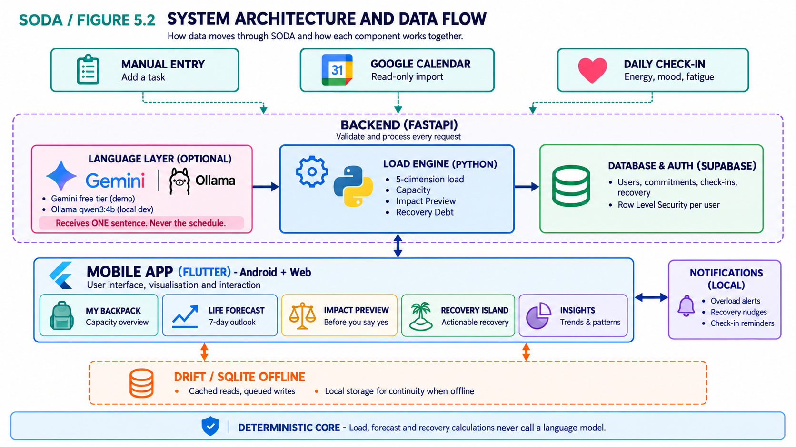
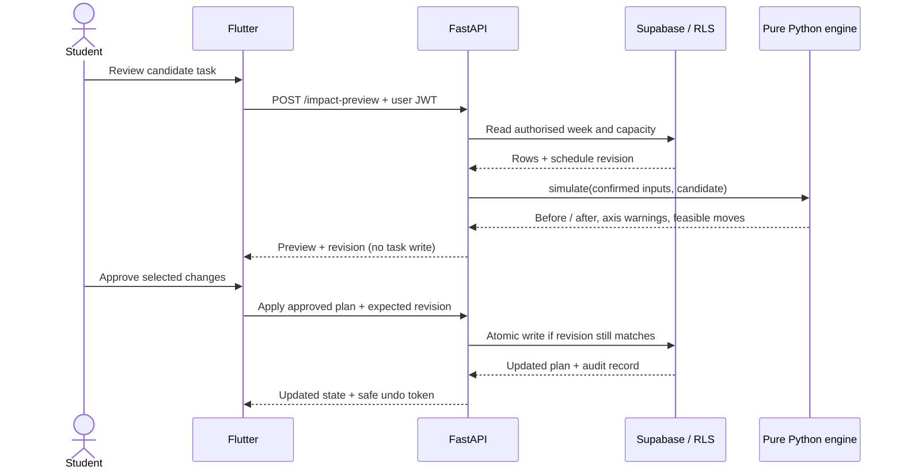

# SODA calculation and architecture specification

Supporting detail for [Section 5 of the submission](../README.md#5--technical-architecture--feasibility). All rules are proposed; fixture calculations are arithmetic checks, not validated human-capacity measurements.

<p align="center">
  
</p>

*Figure 5.2: Proposed system components and data flow. Arrows show logical hand-offs; dashed outlines group components.*

**Reading the diagram:** FastAPI mediates app, engine and database access; the engine does not connect directly to Supabase. “ONE sentence” means a preset synthetic example for the optional Gemini demo, not unrestricted student text. Offline support covers cached reads and queued drafts; fresh calculations require the server.

## Architecture text description and the Impact Preview request path

**Text description of Figure 5.2.**
The Flutter Android/web client collects manual tasks, check-ins and recovery logs, and reviews calendar
imports. Firebase Hosting serves the web build; Railway hosts FastAPI. FastAPI validates the user JWT
and request data, reads/writes the user's Supabase rows, and passes confirmed inputs to the pure Python
load engine. Database access belongs in the service layer, outside the engine.

Google Calendar is an external read-only event source. Supabase provides Auth and PostgreSQL with RLS.
The rule parser handles real text; a separate Gemini adapter accepts only allowlisted synthetic demo
examples. Ollama `qwen3:4b` is a local development experiment and is not deployed. All language output
must be reviewed before becoming confirmed task fields.

Drift/SQLite belongs to the client: it stores dated cached views and queued drafts. It does not run the
Python engine. Fresh previews and rebalances require the server, even when the optional AI adapter is
disabled. Optional local notifications belong to the Android client; web notification behaviour needs
separate implementation and testing.

**Request path for the highest-value interaction (Impact Preview):**



**The preview request writes no task or schedule data.** The later, separately approved apply request persists the plan. A student can preview a
commitment and walk away without creating a commitment. Infrastructure request logs must omit task bodies; read-only API semantics alone do not guarantee zero logging.

## Language modes, privacy boundary and fallback

The optional language layer assists task entry. It is separate from the deterministic engine and is not required to complete the core workflow.

**Four modes, one deterministic core:**

| Mode | Proposed behaviour | Release boundary |
|---|---|---|
| Real student entry | Structured form; backend rule parser when online | Default. No external model receives student text. |
| Optional hosted AI demonstration | Gemini parses a **server-allowlisted synthetic example**, then the user reviews fields | Demo-only, subject to current model access, rate limits and provider terms. Free-form input never reaches this adapter. |
| Local development experiment | Ollama `qwen3:4b` with synthetic fixtures | Developer-machine experiment; not a hosted production dependency. Benchmark before making hardware claims. |
| Offline entry | Save a structured draft locally | No fresh server calculation; recalculate on reconnect before applying changes. |

The [Gemini unpaid-service terms](https://ai.google.dev/gemini-api/terms) permit use of submitted content
to improve services and prohibit sensitive or personal submissions. Therefore the demo adapter accepts
only an example ID, resolves its synthetic sentence on the server, and receives no account context,
calendar, check-ins or load scores. Provider usage also requires eligibility checks. A future real-data
cloud mode needs a separately reviewed data policy and must not silently reuse this demo configuration.

Select and pin an available structured-output model through `GEMINI_MODEL` during build integration;
record its exact ID, test date and project quota. This is an **open integration check**, not a claim
that an unspecified Flash model has a universal free allowance. See the official
[model catalogue](https://ai.google.dev/gemini-api/docs/models) and
[project-dependent rate limits](https://ai.google.dev/gemini-api/docs/rate-limits).
The local candidate is [Ollama `qwen3:4b`](https://ollama.com/library/qwen3:4b); model download size is
not a measurement of runtime memory.

**The load engine never calls a model.** Recovery suggestions use deterministic rules and prewritten
copy. Losing the language adapter removes a convenience, not the calculation. Losing network access is
different: the Python engine is on the server, so offline screens show dated cached estimates and drafts.

## Load model: reproducible planning estimates

**This is a proposed deterministic planning model, not a validated measure of human capacity.**
Weights, ceilings and the 90% warning boundary are adjustable design assumptions. The saved screen
numbers are illustrative; the worked example below is computed from the actual specification.

### Step 1: a task becomes a five-dimensional vector

Each task carries duration `d` (hours), effort `e`, and category `c`. Effort offers five levels, matching the task-entry screen. It is the only load input the student sets by judgement rather than by fact, so the multiplier range is fixed and published, and [Step 7](#step-7-reality-check-correction) corrects a student whose estimates are persistently wrong in one direction.

```
effort multiplier: Low = 0.6   Medium = 1.0   High = 1.4   Very High = 1.7   Extra High = 2.0

category weight vectors w[c] = (mental, time, physical, social, errands)
  Academic   (0.55, 0.30, 0.05, 0.05, 0.05)
  Work       (0.25, 0.35, 0.25, 0.10, 0.05)
  Social     (0.10, 0.25, 0.10, 0.50, 0.05)
  Errands    (0.10, 0.30, 0.25, 0.05, 0.30)
  Other      (0.20, 0.20, 0.20, 0.20, 0.20)

load vector for task i:  L_i = d_i × e_i × w[c_i]        (units: load-hours per dimension)
load vector for a day:   L_day = Σ L_i  over tasks on that day
```

This is the mechanism behind the five-dimensional capacity claim: a 3-hour
assignment (`3 × 1.4 × Academic`) and a 3-hour social event (`3 × 1.0 × Social`) consume the same three
hours and produce completely different vectors.

### Step 2: capacity comes from onboarding, per student

The three calibration questions on Screen 03 set the ceiling:

| Question | Sets |
|---|---|
| "What does a normal week look like for you?" (Light / Moderate / Heavy) | Baseline scaling factor `β` ∈ {1.15, 1.00, 0.85} |
| "How many focused hours can you realistically handle per day?" (2–4 / 4–6 / 6–8 / 8+) | Daily focus budget `H` |
| "What time is protected for recovery each day?" (0–30 / 30–60 / 60–90 / 90+ min) | Daily recovery target `R` |

```
daily capacity ceiling  C = β × H × κ
  where κ = (0.40, 0.40, 0.25, 0.25, 0.20) defines relative axis ceilings, not time shares
```

The focus-hour ranges initialise `H` to 3 / 5 / 7 / 8 hours respectively; the last choice prompts
an editable value. Recovery ranges initialise `R` to 15 / 45 / 75 / 90 minutes, also editable.
These defaults are proposed, not empirically calibrated. `H` must be positive; protect `R` as actual
calendar intervals separately. Each task contributes once, split across dates in the user's stored
IANA timezone when it crosses midnight. Dropped tasks are excluded. Check-ins inform reflection and
preferences in v1; they do not silently change `C`.

#### Weekly recovery target

SODA uses **315 minutes, or 5 hours 15 minutes per week**, as the editable starting target for a student who selects the Moderate baseline. This is calculated as 45 minutes of protected recovery on each of seven days. The other onboarding choices correspond to 105, 525 and 630 minutes per week for the 15-, 75- and 90-minute daily targets respectively.

The target should normally be distributed across the week rather than postponed to one long session. Recovery can include psychologically detached leisure, relaxation, manageable physical activity, social connection or another student-selected activity that is not an academic obligation. Sleep, meals and basic personal care are not counted toward this target because SODA is not intended to measure whether those needs have been met.

Recent longitudinal research with 56 university students preparing for examinations found that weekly physical activity declined from 3.54 to 3.02 hours as examination preparation progressed, while reported recovery and wellbeing also declined and stress increased. Recovery experiences showed increasingly strong relationships with lower stress and higher wellbeing, although the mediation results were mixed and the sample was small ([Reschke et al., 2024](https://doi.org/10.1371/journal.pone.0306809)). Study Demands–Resources theory likewise explains that sustained academic demands consume cognitive, emotional and physical resources and that recovery and other resources are needed to interrupt this depletion process ([Bakker & Mostert, 2024](https://doi.org/10.1007/s10648-024-09940-8)).

The evidence supports protecting regular recovery, but it does **not** establish one clinically correct number of recovery hours for every student. Therefore, 315 minutes is an operational planning default derived from SODA's existing onboarding midpoint, not a medical recommendation. Students can edit it, and SODA should evaluate whether the target is realistic through user feedback rather than presenting it as a universal threshold.

### Step 3: utilisation and the day figure

```
per-dimension utilisation: U_dim = L_dim / C_dim          (display 100 × U_dim as a percentage; do not clamp above 100)

day load % = 100 × ( 0.6 × max(U) + 0.4 × Σ λ_dim · U_dim )
  where λ = (0.30, 0.30, 0.15, 0.15, 0.10)
```

The `max` term increases the influence of the busiest dimension, but **does not guarantee** that a
saturated axis pushes the combined figure over 90%. Display a separate axis warning whenever any
dimension reaches 100%; do not hide it behind the blended score. “Time” here is weighted demand,
not clock hours: an independent interval check detects overlaps and protects actual recovery blocks.

**Worked example, independent of the storyboard.** Let `β = 1`, `H = 5`, hence
`C = (2, 2, 1.25, 1.25, 1)`. A 3-hour high-effort academic task contributes
`(2.31, 1.26, 0.21, 0.21, 0.21)`. Its utilisation vector is
`(1.155, 0.63, 0.168, 0.168, 0.21)` and the day result is **93.576% → 94%**.
Adding one hour of medium-effort errands gives **101.616% → 102%** and a mental-axis warning at 120.5%.
Same confirmed tasks, capacity, timezone and model version must reproduce the same result.

**Week headline:** use the maximum daily score in the displayed week and label it **“Peak day this
week”**. Never label this a weekly average. A separate weekly average, if shown, needs its own label.
Classify on the unrounded score: Light `[0,50)`, Manageable `[50,70)`, Heavy `[70,90)`, Overload `[90,∞)`.
Near a threshold show one decimal or `<90%` to avoid an apparent 90% Heavy label.

### Step 4: severity bands

| Band | Range | UI treatment |
|---|---|---|
| Light | `[0, 50)` | Short bar, no icon |
| Manageable | `[50, 70)` | Medium bar |
| Heavy | `[70, 90)` | Tall bar, cloud icon |
| **Overload** | `[90, ∞)` | Full bar, storm icon, warning glyph, strained mascot |

Ranges are half-open and classified before rounding, matching Step 3. The band name is always shown as
a word beside the number, so severity never rests on colour alone.

**A known inconsistency.** Colour is meant to reinforce the band, and the prototype does not yet apply
it uniformly: on the Life Forecast screen a 78% Heavy day renders amber while an 82% Heavy day renders
green. Overload is consistently red. This is a design defect to resolve during the build, recorded here
rather than presented as an intended rule.

### Step 5: Recovery Debt

```
for each of the last 28 completed local dates, with recorded target R_day:
    A_day = union-duration of completed recovery intervals (count overlaps once)
    S_day = max(0, R_day − A_day)
D = sum(S_day) over dates since onboarding within that 28-day window
Today stays provisional until the day ends; do not charge future recovery as missed.
```

`D` is displayed as a duration ("2h 35m across the last 4 weeks") and never as a score, a percentage or
a risk level. **`D` influences which recovery actions get suggested and how prominently; it never
reduces `C`.** Debt is a signal to review planned versus logged recovery, not a penalty. Missing logs are not proof of missing rest; display history coverage. Extra rest cannot erase previous daily shortfalls, and entries age out after 28 days, so a falling ledger is not itself proof of recovery.

### Step 6: Smart Rebalance using priority

Effort and priority answer different questions. **Effort** describes how demanding a commitment is and remains an input to the five-dimensional load calculation. **Priority** describes how important it is to preserve when SODA searches for a less overloaded schedule. A high-effort task is therefore not automatically high priority, and a low-effort task is not automatically safe to move.

Students assign each flexible commitment one of three priority levels:

| Priority | Meaning | Rescheduling treatment |
|---|---|---|
| **High** | Important or time-sensitive work that should remain in place where possible | Consider only after all feasible Low- and Medium-priority moves have been exhausted |
| **Medium** | Important but adjustable work | Consider after Low-priority work |
| **Low** | Work that can reasonably move within its permitted window | Consider first |

Priority does not replace task constraints. Fixed classes, examinations, paid shifts and approved appointments remain immovable regardless of priority. Deadlines, protected recovery, existing time overlaps and the feasibility of the destination are also treated as hard constraints.

For an overloaded day, Smart Rebalance determines which tasks to reschedule through the following sequence:

1. Exclude fixed commitments, completed tasks and any task whose permitted scheduling window cannot change.
2. Generate alternative times only for flexible tasks, including moving or splitting a task where splitting has been allowed.
3. Reject any alternative that crosses a deadline, overlaps another commitment, consumes protected recovery or creates overload on the destination day.
4. Rank the remaining alternatives by:
   - lower priority first;
   - greater deadline slack first within the same priority;
   - lower disruption first, preferring a simple move over a split;
   - greater reduction in the overloaded day's load;
   - task ID as the deterministic final tie-break.
5. Recalculate the complete week after every proposed move.
6. Show the highest-ranked feasible alternatives with the task name, current time, proposed time, reason and resulting workload change.
7. Apply only the alternatives explicitly approved by the student.

The candidate commitment may also be deferred or declined instead of moving a higher-priority existing task. Shortening or dropping an existing task is never assumed to be academically feasible and is offered only as a separately labelled option requiring explicit permission.

Prioritisation, planning and task organisation are supported as useful time-management strategies in higher education research, while a recent meta-analysis found a moderate positive association between time management and college learning outcomes ([Liu et al., 2026](https://doi.org/10.3389/fpsyg.2026.1700298); [Patzak et al., 2025](https://doi.org/10.3389/feduc.2025.1623228)). These findings support giving students explicit priority control; they do not validate SODA's particular ranking order, which remains a transparent and testable design rule.

### Step 7: Reality Check correction

```
per (student × category), keep the last 5 confirmed responses
if ≥ 3 of 5 are "a little more" or "much more":
    suggest duration multiplier ×1.25 for that category   → student approves or dismisses
if ≥ 3 of 5 are "less time":
    suggest ×0.85

excluded from the sample: skipped responses, auto-completed tasks
never applied silently; disclose the proposed change in hours and the multiplier in calculation details
apply to the original base estimate once; do not compound the multiplier on every check-in
```
